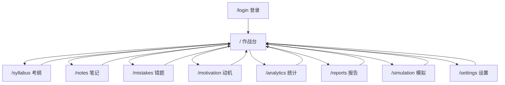

# 站点导航与页面跳转关系

本文档记录 Web 应用的页面清单、导航入口和页面间跳转关系的长期结构事实。功能完成状态不写在本文，见 `docs/development/feature-traceability.md` 与 `docs/development/feature-map.md`；API 明细见 `docs/architecture/api-surface.md`。

## 导航拓扑

整体是以作战台（`/`）为枢纽的星型结构：作战台承载核心闭环操作，八个子页从作战台进入，并统一通过「返回作战台」回到中心。应用没有全局共享导航栏组件，主导航内嵌在作战台页面头部。

## 页面清单

| 路由 | 名称 | 职责 | 入口文件 |
|---|---|---|---|
| `/` | 作战台 | 今日闭环中心：专注计时、任务面板、晚间复盘、AI 建议、恢复模式、状态主题、长期风险面板、版本弹窗 | `apps/web/app/page.tsx` |
| `/login` | 登录 | 单管理员登录；已登录访问时重定向回作战台 | `apps/web/app/login/page.tsx` |
| `/syllabus` | 考纲 | 考纲进度树、作战地图、掌握证明 | `apps/web/app/syllabus/page.tsx` |
| `/notes` | 笔记 | 笔记与资料、附件上传下载、复习提醒 | `apps/web/app/notes/page.tsx` |
| `/mistakes` | 错题 | 错题记录与复盘 | `apps/web/app/mistakes/page.tsx` |
| `/motivation` | 动机 | 动机封存与唤醒信号 | `apps/web/app/motivation/page.tsx` |
| `/analytics` | 统计 | 基础统计与长期风险 | `apps/web/app/analytics/page.tsx` |
| `/reports` | 报告 | 周审判与月复盘、报告决策 | `apps/web/app/reports/page.tsx` |
| `/simulation` | 模拟 | 全真模拟考试、阶段计划与阶段调整草稿 | `apps/web/app/simulation/page.tsx` |
| `/settings` | 设置 | 账户与版本中心（受控更新请求） | `apps/web/app/settings/page.tsx` |

专注计时、任务计划、晚间复盘、AI 建议和恢复模式没有独立路由，它们是作战台页面内嵌区块，对应组件：`FocusTimer`、`TaskPanel`、`ReviewForm`、AI 建议展示（`getDailyReviewAiAdvice` / `getTomorrowPlanAiAdvice` 服务端注入）、`RecoveryStateControls`，以及 `LongTermRiskPanel` 长期风险面板。

## 特殊页面

| 文件 | 职责 | 出口 |
|---|---|---|
| `apps/web/app/error.tsx` | 全局错误边界 | 重试、回作战台、支持入口外链 |
| `apps/web/app/not-found.tsx` | 404 | 回作战台、支持入口外链 |
| `apps/web/app/loading.tsx` | 根级路由加载骨架 | 无 |

## 鉴权环

- 全部业务页面（作战台与八个子页）在服务端校验会话，未登录一律重定向到 `/login`。
- `/login` 在已登录状态下访问时重定向到 `/`。
- 登录成功后进入作战台；退出登录入口在作战台头部（`LogoutButton`）。

## 主导航入口

主导航定义在作战台页面头部的 `dashboardNavItems`（`apps/web/app/page.tsx`），桌面端渲染为头部横排链接，移动端渲染为折叠菜单，两套渲染共用同一数据：

| 文案 | 目标 |
|---|---|
| 考纲 | `/syllabus` |
| 笔记 | `/notes` |
| 错题 | `/mistakes` |
| 动机 | `/motivation` |
| 统计 | `/analytics` |
| 报告 | `/reports` |
| 模拟 | `/simulation` |
| 设置 | `/settings` |

八个子页头部统一提供「返回作战台」链接回 `/`，不在子页之间横向互链。

## 导航之外的跳转

| 来源 | 目标 | 触发 |
|---|---|---|
| 作战台动机区块 | `/motivation` | 页内链接 |
| 版本更新弹窗（`UpdateVersionPopover`，挂载于作战台头部） | `/settings` | 引导进入版本中心 |
| 设置页版本中心（`SettingsWorkbench`） | GitHub Release 页（外链） | 查看候选版本说明 |
| 笔记附件列表（`NoteLibrary`） | 附件鉴权下载 API | 附件下载走鉴权接口，不走公开静态路径 |
| 错误页 / 404 | 支持入口（外链） | `SUPPORT_URL` |

## 同步约定

新增、删除页面路由或调整主导航入口时，同一轮内更新本文档；涉及 API 变化时同步 `docs/architecture/api-surface.md`。触发关系见 `docs/development/doc-sync-checklist.md`。
