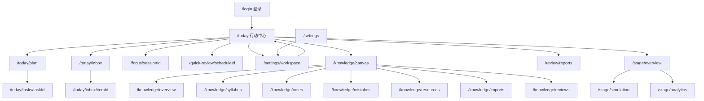

# 站点导航与页面跳转关系

本文档记录 Web 应用的页面清单、导航入口和页面间跳转关系的长期结构事实。功能完成状态不写在本文，见 `docs/development/feature-traceability.md` 与 `docs/development/feature-map.md`；API 明细见 `docs/architecture/api-surface.md`。

## 导航拓扑

隔离分支已启用受保护 App Shell：登录后默认进入今日行动中心；桌面主导航开放今日/计划/知识/复盘/阶段/设置，移动底部导航显示前五项。收件箱保留为今日工作台的页内入口。设置子页开放工作区/档案/通知/AI/体验/系统。`/syllabus` `/notes` `/mistakes` 重定向到 `/knowledge/*`；`/motivation` 重定向到 `/settings/profile`。

## 页面清单（当前开放）

| 路由 | 名称 | 职责 | 入口文件 |
|---|---|---|---|
| `/today` | 今日行动中心 | 推荐、三队列、科目快捷计时、首次工作区 CTA | `apps/web/app/(app)/today/page.tsx` |
| `/today/plan` | 计划 | 七天/日期条、正式任务、欠账、Inbox 计数 | `apps/web/app/(app)/today/plan/page.tsx` |
| `/today/tasks/[taskId]` | 任务详情 | 任务唯一 canonical 详情与启动 | `apps/web/app/(app)/today/tasks/[taskId]/page.tsx` |
| `/today/inbox` | 收件箱 | OPEN 草稿列表 | `apps/web/app/(app)/today/inbox/page.tsx` |
| `/today/inbox/[itemId]` | 收件箱详情 | 转换与来源摘要 | `apps/web/app/(app)/today/inbox/[itemId]/page.tsx` |
| `/focus/[sessionId]` | 全屏专注 | 正计时、暂停/继续、结束收口 | `apps/web/app/(app)/focus/[sessionId]/page.tsx` |
| `/quick-review/[scheduleId]` | 快速复习 | 单对象确认复习事件 | `apps/web/app/(app)/quick-review/[scheduleId]/page.tsx` |
| `/settings/workspace` | 考试工作区 | 首次设置两步流、科目与接管 | `apps/web/app/(app)/settings/workspace/page.tsx` |
| `/settings` | 基础设置 | 账户与版本中心 | `apps/web/app/(app)/settings/page.tsx` |
| `/knowledge/canvas` | 关联画布 | 派生关系图、搜索、等价列表、布局 CAS | `apps/web/app/(app)/knowledge/canvas/page.tsx` |
| `/knowledge/overview` | 知识概览 | 待复习/薄弱/资料/导入摘要 | `apps/web/app/(app)/knowledge/overview/page.tsx` |
| `/knowledge/syllabus` | 考纲 | 考纲进度树 | `apps/web/app/(app)/knowledge/syllabus/page.tsx` |
| `/knowledge/notes` | 知识卡片 | Note 卡片库 | `apps/web/app/(app)/knowledge/notes/page.tsx` |
| `/knowledge/mistakes` | 错题 | 错题库 | `apps/web/app/(app)/knowledge/mistakes/page.tsx` |
| `/knowledge/resources` | 资料 | StudyResource 列表 | `apps/web/app/(app)/knowledge/resources/page.tsx` |
| `/knowledge/imports` | 导入 | 学习树导入历史 | `apps/web/app/(app)/knowledge/imports/page.tsx` |
| `/knowledge/reviews` | 统一复习 | 复习排期列表 → 快速复习 | `apps/web/app/(app)/knowledge/reviews/page.tsx` |
| `/review/reports` | 复盘 | 周/月报告与当前周期决策 | `apps/web/app/(app)/review/reports/page.tsx` |
| `/review/reports/history/[decisionId]` | 报告历史 | 冻结报告决策回放 | `apps/web/app/(app)/review/reports/history/[decisionId]/page.tsx` |
| `/stage/overview` | 阶段总览 | 阶段计划、确认边界与当前建议 | `apps/web/app/(app)/stage/overview/page.tsx` |
| `/stage/simulation` | 模拟 | 模拟列表与结构化失分入口 | `apps/web/app/(app)/stage/simulation/page.tsx` |
| `/stage/simulation/[examId]` | 模拟详情 | 分科结果、失分与补救入箱 | `apps/web/app/(app)/stage/simulation/[examId]/page.tsx` |
| `/stage/analytics` | 阶段统计 | 7/30 天趋势与阶段风险 | `apps/web/app/(app)/stage/analytics/page.tsx` |
| `/login` | 登录 | 单管理员登录；已登录重定向 `/today` | `apps/web/app/login/page.tsx` |

`/` 登录后重定向到 `/today`。

## Legacy 兼容路由（不进当前导航）

| 路由 | 名称 | 说明 |
|---|---|---|
| `/syllabus` `/notes` `/mistakes` | 旧子页 | 服务端重定向到 `/knowledge/syllabus` `/knowledge/notes` `/knowledge/mistakes` |
| `/motivation` | 旧动机页 | 重定向到 `/settings/profile` |
| `/analytics` `/reports` `/simulation` | 旧子页 | 保持兼容入口；canonical 页面分别位于 `/stage/analytics`、`/review/reports`、`/stage/simulation` |

## 鉴权环

- App Shell 业务页在 `(app)/layout.tsx` 校验会话，未登录重定向 `/login`。
- `/login` 已登录访问时重定向 `/today`。
- 深链白名单见 `apps/web/lib/navigation/batch7.ts`；非法目标回 `/today`。

## 主导航入口

| 文案 | 目标 |
|---|---|
| 今日 | `/today` |
| 计划 | `/today/plan` |
| 知识 | `/knowledge/canvas` |
| 复盘 | `/review/reports` |
| 阶段 | `/stage/overview` |
| 设置 | `/settings/workspace` |

移动端底部导航显示今日、计划、知识、复盘、阶段；设置与收件箱从对应工作台页内进入。

顶栏提供五状态灯（`GET /api/app-shell/status`）与次级「我学不下去了」（动机内容库一条匹配 + 继续/5 分钟/最小任务；不伪造完成事实）。

## 同步约定

新增、删除页面路由或调整主导航入口时，同一轮内更新本文档；涉及 API 变化时同步 `docs/architecture/api-surface.md`。触发关系见 `docs/development/doc-sync-checklist.md`。
