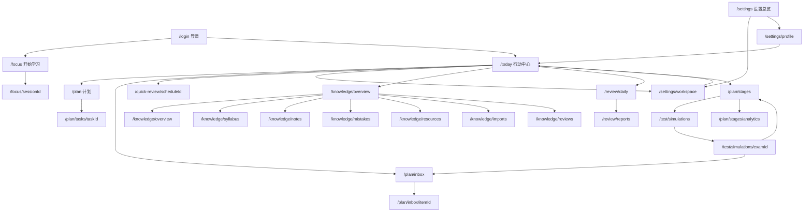

# 站点导航与页面跳转关系

本文档记录 Web 应用的页面清单、canonical 路由和页面间跳转关系。目标 App Shell、页面模板、主操作与桌面/移动布局见 `docs/ux/application-shell-and-workbench-layouts.md`；功能完成状态不写在本文，见 `docs/development/feature-traceability.md` 与 `docs/development/feature-map.md`；API 明细见 `docs/architecture/api-surface.md`。

## 导航拓扑

登录后默认进入开始学习 `/focus`。当前一级导航为开始学习/今日/计划/知识/检验/阶段/复盘/确认中心/设置；开始学习是独立入口，不承载二级导航，进入后直接显示唯一活动计时器。计划、知识、检验、阶段、复盘和确认中心各自承载二级业务入口；设置提供工作区、档案、通知、AI、体验和系统入口。桌面优先，移动端只压缩层级，不改变 canonical 路由。当前只保留一套路由，旧根级业务页、`/today/*` 和旧阶段路径均已移除，访问应返回 404。功能实现差异以 `docs/development/feature-traceability.md` 为准。

跨工作台详情统一使用安全 `returnTo`：来源路径、允许的筛选参数和最多三跳的逐级来源都经过注册路由归一化；页面按实际来源展示明确返回文案。专注完成始终以“回到今日，查看下一行动”为主接力，同时保留具体来源作为次操作；快速复习无后续项时直接回到具体来源。每日复盘、周期报告、阶段处理结果和模拟补救进入计划收件箱时保留当前结果页（及其合法筛选参数），处理完成后可回到原判断上下文。确认历史 `/confirmations/history` 是确认中心二级页面，不是三级对象详情，因此保留确认中心二级导航；只有 `/confirmations/[confirmationId]` 隐藏二级栏并展示当前确认对象。

登录后页面共用工作台级 `loading` 与 `error` 边界：页面切换时 Shell 保持稳定；异常重试失败后按当前路由返回所属工作台。知识、今日、复盘与阶段的动态详情继续使用各自 `not-found` 出口，不把局部内容不存在误报成全站 404。

核心编辑器共用持久化状态：本机草稿与服务端成功必须分开显示；草稿存在时刷新或关闭浏览器会触发离开提醒，站内返回原详情后按既有私密草稿 TTL 恢复。版本冲突不会自动覆盖或自动重放。

核心编辑器也共用操作层级：底部操作区只有一个主提交动作，关闭或放弃为次级动作；卡片、错题、资料编辑时隐藏归档等生命周期操作。冲突未处理时主提交禁用，必须先在冲突弹窗明确选择服务端版本或人工合并。移动端按钮改为纵向全宽排列，不把保存、放弃和归档挤在同一行。

生命周期操作遵循统一去向：归档前确认影响，成功后留在当前详情并提供恢复；恢复直接执行但不会自动恢复已暂停排期；有修改时放弃编辑先确认清除本机草稿，无修改时直接退出。任务放弃同样先确认，成功后由现有任务状态和补做入口承接，不创建额外中间页面。

创建流程也使用统一入口：App Shell 快捷创建可打开任务、知识卡片、错题、资料和考纲节点；对应列表或地图只保留一个页面创建按钮，并使用同一个 Drawer。单个对象创建成功进入新对象 canonical 详情并携带列表 `returnTo`；Markdown、多文件上传等批量创建留在原列表并显示结果摘要。关闭 Drawer 不清除本机草稿。

知识列表统一由工作台顶部搜索承载 `q`，页面工具栏再承载科目、节点、掌握状态、错因、复习、地图或行动等业务筛选。两类条件都写入 URL 和安全 `returnTo`；清除页面筛选不清除 `q`，因此刷新或从详情返回时仍能恢复用户离开前的列表上下文。

知识列表只承担扫描和进入对象：状态标签、标题、摘要和元数据保持同一阅读顺序，唯一对象级导航为“打开详情”。卡片附件与考纲掌握管理仍可在列表显式展开，但默认收起；错题编辑统一进入详情，避免列表与 canonical 详情同时维护两套编辑状态。

```mermaid
flowchart TB
  login["/login 登录"] --> focusEntry["/focus 开始学习"]
  login --> today["/today 行动中心"]
  today --> plan["/plan 计划"]
  today --> inbox["/plan/inbox"]
  focusEntry --> focus["/focus/sessionId"]
  today --> quickReview["/quick-review/scheduleId"]
  today --> workspace["/settings/workspace"]
  today --> knowledge["/knowledge/overview"]
  knowledge --> overview["/knowledge/overview"]
  knowledge --> syllabus["/knowledge/syllabus"]
  knowledge --> notes["/knowledge/notes"]
  knowledge --> mistakes["/knowledge/mistakes"]
  knowledge --> resources["/knowledge/resources"]
  knowledge --> imports["/knowledge/imports"]
  knowledge --> reviews["/knowledge/reviews"]
  today --> dailyReview["/review/daily"]
  dailyReview --> report["/review/reports"]
  today --> stage["/plan/stages"]
  stage --> simulation["/test/simulations"]
  simulation --> simulationExam["/test/simulations/examId"]
  simulationExam --> inbox
  simulationExam --> stage
  stage --> analytics["/plan/stages/analytics"]
  plan --> task["/plan/tasks/taskId"]
  inbox --> inboxItem["/plan/inbox/itemId"]
  settings["/settings 设置总览"] --> workspace
  settings --> profile["/settings/profile"]
  workspace --> today
  profile --> today
```

## 页面清单（当前开放）

| 路由 | 名称 | 职责 | 入口文件 |
|---|---|---|---|
| `/` | 根入口 | 按会话状态重定向到 `/login` 或 `/focus`，不承载独立业务页面 | `apps/web/app/page.tsx` |
| `/knowledge` | 知识索引 | 重定向到知识概览 `/knowledge/overview` | `apps/web/app/(app)/knowledge/page.tsx` |
| `/review` | 复盘索引 | 重定向到今日复盘 `/review/daily` | `apps/web/app/(app)/review/page.tsx` |
| `/test` | 检验中心 | 汇总专项复测与模拟考试，分别进入两条检验路径 | `apps/web/app/(app)/test/page.tsx` |
| `/today` | 今日行动中心 | 推荐、任务/复习/错题单一分段队列、今日完成摘要、科目快捷计时、首次工作区 CTA | `apps/web/app/(app)/today/page.tsx` |
| `/focus` | 开始学习 | 独立一级入口；先选择科目，直接进入唯一活动计时器；任务、考纲和目标时长均为可选上下文 | `apps/web/app/(app)/focus/page.tsx` |
| `/plan` | 计划 | 顶部搜索与科目/状态筛选、日期带、正式任务、欠账和 Inbox 计数；桌面以 `taskId` 在右侧展开任务详情 | `apps/web/app/(app)/plan/page.tsx` |
| `/plan/tasks/[taskId]` | 任务详情 | 任务 canonical 详情与启动；接受白名单 `returnTo`，从今日或计划进入并把来源继续传给专注页 | `apps/web/app/(app)/plan/tasks/[taskId]/page.tsx` |
| `/plan/inbox` | 收件箱 | 待处理、已忽略、已转换列表；详情、已转换任务和空状态保留当前状态/稳定引用筛选 | `apps/web/app/(app)/plan/inbox/page.tsx` |
| `/plan/inbox/[itemId]` | 收件箱详情 | 转换与来源摘要；返回、转换后任务、替代版本和阶段入口都携带安全的收件箱 `returnTo` | `apps/web/app/(app)/plan/inbox/[itemId]/page.tsx` |
| `/focus/[sessionId]` | 全屏专注 | 正计时、暂停/继续、结束收口、证据接力；完成后主操作回今日下一行动，非今日来源可返回原页面；低转化补救进入收件箱时保留专注来源 | `apps/web/app/(app)/focus/[sessionId]/page.tsx` |
| `/quick-review/[scheduleId]` | 快速复习 | 查看真实对象、确认结果、写回下次日期与连续掌握；有下一项时继续，否则按来源回到今日或复习队列 | `apps/web/app/(app)/quick-review/[scheduleId]/page.tsx` |
| `/settings/workspace` | 考试工作区 | 首次设置两步流、考试目标、科目与接管；首次完成返回今日行动 | `apps/web/app/(app)/settings/workspace/page.tsx` |
| `/settings/ai` | AI 设置 | Web 全局 AI 开关、当前浏览器外部 Provider 授权、账户 Provider 状态和 payload 隐私；策略变化确认后保存 | `apps/web/app/(app)/settings/ai/page.tsx` |
| `/settings` | 设置总览 | 汇总六类配置状态；无工作区时给出唯一首次设置动作，有工作区时返回今日行动 | `apps/web/app/(app)/settings/page.tsx` |
| `/settings/profile` | 档案与动机 | 动机封存、当前设备提醒、可展示内容库和低频 AI 草稿 | `apps/web/app/(app)/settings/profile/page.tsx` |
| `/settings/notifications` | 通知 | 通知类别与时间偏好 | `apps/web/app/(app)/settings/notifications/page.tsx` |
| `/settings/experience` | 体验 | 主题、密度与界面偏好 | `apps/web/app/(app)/settings/experience/page.tsx` |
| `/settings/system` | 系统 | 版本中心与诊断入口 | `apps/web/app/(app)/settings/system/page.tsx` |
| `/knowledge/canvas` | 关联画布 | 派生关系图、搜索、等价列表、布局 CAS | `apps/web/app/(app)/knowledge/canvas/page.tsx` |
| `/knowledge/overview` | 知识概览 | 唯一下一行动、到期/薄弱摘要与最近卡片/错题证据 | `apps/web/app/(app)/knowledge/overview/page.tsx` |
| `/knowledge/points` | 知识点 | 独立知识点对象库；按科目、掌握状态和关键词筛选 | `apps/web/app/(app)/knowledge/points/page.tsx` |
| `/knowledge/points/[pointId]` | 知识点详情 | 知识点边界、阶段/考纲关联、学习证据与复测入口 | `apps/web/app/(app)/knowledge/points/[pointId]/page.tsx` |
| `/knowledge/syllabus` | 考纲 | 作战地图与考纲进度树；长期遗忘风险在地图后以紧凑摘要呈现，可展开查看完整原因与下一步动作 | `apps/web/app/(app)/knowledge/syllabus/page.tsx` |
| `/knowledge/syllabus/[nodeId]` | 考纲节点 | 节点身份、当前下一行动、统一复习排期、掌握证明与复测；无排期时可带上下文进入最小任务创建；到期时优先开始复测；接受安全 `returnTo` 返回来源 | `apps/web/app/(app)/knowledge/syllabus/[nodeId]/page.tsx` |
| `/knowledge/notes` | 知识卡片 | Note 卡片库 | `apps/web/app/(app)/knowledge/notes/page.tsx` |
| `/knowledge/notes/[noteId]` | 知识卡片详情 | 查看与编辑卡片；下一行动引导首次排期或查看排期，到期时优先开始复习；接受安全 `returnTo` 返回来源 | `apps/web/app/(app)/knowledge/notes/[noteId]/page.tsx` |
| `/knowledge/mistakes` | 错题 | 错题库 | `apps/web/app/(app)/knowledge/mistakes/page.tsx` |
| `/knowledge/mistakes/[mistakeId]` | 错题详情 | 下一行动引导补全、独立重做或首次排期；错因与复习历史；到期时优先开始复习；接受安全 `returnTo` 返回来源 | `apps/web/app/(app)/knowledge/mistakes/[mistakeId]/page.tsx` |
| `/knowledge/resources` | 资料 | 按科目筛选的 StudyResource 列表；唯一“添加资料”入口打开文件/HTTPS 外链抽屉，未完成上传与重复决策可恢复 | `apps/web/app/(app)/knowledge/resources/page.tsx` |
| `/knowledge/resources/[resourceId]` | 资料详情 | 默认查看资料事实与关联对象；页头消费资料，下一行动承接关联/创建任务，显式进入整理；接受安全 `returnTo` 返回来源 | `apps/web/app/(app)/knowledge/resources/[resourceId]/page.tsx` |
| `/knowledge/resources/[resourceId]/preview` | 资料预览 | 全屏查看私有文件；返回含上游来源的资料详情 | `apps/web/app/(app)/knowledge/resources/[resourceId]/preview/page.tsx` |
| `/knowledge/imports` | 导入 | 默认批次总览；`mode=import` 进入内容、差异与原子确认，`mode=export` 独立导出；未完成草稿可恢复 | `apps/web/app/(app)/knowledge/imports/page.tsx` |
| `/knowledge/imports/[importId]` | 导入批次 | 中文应用/跳过结果、导入明细与考纲核验接力；技术校验信息折叠 | `apps/web/app/(app)/knowledge/imports/[importId]/page.tsx` |
| `/knowledge/reviews` | 统一复习 | 单一到期队列、今日进度、状态筛选 → 快速复习 | `apps/web/app/(app)/knowledge/reviews/page.tsx` |
| `/knowledge/reviews/[scheduleId]` | 复习排期详情 | 按“下一行动 → 对象核验 → 排期管理 → 事件历史”分层；活动排期主操作进入快速复习，暂停/恢复与历史更正为管理动作，并保留安全 `returnTo` | `apps/web/app/(app)/knowledge/reviews/[scheduleId]/page.tsx` |
| `/review/daily` | 今日复盘 | 每日事实、偏差与明日最低行动；完成结果进入收件箱时保留复盘来源 | `apps/web/app/(app)/review/daily/page.tsx` |
| `/review/reports` | 周期报告 | 执行事实、唯一短板、待确认策略 -> 计划收件箱 / 阶段建议；收件箱入口保留当前周/月报告视图 | `apps/web/app/(app)/review/reports/page.tsx` |
| `/review/reports/history/[decisionId]` | 报告历史 | 冻结事实、当时决策与入箱汇总的只读回放；查看当前收件箱时保留历史报告来源 | `apps/web/app/(app)/review/reports/history/[decisionId]/page.tsx` |
| `/plan/stages` | 阶段总览 | 当前生效计划、待确认建议、里程碑与最近处理结果；阶段结果进入收件箱时保留当前概览上下文 | `apps/web/app/(app)/plan/stages/page.tsx` |
| `/test/simulations` | 模拟考试 | 未完成考试优先、已确认历史与独立创建入口；与专项复测分开 | `apps/web/app/(app)/test/simulations/page.tsx` |
| `/test/simulations/[examId]` | 模拟详情 | 录分、失分分析、个人反馈、整场复盘和事实确认；补救动作进入计划收件箱 | `apps/web/app/(app)/test/simulations/[examId]/page.tsx` |
| `/plan/stages/analytics` | 阶段统计 | 最高风险直达处理 + 7/30 天趋势证据 | `apps/web/app/(app)/plan/stages/analytics/page.tsx` |
| `/test/retests` | 专项复测 | 按知识点安排、开始、逐点结果、复盘和待确认列表 | `apps/web/app/(app)/test/retests/page.tsx` |
| `/test/retests/new` | 新建专项复测 | 选择多个知识点并安排一次复测；提交后进入复测详情 | `apps/web/app/(app)/test/retests/new/page.tsx` |
| `/test/retests/[retestId]` | 专项复测详情 | 逐知识点量化结果、个人反馈和完整复盘；确认后更新掌握状态并安排下一次复测 | `apps/web/app/(app)/test/retests/[retestId]/page.tsx` |
| `/confirmations` | 确认中心 | 聚合周期报告、阶段建议、模拟考试、专项复测和 AI 草稿的统一待确认状态 | `apps/web/app/(app)/confirmations/page.tsx` |
| `/confirmations/[confirmationId]` | 确认事项详情 | 统一展示来源、快照、版本和确认入口，再进入原业务表单执行最终决定 | `apps/web/app/(app)/confirmations/[confirmationId]/page.tsx` |
| `/confirmations/history` | 确认历史 | 已确认或已驳回事项的冻结只读回放 | `apps/web/app/(app)/confirmations/history/page.tsx` |
| `/login` | 登录 | 单管理员登录；已登录重定向 `/focus` | `apps/web/app/login/page.tsx` |

`/` 登录后重定向到 `/focus`；`/knowledge`、`/review` 分别重定向到所属工作台的默认入口，`/test` 进入检验中心。

## 已移除的旧路由

| 路由 | 名称 | 说明 |
|---|---|---|
| `/syllabus` `/notes` `/mistakes` `/motivation` | 根级旧业务页 | 页面文件已删除，不提供重定向；访问返回 404 |
| `/analytics` `/reports` `/simulation` | 根级旧统计/考试页 | 页面文件已删除；canonical 页面分别位于 `/plan/stages/analytics`、`/review/reports`、`/test/simulations` |
| `/today/plan` `/today/tasks/*` `/today/inbox*` | 旧计划路径 | 页面文件已删除；计划统一从 `/plan`、`/plan/tasks/*`、`/plan/inbox*` 进入 |
| `/stage/*` | 旧阶段路径 | 页面文件已删除；阶段统一从 `/plan/stages`、`/plan/stages/analytics` 和 `/test/simulations*` 进入 |

## 鉴权环

- App Shell 业务页在 `(app)/layout.tsx` 校验会话，未登录重定向 `/login`。
- `/login` 已登录访问时重定向 `/focus`。
- 深链白名单见 `apps/web/lib/navigation/batch7.ts`；非法目标回 `/focus`。

## 主导航入口

| 文案 | 目标 |
|---|---|
| 今日 | `/today` |
| 开始学习 | `/focus` |
| 计划 | `/plan` |
| 知识 | `/knowledge/overview` |
| 检验 | `/test` |
| 阶段 | `/plan/stages` |
| 复盘 | `/review/daily` |
| 确认中心 | `/confirmations` |
| 设置 | `/settings/workspace` |

开始学习没有二级导航，进入后中间直接显示大计时器。一级侧栏和当前业务的二级侧栏可分别折叠；折叠后保留图标、tooltip 和可访问名称。内容页只展示当前对象，不重复渲染二级导航。底部共享工具栏显示活动计时、当前页面、上一页面、同步状态和跨设备状态。开始计时、在线响应丢失和离线恢复均使用同一启动幂等键；多开页面只跳回同一活动 session。移动端仍只做压缩布局，不作为独立重构目标。

设置桌面端使用左侧纵向二级导航，移动端使用横向滚动二级入口。首次进入且尚无工作区时，从 `/settings` 进入 `/settings/workspace?setup=1`，完成考试目标、首个科目和已有数据处理后返回 `/today`；档案、通知、AI、体验与系统设置均为按需配置，不阻断主学习闭环。

当前顶栏将 `GET /api/app-shell/status` 返回的分项状态汇总为单一“今日状态”入口，并保留次级“我学不下去了”恢复入口；状态详情可以导航到建议动作，但状态本身不作为第二套导航。

## 同步约定

新增、删除页面路由或调整主导航入口时，同一轮内更新本文档；涉及 API 变化时同步 `docs/architecture/api-surface.md`。触发关系见 `docs/development/doc-sync-checklist.md`。
