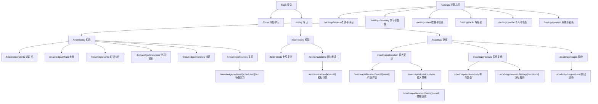

# 站点导航与页面跳转关系

本文档记录 AreaForge 当前唯一的 Web 路由体系、三级工作台结构和跨页面返回约定。页面布局基线见 `docs/ux/application-shell-and-workbench-layouts.md`，功能状态见 `docs/development/feature-traceability.md`。

## 导航拓扑

登录后默认进入 `/focus`。一级导航是开始学习、今日、知识、检验、路线；设置位于侧栏底部工具区，确认中心是共享工作流入口，不与一级业务并列。

知识、检验、路线和设置遵循固定三级结构；开始学习与今日直接进入内容，不制造空的二级导航：

1. 一级：工作台，负责切换业务领域。
2. 二级：该工作台的业务视图，只在所属一级下展开，可独立收起。
3. 三级：当前列表或对象内容页，内容区只展示当前对象，不再次渲染二级导航。

开始学习没有二级导航，进入后当前内容区直接展示唯一活动计时器；今日也不显示二级导航，日期与行动队列属于页面内容。计时前只要求选择科目；任务、考纲和目标时长可以在学习过程中或收口时补充。单个用户同一时间只有一个活动计时器，多标签页和多设备都回到同一个活动 session。

顶部共享工具栏左侧在没有活动时展示今日状态；存在自由学习、快速复习、专项复测或模拟考试时，左侧改为展示当前唯一活动的类型、对象和时长。中间固定提供全局搜索/命令面板触发器，聚焦后支持普通搜索、`$today`、`/start_to_learn now` 等中英文或符号别名；右侧提供确认中心窗口、AI 助手、恢复帮助和快捷创建（`+` 固定最右）。确认中心仍保留 `/confirmations` 深链入口，路由页面只负责唤起公共窗口。面包屑展示真实层级，右侧平铺当前视图功能，不复制二级导航；空间不足时低频功能进入“更多”。底部共享状态栏左侧只展示来源页面，收口状态、后台窗口、警告、同步状态和设备状态整体靠右，不重复显示计时。一级、二级侧栏折叠后保留图标、tooltip 和可访问名称。

`/focus` 只创建 `STUDY + FREE_STUDY`。`REVIEW` 只能由复习排期或专项复测配置启动，`TEST` 只能由模拟考试配置启动；活动结束统一进入 `CLOSING`，完成来源页收口后才清空公共活动槽。

跨工作台详情统一使用安全 `returnTo`。只允许注册的 canonical 路由和白名单筛选参数，最多保留三层来源；非法或旧路径回到独立 `/focus` 入口。

## 导航拓扑图

```mermaid
flowchart TB
  login["/login 登录"] --> focus["/focus 开始学习"]
  login --> today["/today 今日"]
  today --> knowledge["/knowledge 知识"]
  today --> test["/test/retests 检验"]
  today --> roadmap["/roadmap 路线"]
  roadmap --> allocation["/roadmap/allocation 投入安排"]
  allocation --> task["/roadmap/allocation/tasks/[taskId] 行动详情"]
  allocation --> drafts["/roadmap/allocation/drafts 投入草稿"]
  drafts --> draft["/roadmap/allocation/drafts/[itemId] 草稿详情"]
  roadmap --> reviews["/roadmap/reviews 周期复盘"]
  reviews --> daily["/roadmap/reviews/daily 每日复盘"]
  reviews --> history["/roadmap/reviews/history/[decisionId] 冻结报告"]
  knowledge --> points["/knowledge/points 知识点"]
  knowledge --> syllabi["/knowledge/syllabi 考纲"]
  knowledge --> cards["/knowledge/cards 知识卡片"]
  knowledge --> resources["/knowledge/resources 学习资料"]
  knowledge --> mistakes["/knowledge/mistakes 错题"]
  knowledge --> reviews2["/knowledge/reviews 复习"]
  reviews2 --> reviewRun["/knowledge/reviews/[scheduleId]/run 快速复习"]
  test --> retests["/test/retests 专项复测"]
  test --> simulations["/test/simulations 模拟考试"]
  simulations --> simulation["/test/simulations/[examId] 模拟详情"]
  roadmap --> stages["/roadmap/stages 阶段"]
  stages --> trend["/roadmap/stages/trend 阶段趋势"]
  settings["/settings 设置总览"] --> exams["/settings/exams 考试与科目"]
  settings --> learning["/settings/learning 学习与提醒"]
  settings --> data["/settings/data 数据与安全"]
  settings --> ai["/settings/ai AI 与隐私"]
  settings --> profile["/settings/profile 个人与恢复"]
  settings --> system["/settings/system 系统与更新"]
```

## 一级与二级入口

| 一级工作台 | 默认入口 | 二级视图 |
|---|---|---|
| 开始学习 | `/focus` | 无二级，直接显示计时器 |
| 今日 | `/today` | 无二级，日期筛选在内容区，默认今天 |
| 知识 | `/knowledge` | 概览、知识点、考纲、学习资料、知识卡片、错题、复习 |
| 检验 | `/test/retests` | 专项复测、模拟考试 |
| 路线 | `/roadmap` | 路线总览、投入安排、阶段、周期复盘 |
| 设置（底部工具） | `/settings` | 设置总览、考试与科目、个人与恢复、学习与提醒、AI 与隐私、数据与安全、系统与更新 |

确认中心 `/confirmations` 通过共享状态、面包屑功能入口和报告/复测/模拟结果进入；它不制造第四级导航。

## 页面清单

以下 48 条记录与 `apps/web/lib/navigation/canonical-routes.ts`、实际 `page.tsx` 文件由同一门禁校验。

| 路由 | 名称 | 职责 |
|---|---|---|
| `/` | 根入口 | 按会话重定向到 `/login` 或 `/focus` |
| `/login` | 登录 | 未登录用户进入应用的唯一认证页面；已登录用户返回 `/focus` |
| `/focus` | 开始学习 | 只选择科目后直接进行自由学习、暂停/继续、收口和证据接力 |
| `/today` | 今日 | 今日事实、下一行动、计划和完成闭环；日期可切换，默认今天 |
| `/knowledge` | 知识概览 | 知识对象、最近证据和下一行动入口 |
| `/knowledge/points` | 知识点 | 独立知识点对象库和掌握筛选 |
| `/knowledge/points/[pointId]` | 知识点详情 | 当前对象、阶段/考纲关联、证据和复测 |
| `/knowledge/syllabi` | 考纲 | 考纲树、地图状态、导入和节点 CRUD |
| `/knowledge/syllabi/[nodeId]` | 考纲节点 | 当前节点、复习排期、掌握证明和复测 |
| `/knowledge/resources` | 学习资料 | 资料 CRUD、上传、归档和对象关联 |
| `/knowledge/resources/[resourceId]` | 资料详情 | 当前资料事实、预览和关联对象 |
| `/knowledge/resources/[resourceId]/preview` | 资料预览 | 在受鉴权的独立工作区查看资料内容并返回详情 |
| `/knowledge/cards` | 知识卡片 | 笔记/卡片扫描、创建和掌握筛选 |
| `/knowledge/cards/[noteId]` | 知识卡片详情 | 当前卡片编辑、附件、复习排期和关联 |
| `/knowledge/mistakes` | 错题 | 错题扫描、筛选和创建 |
| `/knowledge/mistakes/[mistakeId]` | 错题详情 | 当前错题、错因、复习和修正 |
| `/knowledge/reviews` | 统一复习 | 单一到期队列和进度 |
| `/knowledge/reviews/[scheduleId]` | 复习排期详情 | 当前排期、对象事实、复习历史和可执行入口 |
| `/knowledge/reviews/[scheduleId]/run` | 快速复习 | 已配置复习排期的对象、结果、反馈和下一次排期；不属于自由学习入口 |
| `/knowledge/imports` | 学习树导入 | Markdown 预览、差异、确认和导出 |
| `/knowledge/imports/[importId]` | 导入批次 | 已确认导入批次的结果、统计和后续考纲核验入口 |
| `/knowledge/canvas` | 关联画布 | 知识点关系和布局 |
| `/test/retests` | 专项复测 | 复测安排、待确认和历史 |
| `/test` | 检验中心概览 | 专项复测和模拟考试的工作台入口；不是一级导航默认落点 |
| `/test/retests/new` | 新建专项复测 | 多知识点复测创建 |
| `/test/retests/[retestId]` | 专项复测详情 | 逐点量化结果、个人反馈和完整复盘 |
| `/test/simulations` | 模拟考试 | 模拟考试创建、未完成和历史 |
| `/test/simulations/[examId]` | 模拟详情 | 录分、失分分析、个人反馈和整场复盘 |
| `/roadmap` | 路线总览 | 长期方向和投入/阶段/复盘入口 |
| `/roadmap/allocation` | 投入安排 | 长期投入、七日窗口、欠账和正式任务 |
| `/roadmap/allocation/tasks/[taskId]` | 行动详情 | 当前任务对象、依赖、关联和开始学习 |
| `/roadmap/allocation/drafts` | 投入草稿 | 报告、模拟、复测和 AI 生成的待确认草稿 |
| `/roadmap/allocation/drafts/[itemId]` | 投入草稿详情 | 草稿编辑、冲突处理和转换为任务 |
| `/roadmap/stages` | 阶段 | 生效阶段、待确认建议和里程碑 |
| `/roadmap/stages/trend` | 阶段趋势 | 风险处理和时间趋势证据 |
| `/roadmap/reviews` | 周期复盘 | 周报/月报事实、建议和确认入口 |
| `/roadmap/reviews/daily` | 每日复盘 | 当日事实、低效原因、最小明日行动和收口 |
| `/roadmap/reviews/history/[decisionId]` | 冻结报告 | 报告和确认决策只读回放 |
| `/confirmations` | 确认中心 | 统一待确认项 |
| `/confirmations/[confirmationId]` | 确认事项详情 | 来源快照、版本和最终确认入口 |
| `/confirmations/history` | 确认历史 | 已确认/驳回事项的只读回放 |
| `/settings` | 设置总览 | 汇总配置状态，并进入各设置业务视图 |
| `/settings/exams` | 考试与科目 | 考试目标、工作区、科目、专业课/408 分组 CRUD |
| `/settings/profile` | 个人与恢复 | 个人信息、动机和恢复相关设置 |
| `/settings/learning` | 学习与提醒 | 通知、提醒窗口和界面偏好 |
| `/settings/ai` | AI 与隐私 | Provider、隐私边界和 AI 偏好 |
| `/settings/data` | 数据与安全 | 数据导入导出、存储和安全状态 |
| `/settings/system` | 系统与更新 | 版本、诊断和更新入口 |

## 已移除的旧路由

旧路由不再提供页面或重定向，访问应返回 404：

- `/roadmap/arrangements*` -> `/roadmap/allocation*`
- `/roadmap/reports*` -> `/roadmap/reviews*`
- `/knowledge/syllabus*` -> `/knowledge/syllabi*`
- `/settings/workspace` -> `/settings/exams`
- `/settings/preferences` -> `/settings/learning`
- `/plan*`、`/review*`、`/quick-review*`、`/focus/[sessionId]`
- `/today/plan*`、`/today/inbox*`、`/today/tasks*`、`/stage/*`
- 根级 `/analytics`、`/reports`、`/simulation`、`/syllabus`、`/notes`、`/mistakes`、`/motivation`

## 鉴权与返回

- `(app)/layout.tsx` 统一校验会话，未登录回 `/login`。
- `/login` 已登录访问回 `/focus`。
- `apps/web/lib/navigation/canonical-routes.ts` 是 48 个 canonical 页面的声明式契约，记录工作台、导航层级、PageFrame、工具栏、返回兜底和安全查询参数；`apps/web/lib/navigation/app-navigation.ts` 只负责把该契约投影成导航、标题、面包屑和 `returnTo` 行为。
- 非法来源、外部来源和已移除旧路径统一回 `/focus`。

新增、删除页面或调整主导航时，必须同步本文档、`docs/development/feature-traceability.md` 和对应验证脚本。
