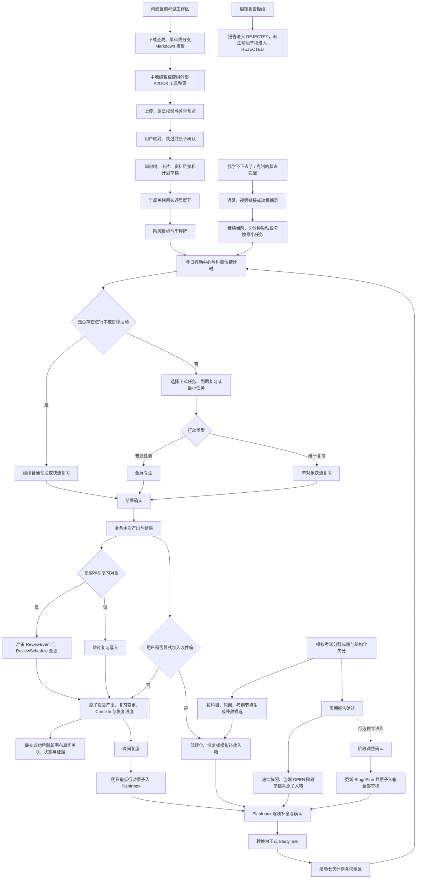

# v1.1 学习行动中心与闭环体验

## 当前状态

- 当前版本状态：产品、页面信息架构、学习树协议、关联画布与实施规格已经完成多轮闭环审查并定案，仍处于待开发（Planning），尚未进入业务代码实施。
- 当前可用基线：生产版本 `0.1.7` 已具备第一版与第二阶段现有文档范围内的核心能力。
- 是否已有线上 Release：没有。当前线上 `v0.1.7` 只是本计划的实现基线，不是 v1.1 的完成证据。
- 当前记录用途：汇总旧讨论任务 `019f6592-46db-7d71-8b30-d90b92acccf6`、当前任务以及后续多轮闭环审查中已经确认的产品、页面、交互、学习树模板、关联画布、状态反馈、数据、API、迁移、验证和发布决策。
- 当前实现边界：本文件只记录未来版本规格，不表示新应用壳、考试工作区、自定义科目、科目快捷计时、统一复习、计划收件箱、学习树版本导入、关联画布、知识卡片、资料资产、动机内容库、浏览器通知、七天看板、结构化失分条目或对应 API/schema 已经实现。
- 文档同步边界：本次只同步当前 v1.1 规划文件；获得实施授权后，再按 Batch 0 同步 `docs/product/**`、`docs/architecture/**`、`docs/modules/**`、`docs/ux/**`、`docs/security/**`、`docs/development/**` 和 `tasks/**`。
- 历史证据边界：v1.1 不计入既有 docs 100% 完成声明，也不改写 v0.1-v1.0、Package A-E 或生产 `v0.1.7` 的历史完成事实。
- 工作区边界：当前工作区已有大量未收口改动；v1.1 实施前必须形成独立 checkpoint，或在不覆盖现有改动的隔离分支中推进。

## 目标

把当前分散在首页、任务、计时、考纲、笔记、附件、错题、复盘、报告、模拟和阶段计划中的能力，组织成五个稳定工作台、一个当前考试工作区、一张全局知识关联画布和一条连续、可恢复、可验证的学习行动闭环。

本版本的核心结果是：用户可以下载标准学习树模板，在本地编辑器或外部 AI/OCR 工具中整理后上传；AreaForge 完成严格校验、差异预览和原子合并，再把考试目标、科目、知识点、卡片、资料、任务、依赖、计时和复习展示在同一关联空间中。用户打开 AreaForge 后仍可在 5 秒内看到一个明确行动；完成专注或快速复习后留下结构化结果和证据；复盘、规则、导入计划与显式 AI 建议只能先形成草稿或进入计划收件箱，再由用户确认创建任务或调整阶段计划。

完整产品闭环：

## Planning Gate

- 目标：让疲惫状态下的用户仍能快速看懂下一步，并从行动连续走到学习结果、复习历史、计划草稿和阶段调整。
- 非目标：不内置图片/PDF OCR，不上传或托管视频文件，不实现浏览器关闭后的后台 Push，不自动生成或应用完整学习计划，不自动应用 AI/报告/恢复建议，不物理删除资料或附件，不引入完整题库、多用户、自由白板或新的生产运维能力。
- Exact docs：Batch 0 必须逐项同步 `docs/product/feature-scope.md`、`docs/product/roadmap.md`、`docs/product/prd.md`、`docs/architecture/data-model.md`、`docs/architecture/api-surface.md`、`docs/architecture/file-storage.md`、`docs/architecture/ai-boundary.md`、`docs/security/threat-model.md`、`docs/security/file-ai-safety.md`、`docs/modules/check-in.md`、`docs/modules/task-debt.md`、`docs/modules/periodic-reports.md`、对应新增 module/UX 文档、`docs/development/dependency-policy.md`、`docs/development/feature-traceability.md`、`docs/development/validation-matrix.md`、错误恢复矩阵、`docs/development/doc-sync-checklist.md`、`docs/development/high-risk-confirmation-packets.md` 和 `docs/development/residual-risk-ledger.md`；每个文件必须注明工作区、学习树协议、导入留存、通知/AI payload、migration 或 residual 的落点。
- Open questions：产品主流程已定案；实施前仍必须完成源文档逐项同步、数据生命周期确认、依赖准入、兼容 floor、任务拆分、`AF-RISK-OPS-006`、`AF-RISK-OPS-007`、完整产品数据 migration 包和各次生产 apply 的实施确认。
- Decisions：五工作台、当前考试工作区、自定义科目与 408 分组、科目快捷计时、页面职责和信息密度、五个全局状态灯、状态栏/Popover/Drawer/Modal/Toast 分工、桌面分栏与移动全屏详情、稳定路由与返回上下文、学习树模板协议、导入版本与原子合并、全局关联画布、知识卡片、任务依赖、今日推荐、空队列、全屏专注、低转化补救、统一复习、`CheckIn v2`、恢复三阶、复习任务桥接、计划收件箱、资料资产、动机内容库、浏览器前台通知、模拟分科总分与结构化失分、报告/阶段不可逆版本决策、错误恢复、迁移拆分和三段发布均已定案。
- Owner skill：跨面编排使用 `areaforge-operating-loop`；体验由 `areaforge-product-experience` 主导；迁移、导入历史与并发由 `areaforge-security-governance` 把关；资料由 `areaforge-file-storage-safety` 主导；AI 边界由 `areaforge-ai-governance` 主导；新增依赖由 enterprise/supply-chain 治理复核；验证和文档收口分别由 `areaforge-validation-driver`、`areaforge-doc-sync` 驱动。
- Validation profile：Mission-Critical + Product Experience。规划阶段为 workflow/docs-only；实现阶段包含 Web、core、db、Prisma migration、storage、桌面/移动浏览器和临时 PostgreSQL 验证。
- Source docs：`docs/product/charter.md`、`docs/product/prd.md`、`docs/product/feature-scope.md`、`docs/product/roadmap.md`、`docs/architecture/data-model.md`、`docs/architecture/api-surface.md`、`docs/architecture/file-storage.md`、`docs/architecture/ai-boundary.md`、`docs/security/file-ai-safety.md`、`docs/development/feature-traceability.md`、`docs/development/high-risk-confirmation-packets.md`、`docs/development/residual-risk-ledger.md`、`workflow/README.md`。
- Source baseline：生产 `v0.1.7`、当前 Prisma schema、现有 API/UI、Package A-E 与 docs 100% 当前范围完成证据，以及本文件记录的后续产品讨论。
- Residual risk IDs：`AF-RISK-UX-001`、`AF-RISK-OPS-006`、`AF-RISK-OPS-007`、`AF-RISK-SC-002`、`AF-RISK-SC-004`，以及实施前必须登记的 `AF-RISK-DATA-001`（学习树规范化 Markdown 长期留存、备份扩散与未来撤销/物理删除缺口）。SC-002/SC-004 是 Release admission blocker；DATA-001 必须记录 data owner、验证 owner、接受期限、备份副本处理、用户撤销/未来删除路线和关闭条件，未完成登记与人工接受时不得开放导入 confirm。
- Release trigger：规划文档不触发 Release；任何用户可见页面、API、schema、storage 或业务规则进入线上时需要新的签名 GitHub Release。每个 Release 还必须有匹配 commit 的 CI/供应链记录、main protection readback、signed assets/provenance、backup/migration/smoke/rollback evidence；本地 governance preflight 不能替代 SC-002/SC-004 远端证据。
- Apply boundary：当前只是仓库文档变更，不改变运行时能力；未来普通读取为 R0，本地临时库和 fixture 为 R1，用户显式创建/确认为 R2，生产 migration、备份、恢复或 updater apply 仍是独立 R4 高风险动作。
- Evidence freshness：实施完成后必须使用当前 checkout 与当前运行实例的新鲜桌面/移动截图、核心旅程、API smoke、临时 PostgreSQL migration/并发证据和 storage crash fixture；历史截图和旧 Release 只能作为对比。
- 当前规划验证：至少运行 `pnpm tasks:doctor`、`pnpm docs:readiness`、`pnpm docs:completion`、`pnpm risk:preflight`、`pnpm governance:preflight`、`git diff --check`。
- 回滚：规划阶段只回滚本版本文档；实现阶段坚持 additive-first schema evolution，仅允许已批准的 Subject code 约束放宽，以及 DailyReview/CheckIn/PeriodicReportDecision 日期或周期唯一约束向 workspace 复合唯一的替换。优先回滚应用代码并保留新增表字段；一旦写入自定义科目、第二工作区或 workspace 复合唯一数据，不得直接回滚到 `v0.1.7`，必须回到同一 Release train 已验证的 compatibility floor。任何 DROP、历史数据修复、文件移动或生产 restore 都需另行确认。

## 版本决策总览

| 判断面 | 最终决策 |
|---|---|
| 产品主闭环 | 阶段目标、今日行动、执行/复习、证据、复盘、收件箱、任务、七天计划、报告和阶段调整形成循环 |
| 工作区闭环 | 一个当前考试工作区、默认和自定义科目、408 分组、历史工作区归档组成稳定范围边界 |
| 导入闭环 | 模板下载、本地编辑、上传校验、差异预览、冲突映射、原子确认、历史回放和稳定导出形成版本链 |
| 关联闭环 | 考试、科目、知识树、卡片、资料、任务、依赖、计时、错题、复习和证据在一张派生画布中可检查 |
| 交互闭环 | 空态、恢复、低转化、浏览器后退、断网、401、409 和本地草稿均有明确恢复路径 |
| 页面闭环 | 页面只承载真实数据和当前操作；说明、风险、证据、确认和结果由状态灯、状态栏、Popover、Drawer、Modal、Toast 分层承载 |
| 数据闭环 | PostgreSQL 保持主状态源；事件不可变，当前状态使用 revision/CAS，旧数据只读兼容且不批量回填 |
| 文件闭环 | `StudyResource` 与 `Attachment` 分离；FILE 一文件、LINK 一条 HTTPS URL；私有鉴权；重复三选一；不物理删除 |
| AI 闭环 | 只显式触发，只保存用户加入后的结构化建议，不自动修改任务、报告、阶段或掌握状态 |
| 动机闭环 | 主动求助或克制提醒 -> 匹配语录/视频/摘录 -> 返回一个最小行动，不让内容消费替代学习 |
| 发布闭环 | OPS-006 patch、OPS-007 patch、完整产品 minor 三段发布；生产动作分别确认和留证 |

## 目标完成态功能总览（假设 v1.1 全部实现）

| 功能域 | 完整用户能力 |
|---|---|
| 考试工作区 | 创建一个当前考试目标，设置目标日期和阶段；默认科目可继续使用，也可新增自定义科目；旧考试工作区可归档查看，不参与当前推荐 |
| 408 分组 | 画布中以 408 为分组展示数据结构、组成原理、操作系统和计算机网络；四科分别计时、排任务和统计 |
| 今日行动 | 5 秒内看到一个可解释的推荐动作、三个互斥队列、状态灯、最小任务入口和恢复动作 |
| 科目快捷计时 | 每科显示今日投入、近 7 日有效投入、当前任务/知识点和立即开始；全局同一时刻只运行一个 session |
| 专注收口 | 正计时、可选目标时长、暂停/继续/恢复、全屏专注、反假学习、低转化补救和笔记/错题/复测证据接力 |
| 阶段与计划 | 阶段、里程碑、计划草稿、正式任务和滚动七天计划形成层级；系统只生成可解释草稿，不静默应用 |
| 任务依赖 | 任务同时关联学习内容和前置任务；软依赖影响排序与提醒，硬依赖在前置未完成时阻止开始 |
| 学习树模板 | 下载空白全局模板、单科/分支模板或当前学习树导出模板，在任意本地编辑器或外部 AI/OCR 工具中编写 |
| Markdown 导入 | 上传标准 `.md`，完成协议版本校验、树形预览、新增/更新/移动/归档/冲突/忽略差异和人工映射 |
| 导入版本 | 保留规范化 Markdown、SHA-256、作用域、差异与结果；历史可软归档和显式导出，所选变更原子提交，语法错误和非法引用未解决前不写入 |
| 全局关联画布 | 从考试目标逐层展开到科目、章节、知识点，再查看任务、卡片、错题、资料、复习和证据；提供无限平移/缩放视口、搜索、筛选和聚焦 |
| 画布布局 | 桌面可拖动并跨设备保存个人布局，移动端可查看、搜索、展开和打开详情；业务关系始终来自真实对象 |
| 知识卡片 | 笔记入口承载普通、概念、方法、例题、日记、总结六类卡片；支持 Markdown 正文、主/相关知识点、附件、链接、归档和复习 |
| 资料资产 | 上传 PDF、PNG、JPEG、WebP、ZIP、Markdown，或保存 HTTPS 资料链接；支持标签、关联、重复处理、私有预览/下载和归档 |
| 统一复习 | 笔记卡片、错题、资料和考纲节点进入同一排期；快速复习、自评、复测、结果更正和任务桥接形成连续历史 |
| 复盘与 Inbox | 晚间复盘、低转化、恢复、报告、阶段、模拟和 AI 草稿统一进入 PlanInbox，由用户补全后转正式任务 |
| 动机求助 | 全局“我学不下去了”入口展示状态匹配的语录、HTTPS 视频链接或用户选择的动机摘录，并提供继续、5 分钟启动或最小任务 |
| 提醒 | 应用内提醒按复习、计划和晚间复盘分类设置；页面打开且用户授权时可发浏览器通知，默认隐藏具体标题 |
| 显式 AI | 用户主动选中文本后，可生成学习树、知识卡片、计划或动机草稿；发送前预览内容，结果只进入预览或 Inbox |
| 模拟与长期校准 | 分科模拟、结构化失分、补救入箱、7/30 天趋势、周/月报告、阶段调整和历史回放保持用户确认边界 |
| 错误恢复 | 草稿、离线、401、404、409、归档、暂停、superseded 和部分上传均有明确恢复动作，禁止强制覆盖和自动重放 |
| 无障碍 | 键盘、读屏、语义播报、焦点恢复、200% 缩放和画布等价列表覆盖核心旅程 |
| 私有与可运营 | 附件鉴权、AI 最小化、日志脱敏、additive-first schema、签名 Release、备份、smoke 和回滚证据保持既有安全边界 |

## 一、信息架构与稳定路由

| 工作台 | 稳定路由 | 主要内容 |
|---|---|---|
| 今日 | `/today` | 当前工作区、科目快捷计时、推荐动作、三队列、活动状态、恢复摘要、快捷创建 |
| 今日 | `/today/plan` | 正式任务、滚动七天日期计划、欠账和带日期收件箱数量入口 |
| 今日 | `/today/tasks/[taskId]` | 任务唯一详情、编辑、关联、行动历史和启动入口 |
| 今日 | `/today/inbox` | 计划草稿列表、筛选、补全、版本状态和逐项转换 |
| 今日 | `/today/inbox/[itemId]` | 单个收件箱项目详情、来源快照、差异与转换 |
| 知识 | `/knowledge/canvas` | 当前考试工作区的全局关联画布、搜索、筛选和快捷创建 |
| 知识 | `/knowledge/overview` | 待复习、薄弱节点、待整理资料和画布摘要 |
| 知识 | `/knowledge/imports` | 模板下载、Markdown 上传、无业务写入预览、映射、跳过和导入历史 |
| 知识 | `/knowledge/imports/[importId]` | 已确认导入的规范化源版本、逐项差异、结果和审计摘要 |
| 知识 | `/knowledge/syllabus` | 考纲树、节点详情、证据、复测 |
| 知识 | `/knowledge/syllabus/[nodeId]` | 考纲节点稳定详情 |
| 知识 | `/knowledge/notes` | 笔记列表、详情、Markdown 编辑与归档 |
| 知识 | `/knowledge/notes/[noteId]` | 笔记稳定详情 |
| 知识 | `/knowledge/mistakes` | 错题列表、详情、作答、解析与归档 |
| 知识 | `/knowledge/mistakes/[mistakeId]` | 错题稳定详情 |
| 知识 | `/knowledge/resources` | 资料上传、整理、预览、关联与归档 |
| 知识 | `/knowledge/resources/[resourceId]` | 资料稳定详情 |
| 知识 | `/knowledge/resources/[resourceId]/preview` | PDF/图片独立鉴权预览；ZIP 不进入该路由 |
| 知识 | `/knowledge/reviews` | 统一复习队列和历史 |
| 知识 | `/knowledge/reviews/[scheduleId]` | 复习排期、事件历史、暂停/恢复和来源链 |
| 复盘 | `/review/daily` | 晚间复盘和明日最低行动 |
| 复盘 | `/review/reports?tab=current\|history&period=week\|month` | 当前/历史和周/月报告分段切换 |
| 复盘 | `/review/reports/history/[decisionId]` | 已冻结报告决策历史详情 |
| 阶段 | `/stage/overview` | 当前阶段、里程碑、恢复/强化/冲刺状态 |
| 阶段 | `/stage/simulation` | 模拟考试、结构化失分和补救建议 |
| 阶段 | `/stage/simulation/[examId]` | 单场模拟的分科成绩、失分、补救和历史 |
| 阶段 | `/stage/analytics` | 7/30 天趋势和长期风险 |
| 设置 | `/settings/profile` | 账户、动机封存和个人档案 |
| 设置 | `/settings/workspace` | 当前/历史考试工作区、科目、408 分组、排序和归档 |
| 设置 | `/settings/ai` | AI 开关、Provider 状态和隐私边界 |
| 设置 | `/settings/experience` | 主题、显示和体验偏好 |
| 设置 | `/settings/notifications` | 复习、计划、复盘提醒窗口和当前设备通知隐私 |
| 设置 | `/settings/system` | 运行状态、版本中心和系统信息 |
| 沉浸流程 | `/focus/[sessionId]` | 普通全屏专注和结束收口 |
| 沉浸流程 | `/quick-review/[scheduleId]` | 单对象快速复习 |

- `/knowledge` 默认服务端重定向到 `/knowledge/canvas`；`/review`、`/stage`、`/settings` 进入各自默认子页。
- `/today/tasks/[taskId]` 是任务唯一 canonical 详情路径；不得新增 `/today/plan/[taskId]`、`/tasks/[taskId]` 或其他平行任务详情页。
- `/today/plan` 使用 `date=YYYY-MM-DD&subjectId=&status=&q=`；移动端固定为日期条加当前单日列表，桌面可展示滚动七天列。
- `/review/reports` 使用 `tab=current|history&period=week|month`；历史详情继续保留 `period`，返回时恢复历史标签、周期和列表位置。
- 知识工作台使用 `KnowledgeContext(workspaceId, subjectId, syllabusNodeId, q)`；切换画布、概览、考纲、笔记、错题、资料和复习标签时保留该上下文，用户可一键清除。
- 标签使用稳定路径；科目、状态、到期范围、关键词和其他筛选使用查询参数。
- `/` 登录后重定向到 `/today`。
- `/syllabus` -> `/knowledge/syllabus`；`/notes` -> `/knowledge/notes`；`/mistakes` -> `/knowledge/mistakes`；`/analytics` -> `/stage/analytics`；`/reports` -> `/review/reports`；`/simulation` -> `/stage/simulation`；`/motivation` -> `/settings/profile`。
- 旧路由持续兼容，只有未来单独确认并证明无依赖时才移除；现有 API 不因路由迁移而删除。
- 登录深链只接受白名单站内路径；非法、外部或缺失目标统一回 `/today`。
- 桌面使用宽工作区和可折叠侧栏；折叠后保留图标、tooltip 和可访问名称。
- 移动端使用五项底部导航；二级入口使用页面内标签或分段控件。
- 桌面列表类页面采用 35%-40% 列表加剩余空间详情的分栏；移动端点击条目后使用同一 URL 进入全屏详情，不在窄屏并列列表和长详情。
- 从列表进入详情统一使用 `push`；返回恢复原筛选、滚动位置和焦点。沉浸流程完成后才使用白名单 `returnContext` 执行 `replace`，浏览器后退不得结束活动。
- 顶栏只展示活动、复习、欠账、阶段和今日闭环五个紧凑状态灯；普通页面不常驻完整风险墙。
- 全局快速创建支持任务、知识卡片、错题和资料；画布中的快捷创建仍调用同一真实对象表单和服务。
- App Shell 顶栏提供全局“我学不下去了”次级入口；点击后打开 Drawer/移动端 Bottom Sheet，不改变页面唯一主动作约束。
- 知识卡片、学习树、计划和动机编辑页提供上下文 AI 工具栏；桌面使用工具栏按钮，移动端使用底部操作条或可访问菜单，均只对当前用户选中的文本触发。
- 动机入口和 AI 工具栏必须有可访问名称、键盘路径、焦点进入/返回规则；没有可选文本时 AI 按钮禁用并说明原因，不自动读取当前页面正文。

### 1.1 逐路由 UX Contract

每个 canonical route 统一采用“顶栏/面包屑 → 工作区与对象上下文 → 主内容 → 次要证据/历史 → sticky 主动作或底部导航”的视觉顺序。桌面列表页使用 35%-40% 列表列，详情列占剩余空间；移动端先显示对象摘要和唯一主动作，详情全屏并为底部导航预留安全区。

| Canonical route | 首屏区域顺序 | 唯一主动作 | 返回与关键状态 |
|---|---|---|---|
| `/today` | 工作区 → 推荐 → 三队列 → 科目卡 → 最小闭环 | 开始或继续当前行动 | 完成行动回本页；活动冲突保留证据并进入冲突 Drawer |
| `/today/plan` | 日期条/七天列 → 正式任务 → 欠账 → Inbox 数量 | 新建任务 | 保存留在列表；409 保留表单 |
| `/today/tasks/[taskId]` | 摘要 → 关联/依赖 → 历史 → 行动入口 | 开始或继续任务 | 列表 push；归档只读；失效回计划页 |
| `/today/inbox` | 筛选 → OPEN 草稿 → 版本/完整度 → 转换结果 | 转换当前选中项 | superseded 只读并指向 successor；409 展示差异 |
| `/today/inbox/[itemId]` | 来源 → 字段 → 依赖 → 转换预览 | 转换为任务 | 成功 replace 到任务详情；来源失效回 Inbox |
| `/knowledge/canvas` | 搜索/筛选 → 派生图 → 关系 Drawer | 打开当前聚焦对象 | 分支失败单独重试；布局冲突不清空画布 |
| `/knowledge/overview` | 待复习 → 薄弱节点 → 待整理资料 → 画布摘要 | 打开最高优先级对象 | 无数据显示事实空态 |
| `/knowledge/imports` | 模板/输入 → parser → diff → 历史 | 当前状态只显示“预览”或“确认”之一 | blocked 禁用确认；过期重新 preview |
| `/knowledge/imports/[importId]` | 源版本 → diff → 映射/结果 → 审计 | 查看导入结果 | 已确认历史只读；重试回 imports 新建 preview |
| `/knowledge/syllabus` | 搜索/树 → 列表 → 详情摘要 → 复测 | 新建节点；到期模式切换为开始复测 | 返回恢复筛选/焦点；归档只读 |
| `/knowledge/syllabus/[nodeId]` | 节点概览 → 状态/风险 → 证据 → 复测历史 | 可复测时“开始复测”，否则“编辑节点” | 列表 push；返回恢复树展开/scroll/focus；归档只读，409 保留编辑输入 |
| `/knowledge/notes` | 筛选 → 卡片列表 → 详情摘要 → 复习状态 | 新建卡片 | dirty 离开确认；归档只读 |
| `/knowledge/notes/[noteId]` | 阅读正文 → 主/相关节点 → 附件/资料 → 复习历史 | 阅读态“编辑卡片”；到期复习模式切换为“开始复习” | 列表 push；返回恢复筛选/scroll/focus；归档只读，409 保留草稿 |
| `/knowledge/mistakes` | 筛选 → 错题列表 → 作答状态 → 复习状态 | 新建错题 | 缺必填事实只能补全，不能确认通过 |
| `/knowledge/mistakes/[mistakeId]` | 题面 → 本次作答 → 错因/正确思路 → 历史 | 未作答时“提交作答”；已到期模式切换为“开始复习” | 列表 push；返回恢复筛选/scroll/focus；归档只读，409 保留作答 |
| `/knowledge/resources` | 上传/链接 → staging → 列表 → 整理状态 | 新建资料 | 部分上传在同一 Drawer 处理 |
| `/knowledge/resources/[resourceId]` | 摘要 → 关联 → 标签 → 复习/归档 | 整理并保存资料 | 鉴权失败提供重试或只读元数据 |
| `/knowledge/resources/[resourceId]/preview` | 鉴权预览 → 元数据 → 下载/返回 | 可下载时“下载资料”；纯查看格式可不显示主动作 | replace 进入、后退回详情；ZIP 不进入；401/格式不支持回资源详情 |
| `/knowledge/reviews` | 到期队列 → 已桥接 → 历史 | 开始下一项复习 | 暂停排期只显示恢复动作 |
| `/knowledge/reviews/[scheduleId]` | 来源 → 排期 → 事件 → 暂停/恢复 | 暂停或恢复排期 | 归档对象只读；不等同活动暂停 |
| `/quick-review/[scheduleId]` | 对象 → 作答 → 结果 → 下次日期 | 确认本次复习 | 完成 replace 回队列；409 保留草稿 |
| `/focus/[sessionId]` | 计时 → 上下文 → 产出 → 收口 | 结束并收口 | 后退不结束；完成 replace 回白名单来源 |
| `/review/daily` | 客观事实 → 失控点 → 明日最低行动 | 保存复盘 | 成功停留结果页；旧版本只读 |
| `/review/reports` | 当前/历史 → 周/月摘要 → 决策状态 | 确认当前报告决策 | 确认后留在本页，不自动进入阶段确认 |
| `/review/reports/history/[decisionId]` | 冻结快照 → 影响 → 入箱结果 | 查看冻结结果 | 返回恢复 tab/period/scroll；全页只读 |
| `/stage/overview` | 阶段 → 里程碑 → 草稿影响 → 证据 | 确认阶段调整 | 与报告确认独立；冲突重新读取 |
| `/stage/simulation` | 最近考试 → 分科 → 失分 → 补救 | 创建考试 | 保存进入详情；阶段草稿仅用状态栏提示 |
| `/stage/simulation/[examId]` | 整场 → 分科切换 → 失分 → 补救 | 保存当前考试结果 | legacy totals 只读；错误定位到分科行 |
| `/stage/analytics` | 7/30 天趋势 → 长期风险 → 下一步 | 打开下一步来源 | 无数据显示事实空态 |
| `/settings/workspace` | ACTIVE → 历史 → 科目/分组 → 影响 | 编辑模式为“保存工作区”；选中历史工作区时切换为“设为当前工作区” | 两种模式由 capability 互斥；切换后 replace `/today`；失败保留输入 |
| `/settings/profile` | 档案 → 动机封存 → 内容库 | 保存个人设置 | 私密正文不进入 AI 默认上下文 |
| `/settings/ai` | 开关 → Provider → payload 隐私 | 保存 AI 设置 | 密钥/策略变更使用确认 Modal |
| `/settings/experience` | 主题 → 显示 → 动画/缩放 | 保存体验设置 | 200%/窄屏仍可达全部控件 |
| `/settings/notifications` | 类别 → 时间窗 → 权限 → 隐私预览 | 保存提醒偏好 | 拒绝只降级，不循环请求 |
| `/settings/system` | 版本/健康 → 兼容性 → 只读状态 | 查看系统状态 | Web 不执行 migration/deploy/update |

列表路由的主动作按页面模式唯一切换，不同时展示两个主按钮：列表态是“新建”，选中到期复习后切换为“开始复习”；导入态依次为“预览”再“确认”；模拟创建态是“创建考试”，编辑态切换为“保存结果”。模式切换必须由服务端 DTO capability 驱动。

### 1.2 页面内容与反馈分层

- 主内容区只展示当前对象的真实数据、当前状态和当前可执行操作；不把长期风险、系统说明、确认边界、API 行为和大段提示直接堆在内容页。
- 每个页面最多一个主动作、最多一条页面状态栏；没有唯一恢复动作时不显示状态栏。
- 桌面顶栏固定五个状态灯：活动、复习、欠账、阶段、今日闭环。移动端合并为一个状态按钮：存在活动时优先显示活动，否则显示当前最高风险状态。
- 全局展示优先级固定为：未知保存结果或离线私密草稿 -> 409 冲突 -> 归档/暂停/阻塞 -> 普通业务风险。今日未闭环最高只到琥珀，不制造红色危机感。
- `Popover` 只放最多三行摘要和一个主动作；`Drawer` 承载原因、证据、历史、来源链和复杂差异；`Modal` 只用于阻塞决策、409 合并、拒绝、连带归档、主动退出登录和未保存离开；`Toast` 只反馈短暂成功或非阻塞结果。
- 状态颜色语义固定：灰色表示无动作或未知，蓝色表示进行中，绿色表示完成或健康，琥珀色表示到期或逾期 1-2 个学习日，红色表示阻塞、逾期至少 3 个学习日或严重欠账。

### 1.3 页面职责矩阵

| 页面 | 主内容 | 唯一主动作 | 可出现的唯一状态栏 | 深层内容容器 |
|---|---|---|---|---|
| `/today` | 当前工作区、科目快捷计时、当前推荐、三队列、活动与最小闭环 | 开始或继续当前行动 | 首次工作区设置、暂停活动、恢复模式最小行动、晚间复盘按优先级取一 | 状态 Popover；科目/任务/复习/欠账 Drawer；放弃或重排 Modal |
| `/today/plan` | 正式任务、七天日期计划、欠账、带日期 Inbox 数量 | 新建任务 | 仅计划写入冲突或高欠账恢复 | 任务详情走稳定路由；欠账建议 Drawer |
| `/today/inbox` | OPEN 草稿、来源、版本和字段完整度 | 转换为任务 | 仅 superseded、来源失效或 409 | 来源与差异 Drawer；转换确认 Modal |
| `/knowledge/canvas` | 当前考试工作区的派生关系图、搜索、筛选和逐层展开 | 打开当前聚焦对象 | 仅布局未保存、对象冲突或加载失败 | 关系/证据 Drawer；真实对象创建表单；重置布局 Modal |
| `/knowledge/imports` | 模板、导入草稿、校验结果、差异和历史 | PREVIEW 状态为“预览”；VALID 状态切换为“确认导入” | 仅语法/引用阻塞、源版本过期或 409 | 逐项差异 Drawer；映射/跳过面板；原子确认 Modal |
| `/knowledge/syllabus|notes|mistakes|resources|reviews` | 对象列表、阅读详情、关联和复习状态 | 按 1.1 route contract 与服务端 capability 只显示当前模式的一个动作 | 只显示当前标签内可执行的到期/恢复动作 | 桌面详情分栏；移动全屏详情；未保存离开 Modal |
| `/review/daily` | 客观事实、复盘表单、明日最低行动 | 保存复盘 | 晚间未复盘且已有有效学习时 | 客观事实 Drawer；保存结果 Toast |
| `/review/reports` | 当前周/月摘要、最大短板、一个下一步、决策状态 | 确认当前报告决策 | 当前版本待确认时 | 明细和历史 Drawer/详情路由；确认或拒绝 Modal |
| `/stage/simulation` | 最近考试、分科成绩、结构化失分 | 列表态“创建考试”；编辑态切换为“保存模拟结果” | 仅待确认阶段草稿 | 失分/历史/阶段建议 Drawer；阶段决策 Modal |
| `/stage/overview` | 当前阶段、下一里程碑、草稿摘要 | 确认阶段调整 | 当前版本待确认时 | 证据和影响 Drawer；确认或拒绝 Modal |
| `/settings/workspace` | 当前/历史考试工作区、科目、分组和排序 | 保存当前工作区 | 未配置当前工作区、归档影响或 409 | 科目编辑 Drawer；切换/归档 Modal |
| `/settings/notifications` | 提醒类别、时间窗、浏览器权限和隐私预览 | 保存提醒偏好 | 权限被拒绝或当前浏览器不支持时 | 权限说明 Popover；测试通知 Toast |
| `/settings/profile|ai|experience|system` | 当前设置和系统状态 | 当前分组的保存或检查动作 | 仅阻塞性系统结果或最近操作失败 | 详情 Drawer；更新/退出/策略变更 Modal |

### 1.4 页面状态矩阵

| 状态 | 主内容表现 | 状态栏与恢复 |
|---|---|---|
| Loading | 保持稳定尺寸的 Skeleton，不显示说明卡 | 不显示状态栏 |
| First use | `/today` 保留行动中心结构但不伪造任务或统计 | 唯一主动作“设置考试目标”；检测到旧数据时先进入接管预览，完成工作区与至少一门科目后返回原页 |
| Empty | 一句事实和一个主动作；有工作区但无任务时提供 25 分钟最小任务 | 不把空态包装成风险墙 |
| Offline | 保留最后一次可信读取；待写内容标记尚未保存 | 仅有待提交写入时显示“恢复网络后重试”，用户显式重提 |
| Unsaved | 标题旁显示 dirty 状态 | 离开时 Modal 提供继续编辑、保留草稿、放弃 |
| 409 stale | 保留本地输入，对冲突对象标 stale | 状态栏主动作“查看最新状态”；Drawer 展示差异，Modal 手动合并 |
| Archived | 只在归档视图或详情中展示 | 可恢复时提供“仅恢复”或“恢复并选择新日期” |
| Paused | 只在活动灯和行动页突出 | `/today` 提供“继续当前活动”，其他页不重复提示 |
| Superseded | 旧版本只读并链接 successor | 仅打开旧项时提供“查看最新版本”，不能恢复旧版 |
| Partial upload | 批次面板逐文件显示成功、失败、重复 | 在同一 Drawer 处理，不连续弹出多个 Modal |
| Import blocked | 保留已解析树和用户映射，不写业务对象 | 定位第一个语法/引用错误；全部阻塞解除后才允许原子确认 |
| Canvas partial | 先显示已加载层级、总量和继续展开入口 | 单个分支失败可重试，不清空已加载画布或重置个人布局 |

- 组合状态只渲染一条状态栏：`Offline + Unsaved` 显示“尚未保存，恢复网络后重试”；`409 + Unsaved` 显示冲突并保留本地草稿；`Archived + Paused Schedule` 显示对象已归档和“仅恢复对象”；`Import blocked + Offline` 先显示离线未提交；`active session + overdue review` 页面状态栏和移动状态按钮均优先活动，复习只保留在灯的 Popover。
- 离线读取必须显示“上次同步于 <服务端时间>”，浏览器 `online` 事件只触发可用性探测，不自动提交写请求。短草稿和长草稿继续按 24 小时/7 天隔离保存；同一对象只保留当前用户当前 revision 的一个草稿，其他标签页发现更新时标记 stale 并要求人工合并。

### 1.5 通用编辑、草稿与返回规则

- 对象详情默认阅读优先；只有创建成功后的首次补全或用户点击编辑图标时进入编辑态。
- 已有活动直接继续；启动全新行动时先打开预填确认面板，确认后再进入沉浸流程。
- 短动作草稿保存 24 小时；笔记、错题、资料整理、报告/阶段补充等长表单草稿保存 7 天。
- 用户主动退出登录成功后清除全部本地私密业务草稿；401、session 过期、离线和 timeout 保留草稿，不自动重放。
- 404 返回对象所属工作台；无法可靠判断来源时返回 `/today`。
- 409 禁止强制覆盖。客户端以 Modal 阻断提交，以 Drawer 展示服务端最新值、本地值和冲突字段，由用户手动合并后使用新 revision 重提。
- `returnContext` 只允许已登记的站内来源、筛选、scroll key 和 focus key；不得接受任意外部 URL 或可执行数据。

### 1.6 五个全局状态灯

| 状态灯 | 灰 | 蓝/绿 | 琥珀 | 红 | Popover 唯一动作 |
|---|---|---|---|---|---|
| 活动 | 无活动 | 蓝：进行中；绿：刚完成且结果已保存 | 已暂停且可继续 | 保存结果未知、活动状态冲突或无法安全继续 | 继续活动或查看冲突 |
| 复习 | 无正式排期 | 绿：当前无到期项；蓝：正在快速复习 | 今日到期或逾期 1-2 个学习日 | 阻塞或逾期至少 3 个学习日 | 开始下一项或查看队列 |
| 欠账 | 无欠账 | 绿：已完成当前恢复安排 | 存在可处理欠账但未形成严重堆积 | 严重欠账或恢复安排被阻塞 | 查看欠账区 |
| 阶段 | 无阶段数据 | 蓝：阶段进行中；绿：里程碑健康 | 里程碑临近、到期或有待确认草稿 | 阶段计划冲突或关键里程碑阻塞 | 查看阶段建议 |
| 今日闭环 | 尚未进入提醒窗口 | 绿：最低行动和当日复盘均已闭环 | 最低行动或晚间复盘尚未完成 | 不使用红色 | 开始最低行动或完成复盘 |

- 状态灯只反映服务端可解释状态，不用前端自行推断第二套业务事实。
- 五个灯同时存在时也不展开五块说明；用户点击后才进入 Popover，页面状态栏仍按全局优先级只选一条。

### 1.7 无障碍与缩放基线

- 所有主动作、状态灯、菜单、分段控件、Drawer、Modal、计时控制和画布详情均可仅用键盘完成；图标按钮必须有可访问名称和 tooltip。
- Modal 打开后焦点进入并限制在容器内；关闭后焦点返回触发控件。Esc 是否关闭由动作风险决定，未保存、拒绝和冲突 Modal 不允许误按 Esc 丢失输入。
- 路由变化、保存成功、错误、409 差异、计时暂停/继续和通知降级使用语义标题与 `aria-live` 播报；颜色不能作为唯一状态表达。
- 浏览器 200% 缩放、390px 窄屏和横屏下不得出现横向滚动、截断、遮挡或不可达控件。画布必须提供按关系/科目筛选的等价列表视图，供键盘和读屏用户完成相同查看与打开详情的任务。
- 主旅程页面必须使用唯一 `main`、层级连续的页面标题和可命名的 `nav/aside`；列表进入详情后焦点落到详情 `h1`，保存后回到触发按钮或结果标题，404/409/计时状态进入 assertive live region，普通成功进入 polite live region。画布键盘布局命令执行后播报对象、方向/分组和保存结果，并把焦点留在被操作节点；等价列表打开详情后遵循相同返回焦点规则。

## 二、今日行动中心

- 当前考试工作区是行动中心、计划、知识、模拟和统计的统一范围；只有一个 `ACTIVE` 工作区参与推荐，归档工作区只读可查。
- 首次使用没有当前工作区时，`/today` 不展示空白统计或大段教程，只显示一个设置状态栏和“设置考试目标”主动作。设置分为“考试目标与科目”和“旧数据处理”两步：检测到旧默认科目或 legacy 根记录时展示数量、影响范围和“接管到当前工作区/暂不接管并创建新科目”选项；确认前显示预览，失败保留输入并提供重试或安全退出，取消不创建 ACTIVE 工作区。
- 当天首次打开直接进入 `/today`，不强制晨间计划。
- 第一屏只突出一个当前推荐动作。已有进行中或暂停活动时直接继续；只有启动全新行动时才先打开预填确认面板。
- 推荐动作下方提供科目快捷计时区：每个科目固定显示今日有效投入、最近 7 个学习日有效投入、当前任务或主知识点摘要和开始按钮；`408` 只作为分组标题，数据结构、组成原理、操作系统、计算机网络分别计时和统计。
- 科目卡片点击“开始”时必须确认具体科目，可选任务、主考纲节点和目标时长；不要求先创建任务。确认后创建真实 `StudySession` 并进入 `/focus/[sessionId]`。
- 默认科目与自定义科目使用同一行为；已归档科目不参与新任务、快捷计时、推荐或当前统计，但历史对象继续按原科目显示。
- 三个互斥队列为：正式任务；笔记/资料/考纲复习；错题复习。
- 桌面每个队列展示前三项；移动端通过分段控件切换。
- 队列项只突出“开始”；编辑、延期、关联、归档等次要动作进入菜单。
- 如果三个队列都为空，主动作固定为“创建今天最小任务”：默认预计 25 分钟、科目必选、考纲节点可选，确认后可立即进入专注。
- 唯一推荐顺序固定为：继续活动 -> active RecoveryState 候选 -> 逾期项 -> 今日高优任务 -> 到期错题 -> 到期其他复习 -> 普通今日任务。
- 存在未完成硬依赖的任务不进入可开始推荐，只显示阻塞原因和前置任务入口；软依赖未完成时可进入推荐，但原因中必须明确提示。
- 同级按风险、逾期天数、预计时长、创建时间和 ID 稳定排序。
- 每个推荐必须展示可解释原因，不使用无法追溯的黑箱评分。
- 恢复模式首屏只突出一个最小行动和必要活动状态；完整任务、欠账和三队列不删除，但收纳到“查看完整计划”次级入口，不要求补完历史欠账。
- 如果一个正式任务承接某个到期 `ReviewSchedule`，当天只显示任务入口，避免任务和复习双入口。
- `/today/plan` 只读取正式任务、欠账和带日期、当前 OPEN、来源有效的 `PlanInboxItem` 计数，不返回草稿正文、来源快照或转换能力；未定日期、superseded 或来源已归档项目不计入，点击数量入口进入 `/today/inbox`。
- `/today/plan` 桌面展示滚动七天，移动端展示日期条和选中单日列表；选中日期写入 `date` query，不靠临时组件状态维持。
- 任务详情统一进入 `/today/tasks/[taskId]`；从今日、计划、Inbox 转换结果、复习桥接或通知进入时都使用同一详情路径。
- `/today/inbox` 负责草稿补全、版本判断、dismiss/restore 和转换；计划页不得复制 Inbox 编辑能力。

## 三、普通专注、收口与低转化

- 普通学习进入 `/focus/[sessionId]`，并可打开当前上下文资料抽屉。
- 计时器固定为正计时；可选目标时长只提供到点提示，不自动结束、不把超时判为失败。目标可在开始前设置，活动中只能按明确规则调整并记录审计摘要。
- `StudySession` 必须绑定当前工作区中的一个科目，可选绑定正式任务和一个主考纲节点；通过科目快捷卡启动时使用 `SUBJECT_SHORTCUT` 来源，仍遵守全局唯一 active session 约束。
- `/focus/[sessionId]` 固定提供“暂停”“继续”“结束并收口”三个可访问命令。暂停立即持久化状态与暂停开始时间，暂停区间不计入有效时长；刷新、返回或换页后只能继续或结束该 session，不能重新开始第二个活动。
- 只有“结束并收口”可以进入结果确认；暂停、继续和结束均携带 expected status/updatedAt、幂等键并返回稳定 409，保存结果未知时不得再次创建 session。
- 普通专注和快速复习互斥；服务端存在 active `StudySession` 时禁止开始快速复习。
- 同设备存在未确认快速复习草稿时，开始普通专注前必须继续、挂起或丢弃该草稿。
- 浏览器后退只离开当前视图，不结束、取消或自动暂停活动；来源页顶部和今日推荐首先显示“继续专注/继续复习”。
- 沉浸流程使用经过白名单校验的 `sessionStorage` 返回上下文；完成后使用 `replace` 返回原队列和原位置。
- 收口第一步记录：达成/部分达成/未达成、理解程度、最小产出、下一动作、任务完成/继续/受阻。
- 系统继续按现有反假学习规则判断 session 是否有效，并向用户展示可解释原因。
- 低转化必须先保存 session，再展示一个最小补产出动作。
- 低转化补救主动作是“立即补产出”；次动作是“加入收件箱”；用户仍可跳过，但系统不得伪造产出。
- 收口第二步只推荐一种证据：笔记、错题或复测。用户可以跳过。
- 证据在同一全屏流程中创建，并预填任务、科目和考纲上下文。
- 断网或请求超时时保留本地输入，显示“尚未保存”，联网后由用户显式重试；不建立离线写队列，不自动重放。
- 写请求收到 401 时保留草稿，跳转登录并携带安全 `returnTo`；登录后恢复页面和草稿，由用户显式重新提交。
- 普通专注收口、快速复习和其他短动作草稿保存 24 小时；笔记、错题、资料整理、收件箱编辑、报告和阶段补充等长表单草稿保存 7 天。
- 用户主动退出登录成功后清除全部本地私密业务草稿，包括快速复习、专注收口、笔记、错题、资料整理、收件箱编辑和未提交表单；session 过期、401、离线和 timeout 不清除。
- 草稿只保存在当前设备浏览器，不上传服务端，也不通过全局幂等账本建立自动同步队列。

## 四、统一复习与快速复习

### 4.1 核心语义

- 使用 `ReviewSchedule + ReviewEvent` 两层模型：Schedule 保存当前排期和暂停状态，Event 保存已经确认的不可变复习事实。
- 确认新的 ReviewEvent 只推进同一个持久 Schedule；Schedule 不被“完成”或消费，后续日期继续由该 Schedule 承载。
- 覆盖 Note、Mistake、StudyResource 和 SyllabusNode。
- 每个对象最多拥有一个持久 `ReviewSchedule`。
- `ReviewEvent` 只在确认时创建，不持久化 active/cancelled 事件。
- 结果固定为 `PASSED/PARTIAL/FAILED`，三种结果都属于真实复习。
- 结果由用户明确自评；系统不根据时间、输入长度或 AI 结果猜测通过状态。
- 零时长不能确认；服务端接受的单次复习时长范围为 1 到 14400 秒。
- 本地计时只用于单管理员自律场景的复习事实，不引入服务端 `ReviewAttempt`。
- 系统只根据结果计算建议日期，用户始终可以修改。

### 4.2 间隔与排期

- 失败：1 天。
- 部分：3 天。
- 连续通过：7、14、30、60 天，之后每次 60 天。
- 部分或失败将连续通过数重置为 0。
- 错题首次加入复习时默认次日排期。
- 笔记、资料和考纲节点由用户显式设置首次日期。
- 暂停复习时清空当前到期日并记录暂停原因。
- 恢复复习时必须重新选择日期，不自动沿用旧日期。
- 所有日期使用 `Asia/Shanghai` 学习日语义；日期输入规范化为上海学习日。

### 4.3 快速复习体验

- 快速复习使用 `/quick-review/[scheduleId]`，一次只处理一个对象。
- ReviewSchedule 的“暂停/恢复”只在 `/knowledge/reviews/[scheduleId]` 执行，改变排期状态、暂停原因和到期日；它不等同于暂停当前快速复习活动。
- 当前快速复习只提供“继续”“挂起草稿”“确认结果”“丢弃草稿”命令；挂起时冻结本地 elapsed 秒数，挂起区间不计入确认时长，继续后从原 elapsed 恢复。挂起/继续只作用于当前设备的本地草稿，不写 ReviewSchedule，不创建 ReviewEvent。
- ReviewSchedule 已暂停时禁止开始新的快速复习；活动期间 Schedule 被其他页面暂停时保留本地草稿、阻止确认并返回最新状态，用户必须先在排期详情恢复并重新选择日期，或丢弃草稿。
- 未确认草稿按用户和 schedule 隔离保存在 `localStorage`，24 小时过期。
- 确认、主动退出登录成功、显式丢弃或草稿过期时清除本地草稿。
- 错题在揭示错因和正确思路前，用户必须输入简短作答，或确认“已在纸上/口头作答”。
- Note、Mistake、StudyResource 的已确认 `ReviewEvent` 本身就是本次复习证据。
- 考纲确认在同一事务中创建对应 `MasteryRetest`；只有通过结果创建 `MasteryEvidence`。
- 部分和失败只保留真实复测事实并推进排期，不自动降低考纲状态或掌握等级。
- 确认成功后停留在结果页，展示结果、下次日期和证据摘要；只有用户点击“下一项”后才进入下一条，不自动跳转。

### 4.4 并发、幂等与更正

- 确认请求必须携带 `idempotencyKey` 和 `expectedRevision`。
- 同一幂等键和相同请求返回原结果；同一键但请求语义不同返回 409。
- 事务内原子完成：创建 Event、CAS 推进 Schedule、刷新 CheckIn、写审计；考纲目标同时创建 Retest/Evidence。
- revision 过期、目标归档、Schedule 暂停或状态已变化时返回稳定 409，不允许最后写入覆盖。
- 409 响应必须返回最新 revision/state 和冲突字段；客户端保留本地输入并展示变化，用户采用最新状态后才能重新提交。
- 只能更正该 Schedule 当前最新的有效 Event；已有后续复习时不能回改旧事件。
- correction 请求必须携带被更正 Event 的 `expectedRevision` 或等价 latest-event identity；事务锁定 Schedule 和当前最新有效 Event 后再次校验，两个基于同一 latest Event 的并发 correction 只能有一个成功，另一请求稳定返回 409。
- 更正通过追加 correction event 完成，不直接更新原 Event。
- 更正允许修改结果、下次日期和短备注；计时秒数不可回改，避免重写 CheckIn 和恢复阶段历史。
- correction 只追加 ReviewEvent，不创建或更新 Mistake，也不回写原事件。
- correction 归属原 ReviewEvent 的学习日，并重建原学习日 CheckIn 的结果分类；不增加今日复习次数，不追溯重算已经推进或结束的 RecoveryState。

### 4.5 旧排期兼容

- 无正式 Schedule 时，Note/Mistake 的旧 `nextReviewAt` 和 SyllabusNode 最新 `MasteryRetest.nextReviewAt` 继续形成只读虚拟排期。
- 用户首次编辑、开始或确认虚拟排期时创建正式 `ReviewSchedule`。
- 正式 Schedule 创建后只写新模型，旧字段保持历史只读，不再双写。
- 旧 API 中的排期字段在完整切换后映射到新 Schedule 服务，不继续更新第二日期源事实。

## 五、CheckIn v2 与恢复模式

### 5.1 CheckIn v2

- 继续扩展原 `CheckIn` 表，不新增第二张日快照表。
- 新增复习次数、复习秒数、通过/部分/失败计数和最低行动来源。
- 最低行动来源固定为 `NONE/SESSION/REVIEW/BOTH`。
- 当日已确认复习累计至少 300 秒可以满足最低行动。
- 快速复习时长不写入 `effectiveMinutes`，不伪增 `effectiveSessionCount`。
- 普通 session 指标继续按现有规则独立计算。
- 只有真实新写触达的学习日升级为 `sourceVersion=2`，并从该日真实 session、task、daily review 和有效 ReviewEvent 重建投影。
- 其他 `sourceVersion=1` 历史保持不动，不批量重算或回填。
- 快速复习按服务端确认时间归属上海学习日；普通 session 保持按 `startedAt` 归属。
- correction event 在聚合中替代原 Event，只计算一次有效复习事实。
- correction 触达 `sourceVersion=1` 的原学习日时，在同一学习日锁内从该日真实 session、task、daily review 和最终有效 ReviewEvent 重建并原子升级为 `sourceVersion=2`；不得只覆盖复习计数，也不得批量升级其他历史日期。

### 5.2 恢复模式

- 继续复用 `RecoveryState`，触发来源为规则或用户主动选择。
- 固定三阶目标：30、60、90 分钟。
- 阶段计量使用有效 `StudySession` 分钟和已确认 `ReviewEvent` 秒数；低转化或未确认活动保留事实，但不推进恢复阶段。
- 每个学习日最多晋级一阶，即使当天一次完成超过三阶总时长也不能跨阶跳过。
- 漏一天不倒退、不清零，继续停留当前阶。
- 完成第三阶后状态转为 `COMPLETED`，退出恢复排序并回正常模式。
- 第七天仍未完成时状态转为 `EXPIRED`，退出恢复排序，回到完整今日页，展示过期摘要和“重新开始恢复”按钮。
- 用户主动退出时状态转为 `CANCELED`。
- 同一用户的同一 workspace 同时只允许一个 active `RecoveryState`；不同用户或不同 workspace 的 active 状态互不冲突。历史 workspace 归档时取消其 active 状态，恢复 workspace 不自动恢复旧状态。
- 恢复状态不会批量延期、隐藏、删除或重写历史任务。

## 六、复习任务桥接

- `StudyTask` 可以关联一个 `ReviewSchedule`。
- 同一 Schedule 同时最多存在一个 `TODO/IN_PROGRESS/DEFERRED` 桥接任务；已完成或已跳过任务保留历史关联。
- 创建桥接任务时，`StudyTask.plannedDate` 与 Schedule 到期日保持一致。
- 七天正式任务看板仍只读取 `StudyTask.plannedDate`；ReviewSchedule 到期日只服务复习队列。
- 未完成桥接任务存在时，行动中心隐藏对应复习项，只显示任务入口。
- 延期桥接任务时，在同一事务中更新任务日期和 Schedule 到期日，并检查双方 revision/CAS。
- 放弃桥接任务后不自动取消复习；Schedule 保持到期并重新出现在复习队列。
- 拆分桥接任务时只有一个用户选定的子任务继承 Schedule，父任务和其他子任务不再抑制复习入口。
- 桥接任务不能在没有已确认复习结果的情况下完成；该结果以同一事务中新建的 `ReviewEvent.result` 为唯一源事实，不新增 `ReviewResult` 模型或第二结果表。
- 普通专注收口或手动完成桥接任务时，必须提交复习结果并在同一事务创建 ReviewEvent、推进 Schedule、完成任务、刷新 CheckIn 并写审计。

## 七、晚间复盘、计划收件箱与七天看板

### 7.1 晚间复盘

- 系统预填客观学习事实；用户填写失控点、保留动作、明日最低行动和可选情绪标签。
- 用户可以随时打开复盘；晚间时段只提高提醒优先级，不强制进入。
- 保存的明日最低行动自动形成计划收件箱项目，不直接创建任务。
- DailyReview 保存与明日最低行动入箱在同一事务内完成；任一写入失败都不能留下半份复盘或半份收件箱结果。
- 保存成功后停留在复盘页，展示简短结果和“查看收件箱”，不强制跳转。

### 7.2 入箱来源

- 自动入箱：明日最低行动、已确认周期报告中的计划草稿、已确认阶段调整中的计划草稿。
- 显式入箱：AI 建议、低转化补救、恢复建议、模拟失分补救。
- AI、低转化、恢复和模拟建议只在用户点击“加入收件箱”后保存。
- 未加入的 AI 建议不保存，也不持久化完整 prompt 或 raw response。

### 7.3 状态、版本和去重

- `PlanInboxItem` 持久状态固定为 `OPEN/CONVERTED/DISMISSED`。
- 是否可转换由状态、字段完整性、来源是否有效、是否为当前版本派生，不增加第二套持久状态。
- 来源保存不可变 `sourceType`、`originKey`、`originVersion` 和最小化 `sourceSnapshot`。
- `originKey` 是当前 workspace 内的 canonical 问题身份，不是跨工作区全局键；同一个底层学习问题可在同一 workspace 的模拟、报告和阶段建议间共享 `originKey`。
- 来源内容发生实质变化时创建新 `originVersion`；旧版本保留历史但不可转换。
- dismissed 项没有新版时恢复原行；已有新版时阻止恢复旧版，并定位到当前新版。
- dismiss 立即执行并提供短时 Undo；Undo 仍需重新校验当前版本，有新版时旧版不可恢复。
- 来源对象归档后，关联 OPEN 项保留历史但暂时不可转换。
- 来源恢复且项目未被新版本替代时，项目重新可转换。
- 已转换任务不因来源归档、修改或恢复而自动改变。
- 历史长期保留，不物理删除。

### 7.4 转换任务

- 可编辑字段为标题、科目、日期、预计时长、可选里程碑、一个主考纲节点、多个相关考纲节点和前置任务。
- 转换要求项目为当前 OPEN 版本、来源有效、标题/科目/日期/时长完整，科目与考纲节点一致。
- 导入或建议中的计划层级固定为 `StagePlan -> PlanMilestone -> PlanInboxItem -> StudyTask`；导入内容只能形成 Inbox 草稿，不能直接创建里程碑或正式任务。
- `af-plan.milestoneKey` 不存在时项目保持不可转换，并提供 canonical 里程碑创建入口；创建成功后返回原 Inbox 项重新校验，不在导入事务中隐式创建里程碑。
- 同批 `plan:<stableKey>` 依赖按拓扑顺序展示；前置 Inbox 尚未转换时，后继项显示“先转换前置计划”并定位到前置项。v1.1 不提供忽略依赖的批量转换，也不允许因转换顺序而静默丢边。
- 依赖默认创建为 `SOFT`；用户显式改为 `HARD` 前必须看到阻塞影响。转换时重新校验前置任务仍存在、属于当前工作区且不会形成环。
- 转换使用 `expectedRevision` 和幂等语义。
- 事务内完成：锁定项目、校验、创建 StudyTask、写唯一 `convertedTaskId`、更新状态、写审计、刷新计划日 CheckIn。
- 重试已成功转换的同一请求时返回原任务，不创建第二条任务。
- 如果项目来源于统一复习，可在转换时创建复习任务桥接。
- 转换成功后停留在 `/today/inbox`，当前行显示已转换结果并提供“打开任务”；打开后进入 `/today/tasks/[taskId]`。

### 7.5 报告/阶段批次与七天看板

- 报告确认在同一事务中冻结当前报告决策快照并将全部计划草稿入箱，不修改 `StagePlan` 或现有 `StudyTask`。
- 阶段确认在同一事务中更新 `StagePlan` 并将全部计划草稿入箱，不创建或修改 `StudyTask`。
- 报告决策和阶段草稿是两个独立来源版本；阶段草稿若由某个报告建议派生，必须保存 `sourceReportDecisionId`。相同底层问题继续复用 workspace 内 canonical `originKey`，阶段版本确认后将同 originKey 的旧报告 OPEN 草稿标记 `supersededByItemId`，不得生成两个同时可转换的等价草稿；非派生、语义不同的建议保留为独立项。
- 报告确认完成后只展示“查看收件箱”和可选“查看阶段建议”，不自动打开或确认阶段草稿；阶段确认同样不回写报告决策。
- 报告确认事务若产生阶段建议，必须同时创建带 `sourceReportDecisionId`、`sourceReportRevision` 和 `originVersion` 的 `StageAdjustmentDraft`，状态为 `OPEN`；报告确认失败则阶段建议一并回滚。`/stage/overview` 只展示当前 ACTIVE workspace、未被 supersede 的阶段草稿。报告拒绝不影响已冻结的报告历史，但会将其尚未确认的派生阶段草稿标记为 `REJECTED`，不得进入确认或转换；阶段确认后再按 `supersededByItemId` 规则替代等价报告 Inbox 项。
- 当前 workspace 已存在相同 `originKey + originVersion` 时视为幂等成功，并复用已有项目；其他 workspace 的同名来源不得冲突或被复用。
- 任一非幂等写失败时回滚整个确认事务，避免部分确认和部分入箱。
- 没有任何可执行草稿时仍允许确认；明确显示“没有新增收件箱项目”，不创建占位草稿。
- 七天看板固定为从今天起滚动 7 天。
- 正式任务继续以 `StudyTask.plannedDate` 为唯一日期源事实。
- 带日期草稿在计划页只形成数量入口；未定日期草稿只留在收件箱。计划页不展示任何草稿正文。
- 过期任务和任务债务进入独立欠账区，不与未来日期混排。

## 八、知识工作台

### 8.1 工作台、知识卡片与真实关系

- 一级入口固定为：关联画布、概览、导入、考纲、卡片、错题、资料、复习；“卡片”继续复用 `Note` 业务对象和 `/knowledge/notes` 路由，不新增第二套笔记源事实。
- `Note.kind` 固定为 `GENERAL/CONCEPT/METHOD/EXAMPLE/JOURNAL/SUMMARY`，分别表示普通、概念、方法、例题、日记和总结卡片；正文使用 Markdown，标题、类型、学习日期和 revision 为结构化字段。
- 每个任务和知识卡片最多有一个主考纲节点，并可关联多个同科目相关节点；计时、学习投入和直接完成证据只累计到主节点，相关节点只表达上下文关系。
- 概览优先展示待复习、薄弱节点、待整理资料、最近导入和画布摘要，不复制完整画布或导入差异。
- 科目/考纲上下文跨标签保持，并允许一键清除。
- 关键词搜索覆盖考纲标题、卡片标题/正文、错题题目/错因/正确思路、资料标题/标签；不搜索附件正文、PDF、图片或 ZIP 内容，不做 AI 语义搜索。
- 卡片、错题、资料、考纲和复习排期都采用阅读优先的列表加详情；创建成功或点击编辑图标后才进入编辑，支持显式保存和本地草稿。
- Note、Mistake、StudyResource 支持软归档；SyllabusNode 在 v1.1 不提供删除，只允许由用户显式设置 `archived=true` 归档。
- 对象归档自动暂停 Schedule，历史 ReviewEvent/MasteryRetest 保持可见；恢复对象本身不恢复 Schedule，若同时恢复复习必须重新选择日期。
- 新错题必须具备题目、错因和正确思路；旧缺字段错题继续只读展示为“待补全”，补全前不能加入新快速复习或确认通过。
- 错题连续通过后只提示用户确认掌握，不自动修改考纲状态或掌握等级。
- 考纲桌面采用左侧树和右侧详情；移动端从列表进入全屏详情。考纲详情分为概览、证据、复测，学习进度、掌握等级和风险保持独立状态。
- 详情 canonical 路由固定为 `/knowledge/syllabus/[nodeId]`、`/knowledge/notes/[noteId]`、`/knowledge/mistakes/[mistakeId]`、`/knowledge/resources/[resourceId]` 和 `/knowledge/reviews/[scheduleId]`。
- 在知识标签间切换时保留 `workspaceId + subjectId + syllabusNodeId + q`；进入详情和返回列表时恢复筛选、滚动位置和焦点。

### 8.2 学习树 Markdown 协议与模板

- 协议名固定为 `AREAFORGE_LEARNING_TREE_V1`，使用 YAML frontmatter、Markdown AST 和 `remark-directive` 指令解析；不得用正则或字符串拼接临时解释业务语义。
- YAML frontmatter 必须声明 `protocol: AREAFORGE_LEARNING_TREE_V1`、`scope: global|subject|branch` 和 `workspaceKey`。`subject` scope 必须声明 `subjectKey`，`branch` 还必须声明 `rootNodeKey`；未知必填值、重复 key 或跨工作区引用均为阻塞错误。
- `global` scope 使用 `::af-group{#groupKey title="408"}` 和 `::af-subject{#subjectKey title="..." group="groupKey"}` 明确科目边界；未归属到 subject 的考纲、卡片、资料或计划均为阻塞错误。导入不得通过 group 指令创建 session 或统计第二源事实。
- `H1-H6` 标题定义当前 subject 内的考纲节点及父子层级；标题后的可选 `::af-node{#stableKey ...}` 叶指令承载稳定 ID、显示顺序、状态和 `archived`。首次导入可省略该指令或 ID，由预览生成；同级稳定 ID 唯一，最大深度 6，标题不得为空。
- `:::af-card{#stableKey kind="CONCEPT" title="..."}` 容器指令定义知识卡片，容器正文是 Markdown；卡片可声明 `subjectKey`、`primaryNode` 和 `relatedNodes`，但不得跨科目关联。
- `::af-resource{#stableKey kind="LINK" subjectKey="..." title="..." url="https://..."}` 只定义 HTTPS 外部资料链接；学习树文件不能内嵌或上传二进制附件，也不触发服务端抓取、预览或元数据请求。
- `::af-plan{#stableKey subjectKey="..." title="..." milestoneKey="..." durationMinutes="25" dependsOn="plan:other-key" dependencyType="SOFT"}` 只形成 PlanInbox 建议；`dependsOn` 仅引用同一导入中的 `plan:<stableKey>`，引用现有任务必须在预览映射 UI 中选择。`milestoneKey` 只能引用当前工作区已有里程碑，不存在时阻止确认并提供 canonical 创建入口，不自动创建里程碑或依赖边。
- 每个 plan directive 在 preview 时生成不可变的 batch-scoped ref，身份由 `sourceSha256 + canonicalPlanHash + plan stableKey + originVersion` 派生并写入逐项结果；confirm 和失败重试只能通过该 ref 映射同批依赖。部分 Inbox 转换后仍保留原 ref 到 `convertedTaskId` 的映射，后继转换不得依赖列表顺序或客户端临时 ID。
- node/card/resource/plan 的 stableKey 首次导入均可省略，但 preview 必须生成并展示；AreaForge 导出后所有对象都必须带 stableKey，后续 UPDATE/MOVE/ARCHIVE 只按稳定 ID 或用户确认映射识别。
- 原始 HTML、脚本、iframe、图片语法、未声明指令、无效属性、重复稳定 ID、循环引用和跨科目引用均阻塞确认；普通段落只在卡片容器中作为正文保留，不允许静默忽略未知业务语法。
- Markdown 渲染固定关闭 raw HTML，经过 AST 节点/属性 allowlist 和 sanitizer；链接只允许明确的安全 scheme，统一使用 `noopener noreferrer` 与最小 referrer policy。远程图片、embed、iframe、`javascript:`、危险 `data:` 和 renderer 扩展产生的任意网络请求均禁止；preview 使用与正式详情相同的 renderer/CSP，并以恶意 Markdown corpus 验证 fail closed。
- 单次导入限制在 2 MiB、5,000 个业务对象、深度 6；解析器必须输出确定性的 canonical AST、规范化 Markdown、source line、warning/error、`protocolVersion`、`sourceSha256` 和 `canonicalPlanHash`。最大规模 confirm 必须使用 bulk write 并满足受控事务时限，超限在 preview 阶段拒绝，不在提交中途降级为部分成功。
- 提供全局空白模板、单科模板、当前分支模板和当前作用域导出模板。第一次导入可不写稳定 ID，但所有无 ID 新对象必须在预览中生成 ID；AreaForge 后续导出始终带稳定 ID。
- 用户可在本地编辑器或外部 AI/OCR 工具中准备 Markdown；AreaForge v1.1 不内置 OCR，也不读取外部工具上下文。

### 8.3 导入预览、原子合并、历史与导出

- 导入固定为“上传/粘贴 -> 解析校验 -> 差异预览 -> 人工映射/跳过 -> 原子确认”五步；预览阶段不得创建或更新考纲、卡片、资料、任务、Schedule 或 AuditEvent。
- 差异类型固定为 `ADD/UPDATE/MOVE/ARCHIVE/UNCHANGED/CONFLICT/SKIP`。文件中缺失的既有对象保持不变；只有明确 `archived=true` 且用户保留该变更时才归档。
- 无稳定 ID 的首次导入按作用域、科目、父路径和标题生成候选匹配；任何一对多、多对一或跨层移动必须由用户映射或跳过，不能自动猜测覆盖。
- 语法、引用、依赖环、跨科目关系、过期 revision 或未解决冲突中的任意一项存在时，确认按钮保持禁用。
- preview token 使用 HMAC 认证的 opaque token 绑定 `actorId`、`workspaceId`、`protocolVersion/parserVersion`、`sourceSha256`、`canonicalPlanHash`、scope、根 revision、expiry 和 nonce；v1.1 不规定或依赖 JWS wire format。token 不包含可执行对象字段，也不能跨用户、工作区或 parser 版本复用。
- 确认请求必须重新提交 canonical Markdown、preview token、逐项选择结果和 `idempotencyKey`；服务端重新解析、重算 hash、重建 diff，并只接受 token 允许的 scope/stable refs。客户端不能提交或覆盖服务端对象字段、diff 类型、来源 identity 或目标 revision。
- Batch 4 阶段所有 node/card/resource/plan directive 都只能形成无业务写入 preview diff，不开放 confirm。Migration 4 先提供并验证 StudyResource schema，Migration 5 再提供导入批次/明细和 confirm 服务；两项 gate 均通过后，确认事务才可原子应用选中的节点、卡片、HTTPS 资料链接和 PlanInbox 草稿。任一写入失败整体回滚，不留下部分知识树或半份历史；资源 directive 未满足 gate 时必须明确阻塞，不能静默跳过。
- 导入批次保留规范化 Markdown、SHA-256、协议/parser 版本、作用域、差异、映射、跳过项、统计、确认结果和审计关联；不得保存二进制附件、完整 AI prompt/raw response 或内部文件路径。
- v1.1 将已确认导入批次视为用户可见版本历史，默认与业务数据同周期保留并进入数据库备份；只允许当前用户读取和导出。v1.1 不提供物理删除导入源版本，用户可软归档并从默认历史隐藏；未来增加物理删除、保留期缩短、用户迁移或批量清理必须单独高风险确认，并记录备份副本与审计最小保留的处理方式。
- 导出前必须预览作用域、对象数量和将包含的卡片正文/计划标题/外链域名；用户显式确认后生成一次性鉴权下载。导出文件不写服务器长期临时目录，响应结束即释放临时资源，日志只记录 scope、计数和 hash。
- 相同幂等键和相同请求返回原结果；同一键不同内容、源 hash 变化、目标 revision 过期、父节点归档或协议版本不匹配返回稳定 409，禁止强制覆盖。
- confirm 失败并整体回滚时不得留下半成品 Batch；同一 idempotencyKey 只有在 canonical request fingerprint 完全相同且 preview token 仍有效、根 revision 未变化时允许重试。token 过期、nonce 已消费、parser/root revision 变化或 fingerprint 不同必须返回稳定错误并要求重新 preview。
- 鉴权导出只生成所选全局、科目或分支作用域的 canonical V1 Markdown；不导出内部数据库 ID、Attachment URI/storedName/绝对路径、AI prompt/raw response 或未选择的私密动机正文。
- 现有 `POST /api/syllabus/import-markdown` 保持 legacy append-only 兼容，不无声切换为 merge；新 UI 只使用版本化 preview/confirm API。未来移除旧入口必须另行盘点和确认。

### 8.4 全局关联画布

- `/knowledge/canvas` 是当前考试工作区的一张全局派生关系画布，不是自由白板，也不是新的业务数据容器。
- 画布节点白名单为考试工作区、科目分组、科目、考纲节点、知识卡片、错题、资料、任务、里程碑、StudySession 摘要和 ReviewSchedule；边由真实外键、关联表和依赖边派生。
- 默认从考试目标逐层展开到分组、科目和一级考纲；附件、HTTPS 链接、复习事件和历史证据默认折叠为子节点，用户按需展开。
- 提供无限平移/缩放视口，并支持搜索、类型/科目/状态筛选、聚焦、逐层展开、折叠、固定节点和重置布局；业务对象规模目标约 5,000 个，使用服务端分层查询和客户端按需加载，不一次渲染全部节点。
- 桌面允许拖动并保存个人节点位置、折叠和固定状态，布局跨设备同步；键盘和读屏用户同时可使用“向四方向微调、移动到视觉分组、自动布局、固定/取消固定、隐藏/恢复、重置”命令完成等价布局操作。所有命令只修改 `KnowledgeCanvasLayout`，不得改变科目归属、考纲层级或业务边；移动端只允许搜索、平移、缩放、展开和打开详情，不允许拖动改布局。
- 画布上创建任务、卡片、错题或资料时调用 canonical 表单和服务；保存成功后画布从真实对象重新派生，不在布局表中复制标题、正文、状态或业务关系。
- 用户不能任意创建、删除或改写业务边；任务依赖和主/相关知识点必须在对应对象表单中编辑。删除布局节点只表示隐藏/折叠，不归档业务对象。
- 附件缩略或预览继续通过鉴权 API；画布 DTO 不返回 URI、storedName、绝对路径、正文全集或动机私密内容。

## 九、资料资产

### 9.1 模型与整理

- 资料业务模型固定命名为 `StudyResource`。
- `Attachment` 继续只表示私有文件 metadata、hash、URI 与存储 identity。
- 资料来源固定为 `FILE/LINK` 二选一。文件型资料对应一个 READY `Attachment`；链接型资料只保存规范化 HTTPS URL，不创建 Attachment；不引入多文件资料容器。
- Attachment 可以同时保留原 `noteId` 并被一个 StudyResource 引用；加入资料库不转移笔记附件归属。
- `Attachment.status=PENDING|READY|FAILED` 只表示 OPS-007 文件 staging/finalize 存储生命周期；`StudyResource` 不复制这组状态。资料整理状态由字段派生：`UNSORTED`（缺少标题、类型或有效关联）、`READY_FOR_USE`（字段完整且引用 READY Attachment/合法 HTTPS）、`ARCHIVED`（用户软归档）。上传 staging 未进入 READY 前不得创建正式 FILE StudyResource；链接型资料不经过 Attachment 生命周期。
- 整理完成要求：有效标题、固定资料类型、合法来源，并至少有一个主科目、标签或业务关联。
- 快速上传后标题默认原文件名，链接型默认使用用户输入标题，类型默认“其他”；条件不满足时显示为待整理。
- 固定资料类型：教材/讲义、课程资料、习题/题集、真题/模拟、题解/解析、总结/速查、截图/图片、其他。
- 资料类型只是业务分类，不放宽文件 MIME、magic bytes、大小、私有下载或 AI 禁止读取边界。
- 允许一个可选主科目、自由标签，以及与任务、笔记、错题和考纲节点的多个显式关联。

### 9.2 文件与重复处理

- 文件型资料支持 PDF、PNG、JPEG、WebP、ZIP 和 Markdown。
- ZIP 只私有保存和鉴权下载，不解压、不预览、不解析。
- Markdown 作为普通私有文件保存，可在鉴权预览页以禁用原始 HTML 的安全 Markdown 渲染；不会自动导入学习树，只有用户显式进入学习树导入流程时才按第八章协议处理。
- 一次最多选择 5 个文件，每个文件独立返回成功、失败或待重复决策结果。
- 单文件限制 20 MB。
- 上传必须继续校验 MIME、magic bytes、大小、hash、路径和私有存储边界。
- ZIP 准入必须补齐 MIME/magic-byte、下载 disposition、storedName/路径禁泄漏、不解压、不预览和不传 AI 的专项实现与测试；当前 0.1.7 不具备该能力，不能在 v1.1 实施前冒充已支持。
- 重复检测采用两阶段协议：先进入 OPS-007 staging、计算 SHA-256，再决定是否写入最终文件。
- SHA-256 重复时由用户选择复用已有资料、上传副本或跳过。
- 重复文件在同一个批次结果 Drawer 中逐项选择复用、上传副本或跳过，不为每个文件连续弹出 Modal；只有用户离开仍存在未决 staging 的批次时才确认。
- 复用已有资料不创建文件或新 StudyResource，只在用户确认后增加需要的业务关联。
- 上传副本创建独立 Attachment 和 StudyResource，允许相同 hash，并记录 `duplicateOfResourceId`。
- 跳过只终止本次新协议 staging，不修改现有资料或附件。
- 旧笔记附件只有在用户显式“加入资料库”后创建 StudyResource，复用原文件，不复制、不自动回填历史资料。
- 链接型资料只接受 `https:`，拒绝 `http:`、`javascript:`、`data:`、`file:`、localhost 和内网地址；服务端不 fetch、不跟随 redirect、不抓取 OpenGraph、不生成缩略图。
- 打开外部资料只由用户点击后在新窗口执行，并使用 `noopener noreferrer`；页面明确显示目标域名，避免把外链伪装成私有附件。

### 9.3 使用、预览和归档

- PDF/图片/Markdown 使用 `/knowledge/resources/[resourceId]/preview` 鉴权全屏预览和元数据侧栏；ZIP 只提供鉴权下载；链接型资料进入详情后由用户显式打开外站，不进入私有预览路由。
- DTO 不暴露 `Attachment.uri`、`storedName`、上传绝对路径或文件系统细节。
- 资料详情的“开始学习”优先选择未完成关联任务。
- 没有关联任务时，预填创建今日正式任务；科目缺失时要求用户补选。
- 资料可由用户显式设置首次复习日期并进入统一复习队列。
- 归档保留 Attachment、标签、关联和历史，自动暂停 Schedule。
- 恢复资料不自动恢复排期，必须重新选择日期。
- 解除业务关联只删除关联关系，不删除资料、Attachment 或文件本体。
- v1.1 不提供资料/附件物理删除，不自动清理历史 orphan。
- 资料上传泛化前必须达到 `OPS-007 local implementation confirmed + matching signed patch evidence`；完整产品进入生产前还必须具备 `independent production apply evidence`，不得用 residual 人工关闭状态替代任一级 gate。

## 十、模拟失分、报告与阶段调整

### 10.1 结构化失分

- `SimulationSubjectResult` 新增 `paperFullScore`；分科满分、目标分、实际分和 `SimulationLossItem.lostScore` 全部使用 0.5 分步进。
- 新建和编辑模拟必须提交完整分科结果；整场满分、目标分和实际分全部由分科结果汇总，新 UI 不写 `SimulationExam` 根级 totals。
- 真实丢分基准固定为 `paperFullScore - actualScore`；目标分差单独计算为目标与实际的差值，两者是独立指标，不得互相替代。
- `SimulationLossItem` 直接归属 `SimulationSubjectResult`，不重复保存科目第二源事实。
- 字段包含固定原因、可选考纲节点、正小数失分值和可选备注。
- 固定原因：概念缺口、记忆/公式、方法错误、计算/粗心、时间分配、审题理解、题型陌生、心态、未作答、其他。
- 考纲节点必须属于对应科目。
- 单项失分 >= 5 分，或同节点/原因在一场考试累计 >= 10 分，判定为高严重度。
- 条目失分总和与真实丢分不一致时返回 warning，但不阻止保存。
- 条目支持软归档和恢复，不物理删除。
- 报告、排序和补救建议只聚合未归档条目。
- 对应科目一旦存在任何结构化失分历史，旧 `SimulationSubjectResult.lossReasons` 永久只作历史展示，不因全部新条目归档而重新参与聚合。
- `SimulationExam.lossReasons` 只作整场历史展示，不与科目结构化聚合混算。
- 历史无分科记录使用 `totalsSource=legacy_fallback` 和 `legacyDisplayTotals` 只读展示，并允许进入历史趋势。
- `legacy_fallback` 不参与结构化失分、严重度、报告候选、补救候选或阶段建议；编辑这类历史记录前必须先补齐分科结果，补齐后切换为 `totalsSource=subject_sum`。

### 10.2 从失分回到行动

- 模拟结果保存后，按“科目 + 原因 + 考纲节点”聚合失分并生成补救候选。
- 用户逐项选择“加入收件箱”；模拟保存本身不自动创建任务或收件箱项目。
- “保存模拟结果”和“将选中补救加入收件箱”是两个显式命令，分别返回各自结果，禁止在保存模拟时隐式入箱。
- 补救建议使用对应失分条目或聚合问题的共享 `originKey`。
- 失分来源修改后生成新版本；旧 OPEN 项变为不可转换。
- 失分来源归档后，关联 OPEN 项暂时不可转换；恢复且未出现新版时可重新启用。
- 已转换任务不因失分条目修改或归档而自动改写。

### 10.3 报告和阶段

- 趋势视图支持 7 天和 30 天切换。
- 报告页使用 `tab=current|history` 和 `period=week|month` 分段切换；首屏只展示当前周期的计划偏差、最大短板、一个下一步和当前决策状态。
- 历史报告从列表进入 `/review/reports/history/[decisionId]`，返回时恢复历史标签、周期、筛选和列表位置。
- 周/月报告只有在考试属于当前周期且失分构成高严重度时，才将相关短板提升为优先候选。
- 报告确认冻结报告快照，并按第七章规则原子入箱全部草稿。
- 阶段概览优先展示当前阶段和下一里程碑。
- 阶段调整确认后更新 `StagePlan`，并原子入箱全部计划草稿。
- 阶段调整不自动创建、修改、延期、删除或批量重排任务。
- 报告和阶段建议继续显式展示 `canAutoApply=false`、`requiresUserConfirmation=true`。
- Report/Stage reject 前必须使用 Modal 说明不可逆影响；拒绝后当前 draft/version 进入 `REJECTED` 终态，不能恢复、确认或再次拒绝，重新考虑必须生成新版本。
- 报告确认、阶段确认或拒绝后都停留在原页，展示冻结版本、入箱数量或拒绝结果，并提供“查看收件箱”；不自动跳转。
- 模拟详情采用整场总览加单科切换，移动端不同时堆叠整场、所有分科、全部失分和阶段建议。

## 十一、设置与 AI 边界

### 11.1 动机内容库与恢复动作

- 动机封存与动机内容库归入 `/settings/profile`；内容类型固定为语录、HTTPS 视频链接和用户显式选取的动机封存摘录。
- 全局提供“我学不下去了”入口；结果使用 Drawer/Modal 呈现一条匹配内容和三个行动：继续当前、5 分钟启动、切换到最小任务。内容消费不能成为独立完成指标或替代学习行动。
- “继续当前”有活动时只继续已有 session；“5 分钟启动”无活动时必须先选择未归档科目，再创建真实 `StudySession(goalMinutes=5, startSource=RECOVERY)`；“切换到最小任务”选择或创建真实最小 `StudyTask` 后进入专注。开始前取消不写 session/task，开始后遵守普通专注暂停、结束和收口规则。
- 自动提醒默认关闭。启用后仅在应用打开、没有进行中的沉浸活动且命中恢复/低转化/用户时间窗时评估；两次自动展示至少间隔 4 小时，每个上海学习日最多 2 次，绝不打断普通专注或快速复习。
- 视频只保存和打开 HTTPS 链接，不上传、不托管、不嵌入 iframe、不自动播放、不由服务端预取。
- 动机正文不进入普通页面常驻摘要、全局日志、浏览器通知标题或 AI 默认上下文；画布只展示“存在动机内容”的最小摘要，不展示正文。

### 11.2 应用内提醒与浏览器通知

- 提醒类别固定为到期复习、计划开始和晚间复盘；每类可单独开启、设置时间窗和安静时段。
- 应用内提醒由状态灯、页面状态栏和队列承担，不新增堆叠式提示卡；同一对象在同一时间窗去重。
- 浏览器通知必须由用户显式授权，只在 AreaForge 页面仍打开时发送；v1.1 不注册后台 Push，不承诺关闭浏览器后的通知。
- 通知默认 payload 的 `title/body/tag/action label` 均使用泛化文案，不显示任务、考纲、卡片、错题或动机标题；`data` 只包含白名单 canonical route 和 opaque object id，不包含正文、查询参数、外链 URL、动机摘录或学习状态。用户可以在当前设备本地偏好中单独选择显示具体标题。
- 通知点击只能进入白名单站内 canonical 路由；对象已归档、已完成或不存在时回到所属工作台并显示短状态，不自动执行任何写动作。
- 权限拒绝、浏览器不支持或系统阻止通知时，只降级为应用内提醒，不循环请求权限，不显示红色故障墙。

### 11.3 显式 AI 草稿

- 外部 AI 只能通过用户显式 POST 动作触发；普通页面读取、SSR、GET、定时任务、导入预览或后台任务不得自动外呼 AI。
- v1.1 提供学习树、知识卡片、计划和动机四类文本草稿；用户必须先选中文本或填写专用输入，发送前预览将发送的全部内容和用途。四类 endpoint 分别固定 allowed fields、最大字节/token、超限规则、`selectionHash`、`previewPayloadHash`、`providerPayloadHash`、`payloadProjectionVersion` 和 schema version；所有可选上下文只能来自下表列明且由用户勾选的本地投影，服务端不得额外读取正文。
- 三个内容派生 hash 使用至少 32 字节、仅服务端可读、按环境隔离的 `AI_PAYLOAD_BINDING_SECRET` 做 domain-separated HMAC-SHA-256，purpose 固定为 `selection:v1`、`preview:v1`、`provider:v1`；禁止使用无密钥 SHA-256 或把 digest 当作跨请求、跨用途、跨环境用户标识。
- hash 只用于同一次“发送前预览 -> provider 请求”一致性验证，放在最长 30 分钟的 opaque authenticated preview token 中；浏览器、日志、AuditEvent、metrics 和 console 不读取或输出单独 digest。密钥轮换立即使未完成 token 失效，用户必须重新预览，不保留旧密钥验证窗口。
- AI preview token 还必须绑定 `actorId`、`workspaceId`、具体 endpoint/purpose、opaque `operationId`、expiry 和 nonce；provider 外呼前以 operationId/nonce 原子占用并记录最小状态。同一有效请求重试返回同一操作结果或稳定进行中状态，不再次外呼；跨 actor/workspace/endpoint 使用、已消费 token 重放或 payload 不一致统一 fail closed。
- 学习树 AI 结果只是可编辑 Markdown 草稿，仍必须经过同一 `AREAFORGE_LEARNING_TREE_V1` preview/confirm；计划结果只进入预览或 PlanInbox，不能绕过校验直接创建任务。
- AI 只发送用户本次明确选择的文本和下表允许、预览中逐项勾选的结构化投影；默认禁止发送未选择正文、完整动机库、完整情绪记录、完整复盘、附件/图片/PDF/ZIP 内容、OCR 结果来源文件、文件路径、完整任务标题、密钥或 session token。
- AI 输出必须结构化校验；失败、超时、限流或非法 schema 时回退本地规则并明确标识。
- 未加入收件箱或未保存为知识卡片/学习树草稿的 AI 结果不持久化；确认保存后只保存验证后的业务字段、来源类型/version、opaque operation ID 和 payload projection version，不保存内容派生 hash。
- 不保存完整 prompt、raw response、token 明细、费用账本或 Provider trace；这些能力若未来新增，需独立高风险确认。
- AI 不自动覆盖任务、报告、阶段计划、复盘、错题、资料、学习树或掌握状态。

| Endpoint | 允许输入字段 | 允许的本地投影 | 输入上限 | 超限与截断规则 | Provider 输出 schema |
|---|---|---|---|---|---|
| `learning-tree` | `selectedText`、`scope` | 用户在预览中逐项勾选的 `subjectLabel`、`rootNodeLabel`；每项最多 120 字符 | 32 KiB 且估算不超过 8,000 tokens | 统一换行和 Unicode NFC；不静默截断 `selectedText`，超限返回 `AI_PAYLOAD_TOO_LARGE`；标签超长在本地投影前拒绝 | `learning-tree-draft-v1` |
| `knowledge-card` | `selectedText`、`kind` | 用户逐项勾选的 `subjectLabel`、`nodeLabel`；每项最多 120 字符 | 12 KiB 且估算不超过 3,000 tokens | 同上；未知 kind/字段 fail closed，不自动读取当前卡片或附件正文 | `knowledge-card-draft-v1` |
| `plan` | `selectedText` | 用户逐项勾选的 `subjectLabel`、`milestoneLabel`、`dateWindow`、`defaultDurationMinutes`；标签最多 120 字符，时长 5-480 分钟 | 12 KiB 且估算不超过 3,000 tokens | 同上；不自动附加现有任务标题、复盘正文或完整报告，只接受预览中显示的投影 | `plan-draft-v1` |
| `motivation` | `selectedText`、`tone=CALM|DIRECT|BRIEF` | 无；不读取动机封存、情绪、连续性或任务状态 | 4 KiB 且估算不超过 1,000 tokens | 同上；不生成或保存长期画像，不把自动提醒状态送给 provider | `motivation-draft-v1` |

- `payloadProjectionVersion` 分别固定为 `learning-tree-input-v1`、`knowledge-card-input-v1`、`plan-input-v1` 和 `motivation-input-v1`；`scope` 只接受 `global|subject|branch`，`kind` 只接受六类 Note kind，日期窗和时长使用 canonical 结构化值。任何版本或枚举未知都 fail closed。
- `selectedText` 只能来自用户本次高亮文本或专用输入框；所有本地投影默认不发送，必须在发送预览中逐项勾选。请求出现表外字段、字段来源无法证明、token 内 projection version 不匹配或 provider payload 无法与预览重建一致时 fail closed，不调用 provider。

## 十二、数据与状态契约

### 12.1 `ExamWorkspace`、`SubjectGroup` 与 `Subject`

- `ExamWorkspace` 必须以非空 `userId` 外键归属 `User`，并保存稳定键、考试名称、目标日期、当前阶段摘要、`ACTIVE/ARCHIVED`、revision、归档时间和操作者；`(userId, stableKey)` 唯一，PostgreSQL 使用 `UNIQUE(userId) WHERE status='ACTIVE'` partial unique index 保证同一用户最多一个 ACTIVE 工作区。所有 workspace 读取、导入历史和导出都先校验 `workspace.userId == actorId`，不信任浏览器提交 owner。
- 创建或恢复另一个工作区为 ACTIVE 时必须显式确认，并在同一事务中归档原 ACTIVE 工作区；历史工作区继续只读，不参与当前推荐、通知或新写入。
- 工作区切换前必须结束或安全挂起当前 StudySession/快速复习草稿；归档事务暂停旧工作区的 active ReviewSchedule、取消 active RecoveryState，并让 OPEN Inbox 保留历史但不可转换。重新激活不会自动恢复排期或恢复状态。
- `StagePlan`、`DailyReview`、`CheckIn`、`RecoveryState`、`PeriodicReportDecision`、`PlanInboxItem`、`StudyResource` 和 `SimulationExam` 增加 workspace 归属；Task/Session/Note/Mistake/SyllabusNode 通过 Subject 归属并在写入时交叉校验，避免历史工作区数据混入当前闭环。
- `StageAdjustmentDraft` 必须通过非空 workspaceId 或非空、同 workspace 的 StagePlan 归属；不得产生无法定位工作区的长期草稿。`PeriodicReportDecision` 的复合唯一键固定为 `(workspaceId, kind, rangeStart, rangeEnd)`。
- DailyReview、CheckIn 和 PeriodicReportDecision 按 workspace + 上海学习日/周期唯一；报告、恢复和通知只读取当前 ACTIVE 工作区，历史工作区通过明确筛选只读回放。
- 所有当前态 service 必须先调用统一 `resolveActiveWorkspace(actorId)`，再把 workspaceId 注入查询和写事务；浏览器提交的 workspaceId 只作 expected context，不能替代服务端解析。工作区在读写之间切换时返回 409，不把对象写入旧/新工作区的混合状态。
- `SubjectGroup` 归属工作区，保存稳定键、名称、顺序和归档，`(workspaceId, stableKey)` 唯一；默认 `408` 分组只负责组织和聚合展示，不承载 session、任务或复习排期。
- `Subject` 归属工作区，可选归属分组，保存 `stableKey`、名称、顺序、显示颜色、归档和可空 `legacyCode`；`(workspaceId, stableKey)` 唯一。
- 现有默认科目的 `legacyCode` 保留兼容；自定义科目不伪造枚举 code。实施 migration 必须先为旧科目生成稳定键，再放宽现有封闭 `SubjectCode`/全局唯一约束，不能删除或重写旧科目身份。
- 当前工作区至少保留一个未归档科目；被任务、session、考纲或历史记录引用的科目只能软归档。

### 12.2 `StudyTask`、`StudySession` 与知识卡片关系

- `StudyTask` 增加可空 `planMilestoneId` 和相关节点关联表；现有 `syllabusNodeId` 明确定义为唯一主考纲节点，不新增平行 primary 字段。主节点必须属于任务科目，相关节点去重且同科目。
- `StudySession` 增加可空 `goalMinutes` 和 `startSource=TASK|SUBJECT_SHORTCUT|RECOVERY`；现有 `syllabusNodeId` 作为开始时主节点快照，不新增 `primarySyllabusNodeId` 第二源事实。目标时长只提示，不决定结束或有效性。
- session 的科目必须属于当前 ACTIVE 工作区；有任务时默认继承任务主节点，快捷计时时由用户显式选择。学习时长只累计到 session 主节点，不分摊到相关节点。
- `Note` 增加 `kind`、`studyDate`、`stableKey`、revision 和相关节点关联表；现有 `syllabusNodeId` 明确定义为主节点，kind 固定为六类知识卡片枚举。
- Note/Task 的主节点和相关节点关系使用唯一约束；主节点归档时对象保留历史关系，但新计时、复习或转换必须要求用户重新选择有效节点。

### 12.3 `PlanMilestone`、`TaskDependency` 与 `PlanInboxItem`

- `PlanMilestone` 归属当前工作区和一个 `StagePlan`，可选绑定科目，保存 stableKey、标题、目标日期、顺序、状态、revision 和归档；`(workspaceId, stableKey)` 唯一。
- `TaskDependency` 保存 predecessor、successor、`SOFT/HARD`、revision、操作者和时间；数据库使用自环 CHECK 与 `(predecessorId, successorId)` 唯一约束。
- 依赖写入在 workspace 级 PostgreSQL transaction advisory lock 内执行 recursive CTE 环检查后再插入；或使用等价 `SERIALIZABLE + 40001` 有界重试。所有创建、修改类型、解除和 Inbox 转换复用同一锁协议，禁止自依赖、重复边、跨工作区边和任何有向环。
- HARD 前置未完成时 successor 不可开始；SOFT 只影响排序和提示。前置任务归档/放弃时必须要求用户解除、替换或降级依赖，不能静默解锁。
- `PlanInboxItem` 保存 stableKey、不可变来源身份和快照、可编辑任务字段、可空 milestone、主/相关节点建议、依赖建议、revision、唯一 convertedTaskId、操作者和时间戳。持久状态固定为 `OPEN/DISMISSED/CONVERTED`；`supersededByItemId` 是独立版本替代引用，不是第四状态。superseded 项保持原状态的历史语义但禁止恢复或转换，只能打开 successor。
- 数据库保证 `(workspaceId, originKey, originVersion)` 唯一；status=CONVERTED 时 convertedTaskId 必填，其他状态不得绑定 convertedTaskId。`originKey` 不编码或暗示其他 workspace 的身份，跨 workspace 不复用项目。
- 依赖建议使用独立 `PlanInboxDependencyRef` 引用现有 Task 或同批不可变 Inbox stable ref；stable ref 绑定导入 batch、plan stableKey 和 originVersion，并在 confirm 时持久化映射。转换事务内解析为真实 TaskDependency，批次重试复用相同映射，无法解析时阻止转换而不是丢弃。

### 12.4 学习树版本、导入批次与导入明细

- `SyllabusNode` 通过 Subject 派生 workspace，只增加稳定键和 revision；`(subjectId, stableKey)` 唯一，不新增直接 workspaceId。旧节点首次导出或编辑时按兼容规则补充稳定键，不批量猜测历史语义。
- `LearningTreeImportBatch` 只在原子确认成功时创建，保存 workspace、协议/parser 版本、作用域、规范化 Markdown、`sourceSha256`、`canonicalPlanHash`、根 revision、统计、结果、`idempotencyKey`、`requestFingerprint`、软归档、操作者和确认时间；数据库保证 `(workspaceId, idempotencyKey)` 唯一。
- `LearningTreeImportItem` 保存批次内稳定引用、对象类型、diff 类型、源行、原目标、映射目标、用户选择、应用结果和脱敏错误码；不复制附件内容、AI prompt 或内部路径。
- preview 响应使用有时效的签名 token 绑定规范化内容、hash、作用域和根 revision；服务端不因 preview 创建 SyllabusNode、卡片、资料、Inbox、AuditEvent 或确认历史。
- confirm 必须重新解析并从 canonical Markdown、token identity、逐项选择和 parser version 计算 `requestFingerprint`；事务先通过 workspace-scoped unique key 建立/锁定 Batch 幂等身份，再创建 Items、应用所有选中变更和写审计。并发同 key + 同 fingerprint 返回已提交结果，同 key + 不同 fingerprint 返回 409；任一失败整体回滚，不能重复应用领域变更。
- 失败回滚后不把 idempotencyKey 视为已成功消费；仅允许携带同 fingerprint、仍有效且未消费的 preview token 重试。若 token/nonce、parserVersion 或根 revision 已失效，必须重新 preview；成功提交后 nonce 与 Batch 结果绑定，后续同 fingerprint 只读取原结果，不再次应用领域写入。

### 12.5 `KnowledgeCanvasLayout`

- 业务节点和边按真实对象实时派生，不新增可编辑 `CanvasEdge` 业务表。
- `KnowledgeCanvasLayout` 以用户 + workspace 唯一，保存视口、布局 revision 和更新时间。
- `KnowledgeCanvasNodeLayout` 以 layout + `entityType + entityId` 唯一，只保存 x/y、折叠、固定和隐藏偏好；不保存对象标题、正文、业务状态或关系副本。
- 对象归档或删除布局记录不会改变业务对象；布局中的失效引用由读取时忽略并通过有界 reconciliation 清理候选报告，不自动物理删除业务数据。

### 12.6 `StudyResource`

- `StudyResource` 保存 stableKey；`(workspaceId, stableKey)` 唯一。`sourceType=FILE|LINK`，数据库 raw CHECK 保证 FILE 时 `attachmentId` 必填且 `externalUrl` 为空，LINK 时 `externalUrl` 必填且 `attachmentId` 为空。
- FILE 只允许引用 OPS-007 READY Attachment，`attachmentId` 唯一；LINK 只保存规范化 HTTPS URL 和展示域名，不由服务端发起请求。
- `duplicateOfResourceId` 仅适用于 FILE，并由 raw CHECK 阻止 LINK 设置该字段；服务层在同一事务验证两边 Attachment hash 相同。
- 标签按规范化值在单个资料内唯一，并保留展示文本；与任务、卡片、错题、考纲的关联按 `(resourceId, targetId)` 唯一。
- 归档字段与业务关联不改变 Attachment 文件身份或外链值。

### 12.7 `ReviewSchedule` 与 `ReviewEvent`

- ReviewSchedule 使用四个可空真实外键：Note、Mistake、StudyResource、SyllabusNode；raw SQL CHECK 保证且只能有一个目标外键非空并与 targetType 一致，四个 partial unique index 保证每个目标最多一个 Schedule。
- Schedule 保存 ACTIVE/PAUSED、到期日、暂停原因、连续通过数、revision、时间戳和操作者；raw CHECK 保证 ACTIVE 必须有到期日、PAUSED 不保留可执行到期日。
- 目标归档时同事务暂停 Schedule，暂停原因记为目标归档。
- ReviewEvent 保存 Schedule、领域幂等键、请求指纹、expected/applied revision、结果、秒数、确认时间、归属学习日、下次日期、连续通过变化和操作者；`(reviewScheduleId, idempotencyKey)` 唯一。相同 key/fingerprint 返回原事件，不同 fingerprint 返回 409；Event 不更新、不删除。
- correction event 关联被更正事件并继承原学习日，只替代结果类聚合，不改变原确认计时或追溯重算 RecoveryState；服务以 expected latest revision/CAS 和 Schedule 行锁串行化更正链，并保证同一有效 Event 不能产生两个直接生效的 correction successor。
- `MasteryRetest` 增加可空且唯一的 ReviewEvent 关联，以兼容旧人工复测。

### 12.8 `CheckIn v2` 与 `RecoveryState`

- CheckIn 以 `(workspaceId, learningDate)` 唯一；新字段对 v1 历史保持可识别的未计算状态，sourceVersion=2 时对应字段必须完整。
- CheckIn 刷新必须在 OPS-006 的同日事务锁内完成，避免旧聚合覆盖新聚合。
- RecoveryState 增加 user/workspace 归属、当前阶、窗口开始/结束学习日、最近达标日、progression version 和 revision；数据库使用 `(userId, workspaceId)` scoped partial unique 保证每个用户在每个 workspace 最多一个 active RecoveryState，服务层同时拒绝向非当前 ACTIVE workspace 新建状态。
- 旧 active RecoveryState 若存在，在用户首次进入新恢复流程时按明确兼容路径升级，不做批量历史回填。

### 12.9 复习任务桥接

- `StudyTask` 增加可空 `reviewScheduleId`；数据库保证同一 Schedule 最多一个 `TODO/IN_PROGRESS/DEFERRED` 任务。
- 历史 DONE/SKIPPED 任务可继续保留 Schedule 关联。
- 任务状态变化与 Schedule 日期/事件变化必须在同一事务中保持用户已确认语义。

### 12.10 `MotivationItem`、`MotivationReminderState` 与提醒偏好

- `MotivationItem` 类型固定为 `QUOTE/VIDEO_LINK/VAULT_EXCERPT`，保存标题、正文或 HTTPS URL、标签、启用状态、顺序、revision 和操作者；VIDEO_LINK 不保存抓取内容。
- VAULT_EXCERPT 必须由用户从自己的动机封存中显式选取，只保存所选摘录和来源记录 ID，不默认复制完整动机正文。
- `MotivationReminderState` 以用户唯一，频控明确跨该用户所有工作区共享；只保存最近自动展示时间、当前学习日、当日计数、最近有限个 itemId 和 revision，用于 4 小时间隔/每日两次去重，不保存 workspace 内容或长期 exposure/action 历史。切换工作区不会重置提醒额度，实际推荐内容和恢复动作仍只读取当前 ACTIVE workspace。
- `NotificationPreference` 按用户保存三个类别开关、时间窗、安静时段和 revision；浏览器实际 permission 与“显示具体标题”属于当前设备本地偏好，不伪造服务端授权状态，也不跨设备默认开启敏感标题。

### 12.11 `SimulationLossItem`

- 保存父科目结果、固定原因、可选节点、失分值、备注、归档、操作者和时间戳。
- 失分值必须大于 0，并设置合理上限；节点必须属于当前考试工作区的对应科目。
- 创建、编辑、归档和恢复使用幂等/CAS 与稳定审计语义。

### 12.12 页面公共 DTO、revision 与幂等

- `AppShellStatus` 返回六类内部摘要：active activity、可直接执行复习数、已桥接复习数、欠账、阶段和今日闭环；UI 映射为五个灯，其中“可直接执行复习数 + 已桥接复习数”共同组成唯一“复习”灯，Popover 再区分两类数量。服务端同时返回移动端最高优先级状态。
- `SubjectTimerSummary` 返回科目/分组 identity、今日/近 7 日有效投入、当前上下文和 start capability；分组只返回聚合，不可直接开始 session。
- 公共页面 DTO 使用 `EntitySummary`、`ActionCapability`、`PagedList<T>` 和 `ConflictState`，统一对象摘要、允许动作、分页和冲突展示语义。
- 新增或批量编辑的聚合根使用整数 revision；`StudyTask/StudySession` 继续采用 OPS-006 的 `expectedStatus + expectedUpdatedAt` CAS，不并行引入第二种 revision 事实。
- `StagePlan`、报告/阶段 draft、`SimulationExam` 和 `SimulationSubjectResult` 的编辑、确认或拒绝必须携带 expected revision，并在事务提交时递增。
- `SimulationSubjectResult` 保存 `paperFullScore`；新记录 totals 由 subject rows 派生，历史根 totals 只通过 `legacyDisplayTotals` 输出。
- 不新增全局 `IdempotencyRecord`。幂等键、请求指纹和命令结果引用保存在对应领域记录或现有审计边界中。
- 四类 AI 草稿使用最小化 `AiDraftOperation` 状态记录承载防重放：`operationId`、`actorId`、`workspaceId`、endpoint/purpose、requestFingerprint、token nonce、projectionVersion、`PENDING/IN_FLIGHT/SUCCEEDED/FAILED/EXPIRED`、resultReference、expiresAt、consumedAt 和 revision；`(workspaceId, operationId)` 与 `(workspaceId, endpoint, nonce)` 唯一。provider 外呼前在事务内将 PENDING CAS 为 IN_FLIGHT，成功或可重试失败原子写回；同 operation 重试只读取结果/进行中状态，绝不再次外呼。该记录不保存 prompt、raw response、token 或正文。

## 十三、API 与错误恢复契约

### 13.1 新 API 分组

- `GET /api/app-shell/status`：返回五个桌面状态灯、移动端最高优先级状态和对应唯一动作。
- `GET /api/action-center/today`：返回当前工作区、科目快捷计时摘要、当前推荐、三队列、活动、恢复摘要和 CheckIn v2。
- `GET /api/plan/rolling`：只返回 `{ plan: { days, tasks, debt, datedInboxCount, inboxEntryPath } }`；不得返回 Inbox 正文、来源快照或转换能力。
- `/api/exam-workspaces/**`：创建、读取、编辑、显式切换 ACTIVE、归档和历史列表。
- `/api/exam-workspaces/:id/subject-groups/**` 与 `/subjects/**`：创建自定义科目、408 分组、排序、归档和恢复；所有写入使用 workspace revision。
- `POST /api/study-sessions/start` 扩展 `subjectId/taskId/syllabusNodeId/goalMinutes/startSource`；科目快捷启动与任务启动复用同一命令和 OPS-006 并发约束，不新增平行 primary 字段。
- `/api/plan-milestones/**`：里程碑列表、创建、编辑、排序、归档和恢复。
- `/api/tasks/:id/dependencies/**`：添加、修改类型、解除和查询前置；服务端在 workspace advisory lock 或等价 SERIALIZABLE 重试内执行 recursive CTE 环检测和跨工作区校验。
- `GET /api/learning-tree/templates?scope=`：下载全局、单科或分支模板；`GET /api/learning-tree/export?scope=`：导出 canonical V1 Markdown。
- `POST /api/learning-tree/imports/preview`：无业务写入解析、校验、匹配和 diff；返回签名 preview token、hash、根 revision、逐项结果和阻塞错误。
- `POST /api/learning-tree/imports/confirm`：必须携带 canonical Markdown、preview token、逐项选择和 idempotencyKey；重新解析、重算 hash/request fingerprint，并在 `(workspaceId,idempotencyKey)` unique 保护下原子应用选中变更并创建导入批次；不信任客户端提供的对象字段或差异结论。
- `GET /api/learning-tree/imports` 与 `GET /api/learning-tree/imports/:id`：先验证 actor 是 workspace owner，再读取已确认历史、规范化源版本、映射和结果；不返回内部路径或 AI 原始内容。
- `GET /api/knowledge-canvas`：按 workspace、focus、depth、cursor 和 filters 分层返回派生节点/边；不得一次返回全部正文或 5,000 个对象。
- `PUT /api/knowledge-canvas/layout` 与 `DELETE /api/knowledge-canvas/layout`：CAS 保存或重置个人视口/节点布局；不能创建、删除或修改业务关系。
- Note API 扩展知识卡片 kind、studyDate、stableKey、主/相关节点和 revision；画布快捷创建仍调用同一 Note API。
- `/api/study-sessions/:id/pause|resume` 与现有 start/end 路由：使用 expected status/updatedAt 和幂等键，暂停区间不计有效时长。
- `/api/review-schedules/**`：查询、创建/物化、改期、暂停、恢复。
- `POST /api/review-schedules/:id/events`：确认快速复习。
- `POST /api/review-events/:id/corrections`：追加最新事件更正。
- `/api/plan-inbox/**`：列表、编辑、dismiss、restore、convert。
- `/api/study-resources/**`：列表、详情、整理、关联、归档和恢复。
- 资料上传使用批量 staging API 和 duplicate resolve API；链接型资料使用独立显式创建命令，不经过上传 staging。
- `/api/motivation/items/**`：动机内容库列表、创建、编辑、启停、排序和归档；`POST /api/motivation/next` 只返回一个可展示内容与三个恢复动作。
- `POST /api/motivation/reminder-state`：在服务端 CAS 更新最近自动展示时间、当日计数和有限 itemId；用户恢复动作由真实 session/task 命令记录，不接受客户端伪造完成事实。
- `GET/PATCH /api/notification-preferences`：读取和保存提醒类别、时间窗与安静时段；“具体标题”是当前设备本地偏好。`POST /api/notifications/test` 只返回同一套最小 payload，不绕过浏览器 permission、不持久化测试正文。
- `POST /api/ai/drafts/learning-tree|knowledge-card|plan|motivation`：显式、鉴权、选中文本输入的草稿 API；严格使用 11.3 表格中的 allowed fields、字段来源、字节/token 上限、超限规则和 output schema。selection/preview/provider payload 由 30 分钟 opaque authenticated token 绑定，返回结构化预览，不直接写业务对象。
- `/api/simulation/subject-results/:id/loss-items/**`：结构化失分创建、编辑、归档和恢复。
- 模拟补救使用显式入箱 API，由服务端根据失分来源重建建议，不信任浏览器伪造来源身份。
- 模拟保存 API 只保存考试、分科和失分；补救入箱使用独立显式命令。
- 报告 confirm/reject API 使用报告版本 revision；confirm 冻结快照并原子入箱，reject 将当前版本置为不可逆 `REJECTED`。
- 阶段草稿 confirm/reject API 使用 draft revision；confirm 原子更新 StagePlan 并入箱，reject 将当前 draft/version 置为不可逆 `REJECTED`。

### 13.1a 复盘、阶段与模拟资源 API

- `/api/daily-reviews`：`GET /api/daily-reviews?date=` 读取当前 workspace 复盘，`POST /api/daily-reviews` 创建当天版本，`PATCH /api/daily-reviews/:id` 使用 expected revision 保存；明日最低行动与复盘在同一事务入 PlanInbox。
- `/api/check-ins`：`GET /api/check-ins?from=&to=` 读取当前 workspace 的 CheckIn v2 投影；不提供客户端直接写入，刷新只由 session/review/task/Inbox 事务触发。
- `/api/recovery`：`GET /api/recovery/active`、`POST /api/recovery/start`、`POST /api/recovery/:id/cancel`、`POST /api/recovery/:id/restart`；均校验 ACTIVE workspace、user/workspace partial unique 和 progression revision。
- `/api/stage-plans`：`GET /api/stage-plans/current`、`PATCH /api/stage-plans/:id` 使用 workspace revision；`/api/stage-adjustment-drafts` 提供列表、详情、confirm、reject，confirm/reject 都是不可逆版本命令。
- `/api/reports`：`GET /api/reports/current?period=`、`GET /api/reports?tab=history`、`GET /api/reports/:id` 读取当前/历史；`POST /api/reports/:id/confirm` 和 `/reject` 冻结或拒绝当前 revision，并返回 `stageDraftId`（若有）与入箱结果。
- `/api/simulation-exams`：`GET/POST /api/simulation-exams`、`GET/PATCH /api/simulation-exams/:id`、`POST /api/simulation-exams/:id/confirm`；详情 API 返回分科、失分、补救候选和当前 workspace 归属，不把 legacy totals 当作可编辑分科数据。
- 所有上述读取/写入都经 `resolveActiveWorkspace(actorId)`；历史 workspace 只能通过显式只读查询读取，不能进入当前推荐、通知或写事务。

### 13.2 现有 API 扩展

- Subject 读取 DTO 同时返回 workspace/group/stableKey 与 legacy code；旧 API 继续接受已有默认 code，但创建自定义科目只走新 workspace API。
- session end 扩展低转化补救结果，并在桥接任务完成事务中创建带 `ReviewEvent.result` 的复习事件；不新增 `ReviewResult` 模型或 API。
- session start/end 扩展可选目标时长、启动来源和主考纲节点；任何入口都不能绕开全局 active session 唯一约束。
- 任务创建/编辑扩展里程碑、主/相关节点；完成、延期、放弃和拆分扩展依赖与复习任务桥接语义。
- 报告确认和阶段确认扩展原子入箱结果、复用项目和零草稿摘要。
- Note/Mistake/手工 MasteryRetest 的旧排期输入映射到统一 Schedule 服务。
- `POST /api/syllabus/import-markdown` 明确保留 legacy append-only 行为并标记 `protocolVersion=LEGACY_V0`；服务端仍解析 ACTIVE workspace/archived subject 边界，不得把旧调用方无声切到 V1 merge。
- 原 `/api/ai/**` 继续保持显式触发和最小上下文；新草稿 API 不扩大附件、动机全文、完整复盘或后台外呼权限。
- 旧读取 API 继续兼容，但新 UI 优先使用新的工作台 DTO。

### 13.3 稳定错误行为

| HTTP | 行为 |
|---|---|
| 400 | 请求结构、字段、目标类型或业务前置条件无效 |
| 401 | 未登录；保留本地草稿并提供安全登录返回，不自动重放 |
| 404 | 对象不存在、不可访问或已经不再提供当前动作 |
| 409 | revision、幂等、状态、归档或来源版本冲突；返回最新状态和冲突字段 |
| 413 | 上传文件超过限制 |
| 429 | AI 或提醒显式请求超过受控频率；返回可重试时间，不自动重放 |
| 500 | 只返回稳定 `INTERNAL_ERROR` 和脱敏 `errorId` |

- API 不返回原始 Prisma 错误、数据库 URL、内部 URI、绝对路径、完整正文、文件名、prompt 或 raw response。
- 新写请求把 `expectedRevision` 和 `idempotencyKey` 放在 JSON/form body；本版本不并行使用 `If-Match`。
- 409 统一返回 `{ error, latest, conflictFields }`；客户端必须保留输入、读取最新状态并展示差异，用户明确合并后才能重提。
- 不允许“强制覆盖”或自动重放非幂等写请求。
- 领域幂等键只覆盖一个明确命令；相同键和相同请求返回已有命令结果，相同键和不同请求返回稳定 409。
- 学习树 preview token 过期、根 revision 变化、依赖环、跨工作区引用或目标归档统一视为不可安全应用；返回稳定错误并保留本地 Markdown/映射，不创建部分批次。
- 外部资料链接校验只做语法、scheme 和禁止主机判断，不由服务端联网确认 URL 可达；可达性失败不是服务器 500。
- URL 使用标准 parser 后 canonicalize host：拒绝所有 IP literal、localhost、`.local`、危险 scheme、用户名密码、fragment 和非规范端口；创建、preview、confirm、编辑每次重验，UI 只显示 canonical hostname。服务端不做 DNS 解析或可达性探测。
- 页面收到 404 时返回对象所属工作台；无法从安全来源确定所属工作台时统一返回 `/today`。

## 十四、迁移与发布

### 14.1 前置地基

1. `AF-RISK-OPS-006`：active session 唯一约束、task/session CAS、结束计时事务内单次副作用、同日 CheckIn 串行化和稳定 409。
2. `AF-RISK-OPS-007`：Attachment PENDING/READY/FAILED、staging/fsync、原子 finalize、READY CAS、O_NOFOLLOW 安全句柄读取和有界 reconciliation。

- 两个地基分别形成高风险确认、临时环境验证、签名 patch Release 和独立生产 apply 记录。
- 两个地基 Release 不开放任何半成品 v1.1 页面。
- 文档中使用四级 gate 词：`local implementation confirmed`、`matching signed patch evidence`、`independent production apply evidence`、`human residual review/ledger update`。Batch 5 只依赖前两级，不把 residual 人工关闭或生产 apply 误当作本地实现完成。

### 14.2 八个产品 schema migrations

| 顺序 | Migration 内容 |
|---|---|
| 1 | 带非空 User owner 外键和 active partial unique 的 `ExamWorkspace`、`SubjectGroup`；Subject 和现有 StagePlan/DailyReview/CheckIn/RecoveryState/SimulationExam/StageAdjustmentDraft/PeriodicReportDecision 先增加可空 workspace/stableKey 归属。新写入必须非空；未接管 legacy 行以 `workspaceId IS NULL` 作为唯一只读 legacy scope。接管后转为非空，并替换旧日期/周期全局唯一约束；为自定义科目放宽旧 `Subject.code` 非空和全局唯一约束，保留 legacy code 兼容 |
| 2 | Note 六类卡片、studyDate/stableKey/revision、复用现有 Note/Task/Session `syllabusNodeId` 作为主节点、相关考纲关系、StudySession goalMinutes/startSource |
| 3 | `PlanMilestone`、`TaskDependency`、带 workspace 归属的 `PlanInboxItem`、依赖建议引用、workspace-scoped originKey/version unique、三态、revision、convertedTaskId 和领域幂等 |
| 4 | 带 workspace 归属的 `StudyResource`、stableKey、FILE/LINK exactly-one、标签、四类关联、Attachment 唯一关系、副本来源、HTTPS URL 和归档；先于资源 directive 的原子导入 |
| 5 | SyllabusNode stableKey/revision、`LearningTreeImportBatch/Item`、协议/hash/diff/mapping/result 历史、`(workspaceId,idempotencyKey)` unique、request fingerprint 与导入审计关联；只有本 migration 的 confirm 服务与 Migration 4 StudyResource schema 均验证通过后，资源 directive 才允许进入 confirm |
| 6 | `ReviewSchedule/ReviewEvent`、learningDate/correction 链、CheckIn v2、MasteryRetest 关联、复习任务桥接、Note/Mistake 归档、RecoveryState v2 与唯一约束 |
| 7 | `KnowledgeCanvasLayout/NodeLayout`、`MotivationItem/ReminderState`、`NotificationPreference`、最小化 `AiDraftOperation` 及布局/频率/操作 nonce 唯一约束 |
| 8 | `SimulationSubjectResult.paperFullScore`、模拟/分科 revision、`SimulationLossItem` 固定原因/节点/0.5 分步进/归档/索引，以及 legacy totals 兼容读取 |

- 八项 migration 使用一个完整产品数据高风险确认包，但保留八个独立 migration 文件夹、验证记录、回滚说明和可定位失败点。
- 除 Migration 1 明确的 Subject/日期/周期唯一约束放宽与索引替换外，其余只允许 additive DDL；任何 migration 都不删除表/列、不批量解析历史文本、不移动历史文件、不清理 orphan、不重写 ReviewEvent/AuditEvent。
- Migration 1 先新增可空 workspace/stableKey 并保留旧 code；现有 Subject、DailyReview、CheckIn、PeriodicReportDecision 和其他 legacy 根记录不在 migration 中猜测归属。用户首次设置时通过显式、可预览事务把旧科目及可归属根记录一致接管到新 ACTIVE 工作区；无法归属的记录进入 legacy 只读范围。
- legacy 只读范围不新增第二张业务表：以 `workspaceId IS NULL` 和原 owner/关联链校验表示，所有新建、编辑、转换、导入、复习和统计当前态查询都排除该范围；只有兼容历史读取 API 可返回 `legacyScope=true` DTO。接管事务必须一次性补齐可归属关系，不能留下同一聚合根部分 NULL、部分已归属。v1.1 不强制把 legacy 列改为数据库 `NOT NULL`；未来清零 NULL 前必须独立盘点和 migration 确认。
- legacy owner 判定必须按固定证据链执行：Subject 使用现有创建者/默认种子归属与其被引用对象的一致 owner；Task/Session/Note/Mistake/SyllabusNode 只能经同一 Subject 链归属；StagePlan/StageAdjustmentDraft 经其用户或关联 Subject 集合归属；DailyReview/CheckIn/PeriodicReportDecision/SimulationExam 必须由现有显式 userId 或同一用户的不可歧义关联集合证明。缺少 owner、存在多个候选用户、跨用户引用或孤儿外键时一律标记 `UNRESOLVED_LEGACY`，不展示接管按钮、不进入当前统计，只允许管理员离线诊断；Web 不猜测、不修复。
- 接管预览必须按模型返回可接管数、不可归属数、交叉引用阻塞数和受影响日期/周期，不返回其他用户正文。临时 PostgreSQL fixture 至少覆盖单用户完整链、两个用户同名默认科目、孤儿 Subject、跨 owner Task/Session、无 userId 日快照和接管事务中途失败；任何阻塞存在时不得部分接管同一聚合链。
- 旧全局唯一约束只有在 legacy scope 兼容读取和复合唯一验证完成后才替换；新应用必须先具备 nullable legacy code、workspace 复合唯一和旧 API 双读能力。自定义科目或第二工作区写入后，禁止直接回滚到不理解新 schema/nullable code 的 `v0.1.7`，回滚目标必须是同一 Release train 生成的 compatibility floor build。
- 每项都必须在空库和包含 legacy fixture 的临时 PostgreSQL 中验证 apply、repeat/完整历史重放、旧读取兼容、workspace 接管失败回滚和 compatibility floor 回滚；Subject 约束放宽另验证旧 code API 与多个自定义科目共存。

### 14.3 新依赖准入

- 关联画布计划使用 `@xyflow/react`，不自行实现节点视口、缩放和平移核心交互。
- 学习树 parser/exporter 计划使用 `unified`、`remark-parse`、`remark-frontmatter`、`remark-directive`、`yaml` 和 `mdast-util-to-markdown`，业务语义仍由 `packages/core` 的纯规则约束。
- 依赖进入实现前必须按 dependency policy 复核维护状态、许可证、生产漏洞、bundle 影响、锁文件和 build scripts，并运行 `pnpm governance:preflight`、`pnpm audit:prod` 与对应 package 测试。
- 任何依赖若要求客户端密钥、远程 SaaS、自动上传内容、服务端 URL 抓取或不受控 telemetry，则不符合本版本准入，必须更换或另行高风险确认。

### 14.4 三段签名发布

1. 地基 Release 1：下一可用 patch，OPS-006。
2. 地基 Release 2：下一可用 patch，OPS-007。
3. 完整产品 Release：下一可用 minor；先验证 compatibility floor，再由 migration runner 顺序应用八个产品 migrations，一次切换完整 Web。

- `v1.1` 是 workflow 阶段名，具体 tag 在各自 Release train 中根据当时版本确定。
- 完整产品 Release 不按工作台分批暴露，不增加生产功能开关或半成品双入口。
- 失败时优先回滚到 compatibility floor 应用镜像并保留 schema；数据库/上传目录 restore、DROP 或数据修复另行确认。新 custom subject、workspace composite unique 或多工作区根记录写入后，不允许直接回滚到 `v0.1.7`。
- 每次生产 backup、migration deploy、签名 Release、updater apply、smoke 和回滚目标分别确认、分别留证。

### 14.5 实施确认与准入矩阵

| Gate | 进入时点 | 明确授权范围 | 必须证据 | 明确不授权 |
|---|---|---|---|---|
| `OPS-006 local implementation confirmed` | Batch 1 前 | 本地 additive active-session unique、task/session CAS、结束副作用单次提交、同日 CheckIn 锁和 409 映射 | 确认包 source binding、临时 PostgreSQL migration/apply/repeat、并发 start/pause/resume/end/task/CheckIn fixture、doctor before/after | 生产 migration、历史 session 修复/合并/删除、Release apply、residual 关闭 |
| `OPS-007 local implementation confirmed` | Batch 2 前 | 本地 additive Attachment lifecycle、staging/fsync、atomic finalize、READY CAS、同句柄读取和有界 reconciliation | 确认包 source binding、临时 PostgreSQL/上传目录 kill-point、MIME/magic-byte、O_NOFOLLOW、backup/restore 边界和 reconciliation fixture | 生产 migration、历史 orphan 清理、附件删除/移动、上传目录迁移、residual 关闭 |
| `complete product data migration confirmed` | Batch 10 完成后、Batch 11 Release admission 前 | 在隔离环境按 1→8 顺序完成全部 Migration；包含 workspace 归属、Subject code 放宽、日期/周期复合唯一、导入历史、复习、布局、动机和模拟 schema | 八个独立 migration 记录；空库与 legacy fixture apply/verify/replay；接管失败回滚；旧 API 双读；compatibility floor 应用回滚 | 生产 deploy、历史文本批量解析、数据修复、destructive DDL、文件移动、旧审计事件重写 |
| `learning-tree data lifecycle confirmed` | Batch 5 confirm/export 前 | 已确认导入批次仅当前用户可见；无自动过期、可软归档、随数据库同周期备份；一次性 canonical 导出；未来删除/撤销边界冻结 | 鉴权读取/导出、归档可见性、backup/restore fixture、临时导出资源释放、redaction matrix、data owner/validation owner/residual close condition | 物理删除、缩短保留期、备份副本同步删除、用户迁移、完整账户导出包、AI history/provider trace |
| `AI four-draft purposes confirmed` | Batch 9 前 | 学习树、知识卡片、计划、动机四个显式 POST 用途的 endpoint-specific projection | 11.3 四行 contract、`AI_PAYLOAD_BINDING_SECRET` 配置/轮换、purpose-separated HMAC、30 分钟 token、provider mock、fallback、未知字段 fail-closed 和日志脱敏 | 后台/GET 外呼、附件或未选择正文、完整动机/复盘、prompt/raw response 历史、费用账本、自动写业务对象 |
| `dependency admission passed` | 首次修改 lockfile 前 | `@xyflow/react` 与 unified/remark/yaml 的本地依赖引入 | 许可证与维护状态、frozen lockfile、生产漏洞、bundle/build-script、telemetry/远程上传复核、`governance:preflight` | 客户端密钥、远程 SaaS、自动上传内容、服务端 URL 抓取、不受控 telemetry |
| `patch release admission` | OPS-006/007 local implementation confirmed 后 | 只允许创建对应的签名 patch Release、生成 immutable assets/provenance 和匹配 CI 记录 | matching commit、CI/供应链记录、signed assets、GHCR digest、checksum、cosign、rollback target | 不授权 production apply、backup/restore、migration deploy、updater apply 或 residual 关闭 |
| `independent production apply` | 对应 patch release admission 通过后 | 只允许对已确认的 OPS-006 或 OPS-007 patch 执行独立 production backup、migration/apply、smoke 和应用回滚 | production backup、migration result、health、登录态 smoke、update-agent、rollback target、evidence bundle | 不授权完整 v1.1 minor Release、其他 migration、数据库/上传目录 restore、自动关闭 residual |
| `complete minor release admission` | Batch 10 完成、Batch 11 本地完成记录与验证候选就绪、完整 Migration Gate 和两个独立 production apply 证据齐全后 | 只允许创建完整 v1.1 minor signed Release 和 immutable assets | SC-002/SC-004、完整 CI/供应链、main protection readback、SBOM/provenance、GHCR digest、compatibility floor | 不授权 production apply、Web runtime 服务器命令、自动应用策略变化或 residual 关闭 |
| `human residual review/ledger update` | 对应 Release/apply/evidence 全部完成后 | 只允许人工复核并按证据更新 residual 台账状态 | closure review、validator 输出、重新打开条件和未执行事项 | 不授权补做实现、migration、backup/restore、Release 或生产动作 |

- 上表 gate 按阶段累积，不相互替代。`local implementation confirmed` 只授权本地实现，`matching signed patch evidence` 只证明匹配补丁已发布，`independent production apply evidence` 只证明该补丁已独立进入生产，`human residual review/ledger update` 仍是最后的人工治理动作。
- Batch 5 的本地开发只依赖 OPS-007 前两级；完整产品 minor 进入生产前，OPS-006/007 必须补齐独立生产 apply 证据。SC-002/SC-004 只阻断 Release admission，不把已通过验收的产品功能重新标为未实现。

## 十五、实施批次

- Batch 3-6 中“实现/开放”只表示本地或隔离验收环境的 service、API contract 与 fixture 可用，不新增生产可路由页面、导航入口、通知深链或功能开关。用户可见入口必须等到所属批次的 App Shell、canonical 路由、错误恢复和后续行动全部具备后，才在隔离验收环境启用；生产始终只在 Batch 11 的完整 minor Release 一次切换。
- 所属批次前导航项保持隐藏；新 canonical 路由尚未注册时返回工作台级 404，已有 legacy 路由继续按兼容规则工作，不创建空壳页面、禁用菜单或半成品深链。

1. Batch 0：同步产品、架构、模块、UX、安全、验证、任务和本 workflow；消除当前恢复模式、旧路由和完成状态表述冲突。
2. Batch 1：独立确认、实施、验证并发布 OPS-006。
3. Batch 2：独立确认、实施、验证并发布 OPS-007。
4. Batch 3：完成新依赖准入；在分阶段 migration 确认包内实施 Migration 1-3、工作区/科目兼容、知识卡片关系、里程碑/依赖和 PlanInbox core 规则；只提供隔离环境 API/fixture，不开放用户可见生产入口。
5. Batch 4：实现 `AREAFORGE_LEARNING_TREE_V1` parser/exporter、模板、无业务写入 preview、node/card/resource/plan diff 和 legacy importer 兼容；同时实施并验证 Migration 4 的 StudyResource schema/domain constraints；只有隔离 preview 入口，不开放 confirm 或生产资料入口。
6. Batch 5：在 Migration 4 已验证且达到 `OPS-007 local implementation confirmed + matching signed patch evidence` 后，实现 FILE/LINK 资料、Markdown/ZIP storage policy 和重复处理；随后实施 Migration 5，开放隔离环境 node/card/resource/plan 原子 confirm、导入历史与一次性导出。任何 resource directive 未满足 gate 时必须阻塞，不能静默忽略。
7. Batch 6：实施 Migration 6、统一复习、CheckIn v2、恢复、桥接和 PlanInbox 原子转换，完成核心服务/API 和 legacy fixture 验证。
8. Batch 7：建立受保护 App Shell、稳定路由、首次工作区设置、今日行动中心、科目快捷计时、全屏专注和快速复习；仅开放今日、任务、专注、快速复习和基础设置入口。
9. Batch 8：一次性实施 Migration 7 的 layout、motivation/reminder 和 notification schema；在隔离验收环境开放画布、考纲、卡片、错题、资料、导入和统一复习页面，以及跨设备布局、分层查询和画布快捷创建；动机/通知/AI 入口继续隐藏。
10. Batch 9：在既有 Migration 7 schema 上实现动机内容库、恢复动作、浏览器前台通知、通知偏好和经独立确认的四类显式 AI 草稿；开放动机、通知和上下文 AI 入口；同步 `.env.example` 与 `packages/config` 的 `AI_PAYLOAD_BINDING_SECRET` 服务端配置和客户端禁泄漏检查。
11. Batch 10：实施 Migration 8 的结构化模拟失分与 legacy totals 兼容；开放七天看板、模拟、报告和阶段入口，并完成资料、导入、画布、计划、复盘和阶段之间的跨页面完整闭环，以及桌面/移动、可访问性、错误恢复、观测信号和旧路由/API 兼容。
12. Batch 11：先形成本地完成记录与完整验证候选，通过 complete minor Release admission 后创建签名 minor Release；生产 backup、migration deploy、updater apply、smoke 与回滚目标仍分别确认。

## 十六、验证与验收矩阵

### 16.1 Core 和业务规则

- 当前工作区唯一、旧工作区归档、自定义科目稳定键、408 仅分组不直接计时。
- 科目快捷计时与任务计时使用同一 active session 规则；目标时长只提示，不自动结束。
- 今日推荐顺序、同级排序和可解释原因。
- HARD/SOFT 依赖、跨工作区拒绝、环检测、阻塞/解锁和推荐排序。
- StagePlan -> PlanMilestone -> PlanInbox -> StudyTask 层级，以及导入计划只能先入箱。
- 学习树 parser golden fixtures、相同输入确定性、canonical Markdown 往返、稳定 ID、最大深度/对象数和未知语法拒绝。
- 导入 diff 的 ADD/UPDATE/MOVE/ARCHIVE/UNCHANGED/CONFLICT/SKIP；缺失对象不变、只有显式 archived=true 才归档。
- 知识卡片六类、主/相关节点一致性，以及计时只累计主节点。
- 复习间隔、连续通过、部分/失败重置、暂停/恢复。
- CheckIn v2 的 session/review 分离和最低行动来源。
- 恢复 30/60/90 三阶、漏日停阶、单日只晋一级和第七天 expired。
- PlanInbox originKey、originVersion、superseded、来源归档和可转换性。
- 模拟失分高严重度规则和报告周期过滤。
- 报告/阶段零草稿确认与幂等入箱。
- correction 归属原学习日、替代原结果且不追溯重算 RecoveryState。
- 分科满分/目标/实际 0.5 分步进、整场 totals 汇总、真实丢分与目标分差分离。
- `legacy_fallback` 只参与历史展示/趋势，不进入结构化失分、报告或阶段建议。
- AppShellStatus 五灯优先级、移动端活动优先和今日未闭环最高琥珀规则。
- 动机自动展示至少 4 小时间隔、单日最多 2 次、不打断沉浸流程，以及三个恢复动作不会伪造完成事实。
- 通知类别、时间窗、安静时段、标题隐私和 canonical 深链选择。
- AI 四类草稿只消费用户选中文本，学习树/计划草稿不能绕开 preview/Inbox。

### 16.2 PostgreSQL 与迁移

- ExamWorkspace `userId` 非空且 owner FK 有效；每个用户最多一个 ACTIVE ExamWorkspace；跨 owner 的 workspace 读取、导入历史和导出均拒绝。Subject workspace/stableKey 唯一，默认 legacy code 与多个自定义科目共存。
- 首次接管旧科目和 DailyReview/CheckIn/PeriodicReportDecision 等可归属根记录事务失败时，不留下半个工作区、半批数据或错误 active 状态；无法归属项保持 legacy 只读。
- DailyReview/CheckIn/PeriodicReportDecision 旧全局唯一到 workspace 复合唯一的替换、nullable legacy code 和 compatibility floor 应用回滚通过。
- Note/Task 主与相关节点唯一且同科目；StudySession 主节点快照不因后续任务编辑漂移。
- TaskDependency 自依赖、重复边、跨工作区和有向环全部拒绝；并发 `A->B/B->A` fixture 在 advisory lock 或 SERIALIZABLE 重试下只能成功一个。
- ImportBatch/Item、节点/卡片/外链/Inbox 确认事务无部分副作用；`(workspaceId,idempotencyKey)` unique 与 request fingerprint 在并发 confirm 下保证相同请求复用结果、不同请求 409。
- KnowledgeCanvasLayout 每用户/工作区唯一，节点布局不复制业务字段；失效布局引用不影响对象读取。
- StudyResource FILE/LINK raw CHECK、FILE Attachment 唯一、LINK 无 Attachment、duplicateOf 仅 FILE、HTTPS 规范化。
- ReviewSchedule exactly-one raw CHECK、targetType 一致、四个 partial unique index 和 ACTIVE/PAUSED 到期日 CHECK。
- ReviewEvent `(scheduleId,idempotencyKey)` 唯一、请求指纹复用/冲突、revision CAS、correction 单计数。
- 同一 Schedule 最多一个未完成桥接任务。
- 同一 workspace 的 originKey/version 最多一个收件箱项目；不同 workspace 不冲突；convertedTaskId 唯一。
- ReviewEvent/Schedule/CheckIn/Audit/MasteryRetest 事务无部分副作用。
- 桥接任务延期、放弃、拆分和完成事务一致。
- 归档自动暂停、恢复不自动续排。
- 八个 migrations 在空库和 legacy fixture 上 apply/verify/replay；Migration 1 额外验证 Subject/日期/周期约束放宽、旧 API 兼容、workspace 接管和 compatibility floor 回滚。
- `TODO/IN_PROGRESS/DEFERRED` active bridge 部分唯一约束，DONE/SKIPPED 历史可共存。
- Report/Stage reject 的 `REJECTED` 终态、revision CAS 和新版本重建规则。
- 新模拟 totals 只从 subject rows 派生；历史无分科 fixture 保持只读且不被回填。
- MotivationReminderState 的学习日/间隔去重与 NotificationPreference 唯一约束保持一致。

### 16.3 Storage

- 一次最多 5 文件，每个文件独立结果。
- PDF/PNG/JPEG/WebP/ZIP/Markdown、20 MB、MIME、magic bytes、hash 和路径校验。
- duplicate staging -> 复用/副本/跳过三条路径。
- PENDING/READY/FAILED、kill-point、fsync、READY CAS、补偿失败和重启 reconciliation。
- O_NOFOLLOW、same-handle fstat、private/no-store、nosniff 和 DTO 无内部路径泄露。
- ZIP 不解压、不预览、不传 AI；Markdown 禁用原始 HTML 并经过安全渲染，不自动触发学习树导入。
- Markdown 恶意 fixture 覆盖 raw HTML、iframe、SVG、`javascript:`、data URI、HTML entity/Unicode 混淆、编码 scheme、target/rel 与受限 CSP。
- HTTPS 链接不经过 storage、不服务端 fetch、不跟随 redirect、不生成缩略图。
- 历史 orphan 始终 report-only，不自动删除或修复。

### 16.4 API 与错误恢复

- 未登录读取/写入 401。
- 登录恢复后只恢复草稿，不自动重提。
- 400、404、409、413、429、500 稳定错误码和错误脱敏。
- 相同幂等键同请求复用；不同请求冲突。
- 409 返回最新 revision/state 和冲突字段。
- 旧 nextReviewAt 按需物化，正式 Schedule 后不双写。
- 来源归档、版本过期、Schedule 暂停和目标失效均不产生部分写入。
- `/api/plan/rolling` 只返回正式任务、欠账、`datedInboxCount` 和入口，不泄露 Inbox 正文。
- 模拟保存和补救入箱两个命令互不隐式触发。
- Report confirm 不改 StagePlan/Task；Stage confirm 更新 StagePlan 但不改 Task；两者都原子入箱。
- 主动 logout 清除全部本地私密草稿；401/session 过期/离线/timeout 保留草稿且不自动重放。
- session pause/resume/end 的 expected status/updatedAt、暂停时长排除、重复请求和保存结果未知恢复通过。
- ReviewSchedule pause/resume 与 quick-review draft suspend/resume 必须由不同命令、不同状态和不同页面处理；Schedule 暂停时 quick-review start 稳定返回阻塞错误，草稿挂起不改变排期。
- workspace 切换原子归档旧 active；归档科目/工作区后的旧深链可读但不能新写。
- learning-tree preview 不写领域表或 AuditEvent；confirm 重新解析、校验 hash/revision、原子提交并保留历史。
- parser 语法/引用错误、preview token 过期、根 revision 变化、映射冲突和同 key 不同请求分别返回稳定错误。
- 画布分层查询 cursor/depth/filter 稳定，布局 CAS 冲突不覆盖其他设备更改。
- TaskDependency 写入前后均校验无环；并发插边不能绕过数据库/事务保护。
- LINK URL 拒绝非 HTTPS、IP literal、localhost/`.local`、危险 scheme、userinfo、fragment 和非规范端口；创建/preview/confirm/edit 每次重验，服务端零 DNS/网络请求。
- 动机曝光频控由服务端事实决定；通知测试不绕过浏览器 permission，点击不执行写动作。
- AI 草稿鉴权 POST-only，发送内容预览与实际 provider payload 一致；附件、未选择正文和完整动机库不进入 payload。
- 四类 AI endpoint 逐行 contract 的 allowed fields、字段来源、最大字节/token、超限规则和 provider output schema 通过；未知字段 fail closed。
- selectionHash、previewPayloadHash、providerPayloadHash 使用环境隔离、purpose-separated HMAC，最长 30 分钟且只存在于 opaque preview token；不同 purpose/环境不可关联，密钥轮换使旧 token 失效，任何 digest 不进入日志、AuditEvent、metrics 或 console。
- `AI_PAYLOAD_BINDING_SECRET` 缺失、过短或进入客户端 bundle 时门禁失败；配置错误只阻止四类外呼并返回稳定 fallback，不影响任务、计时、复习、导入 preview 或其他本地闭环。

### 16.5 浏览器与真实体验

- 首次使用从 `/today` 设置考试目标、默认/自定义科目和 408 分组后返回行动中心；页面不出现说明墙。
- 桌面和移动登录后 5 秒内识别下一行动。
- 科目卡展示今日/近 7 日投入，四门 408 子科分别开始；全局 active session 冲突时只提供继续当前活动。
- 空行动中心创建 25 分钟最小任务并开始专注。
- 三队列、推荐原因、任务/复习桥接不重复。
- 普通专注开始、暂停、恢复、结束、低转化补救和证据接力。
- 快速复习、错题揭示门禁、自评、日期修改、草稿恢复和 Event 更正。
- 恢复三阶、漏日、完成、取消、expired 和重新开始。
- 资料五文件、重复三选一、整理、预览、开始学习、排期、归档和恢复。
- 学习树全局/单科/分支模板下载、无 ID 首次导入、差异预览、人工映射/跳过、阻塞错误、原子确认、历史与导出往返。
- 约 5,000 对象 fixture 下画布首屏非空、分层加载、搜索、筛选、聚焦、展开、布局保存和重置；桌面可拖动，移动端只读布局且无重叠。
- 画布快捷创建任务/卡片/错题/资料后，canonical 详情和其他工作台立即读取同一对象，不出现画布私有副本。
- 复盘、自动/显式入箱、版本冲突、逐项转换和七天看板。
- 模拟失分、warning、补救入箱、报告和阶段原子确认。
- 旧路由、深链白名单、浏览器后退、焦点恢复、空态、loading、错误态、401、409 和移动端无重叠。
- `/today/plan` 桌面七天列与移动日期条；任务详情始终使用 `/today/tasks/[taskId]`。
- 知识标签保留 `workspaceId/subjectId/syllabusNodeId/q`，列表进入详情后 back 恢复筛选、滚动和焦点。
- 页面主内容没有大段风险墙；每页最多一条状态栏、一个主动作，Popover/Drawer/Modal/Toast 分工符合矩阵。
- App Shell 顶栏可发现动机入口；知识卡片、学习树、计划和动机编辑页可从上下文工具栏触发 AI；桌面/移动/键盘/读屏入口、焦点进入和返回均可复现。
- 快速复习确认后停留结果页，由用户点击“下一项”；Inbox 转换、复盘、报告和阶段确认后停留原工作台并提供后续入口。
- 报告 current/history、week/month 分段布局和历史详情返回恢复。
- 模拟整场总览、单科切换、0.5 分输入、legacy fallback 只读提示及移动端无内容重叠。
- 资料批次重复处理在同一 Drawer 逐项完成；PDF/图片/Markdown 鉴权预览、ZIP 只下载。
- 画布除拖动外提供键盘/读屏等价布局命令：方向微调、移动到分组、自动布局、固定/取消固定、隐藏/恢复和重置；命令结果与拖动保存同一布局状态。
- Markdown 私有安全预览、HTTPS 外链域名提示与新窗口打开，不内嵌第三方页面。
- “我学不下去了”、克制自动提醒、语录/视频/摘录和继续/5 分钟/最小任务三条恢复路径；自动提醒不打断计时。
- 浏览器通知授权、拒绝、降级、安静时段、默认隐藏标题、点击深链和对象失效 fallback。
- AI 选中文本、发送前预览、四类草稿、schema 失败 fallback、学习树再次校验和计划入箱边界。

### 16.6 门禁与发布证据

- 常规实现：`pnpm check`、`pnpm db:validate`、专项 core/Web/storage 测试和临时 PostgreSQL fixture。
- 新依赖：frozen lockfile、许可证/维护状态审阅、`pnpm audit:prod`、bundle/build-script 复核和 `pnpm governance:preflight`。
- 文档治理：`pnpm tasks:doctor`、`pnpm docs:readiness`、`pnpm docs:completion`、`pnpm risk:preflight`、`pnpm governance:preflight`、`git diff --check`。
- UX：当前 checkout 和实际运行实例绑定的桌面/移动体验记录、截图和 authenticated smoke。
- Release：tag、GHCR immutable digest、manifest、SBOM、provenance、SHA256SUMS、cosign signature、备份 hash、migration 结果、health、登录态 smoke、update-agent 状态、rollback target、evidence bundle hash 和 residual IDs。
- Release Gate：patch Release admission、独立 production apply、complete minor Release admission 和 human residual review 必须分别生成记录，任一记录不得被另一记录替代。

## 十七、脱敏观测

- v1.1 不新增业务指标数据库或长期用户行为追踪表；MotivationReminderState 仅是有界频控状态，不作为分析事件流。
- 使用现有日志体系记录脱敏结构化信号：revision conflict、idempotency reuse/conflict、legacy fallback、duplicate decision、Attachment 状态失败、入箱复用、模拟 warning、稳定错误码、学习树 parser error code、preview/confirm 结果计数、依赖环拒绝、画布分层加载/布局冲突、动机提醒状态更新和通知权限状态。
- learning-tree preview 不写领域 `AuditEvent`，但必须生成 actor-scoped opaque operation ID，并记录开始/成功/失败、对象计数、阻塞错误码、限流结果和耗时区间；不记录 Markdown、标题、stableKey、映射明细或 token。confirm 成功后 AuditEvent 只关联该 operation ID、Batch ID 和计数，形成从预览到确认的最小追踪链。
- 日志只记录事件类型、计数、状态和脱敏 errorId。
- 统一 redaction matrix 适用于 request log、AuditEvent、error telemetry、metrics 和浏览器 console：导入只允许长度、协议/parser 版本、脱敏错误码和业务记录中的 source/canonical hash；AI 只允许 opaque operation ID、endpoint、projection/schema version、结果类型和脱敏错误码，禁止记录任何 selection/preview/provider content digest。所有通道继续禁止学习树 Markdown、稳定 ID 映射明细、selection、通知 body、外链 query/fragment、学习正文、任务标题、卡片/错题/动机内容、原始文件名、URI、storedName、绝对路径、preview token、prompt、raw response、密钥或数据库 URL。
- 画布观测只记录请求对象数、展开深度、耗时区间和错误类型，不记录节点标题、正文或边端点 ID。
- 动机/通知观测只记录类型、是否展示、用户选择的动作类别和 permission 状态，不记录语录、视频 URL、摘录或通知正文。
- docs gate、health、readiness、doctor、API smoke 和旧截图不能替代真实桌面/移动体验证据。

## 十八、范围

- 五工作台应用壳和桌面/移动导航。
- 一个当前考试工作区、历史工作区归档、默认/自定义科目、408 分组、首次设置与全局范围切换。
- 今日行动中心、科目快捷计时、三队列、空态最小任务、可选目标时长、全屏专注和证据接力。
- StagePlan、PlanMilestone、PlanInbox、StudyTask、SOFT/HARD 依赖和滚动七天计划的连续层级。
- 统一复习、快速复习、CheckIn v2、复习任务桥接和恢复三阶。
- 晚间复盘、计划收件箱、七天日期计划和欠账区。
- 知识工作台的全局关联画布、概览、导入、考纲、六类知识卡片、错题、资料、复习和关键词搜索。
- `AREAFORGE_LEARNING_TREE_V1` 全局/单科/分支模板、Markdown preview/confirm、差异映射、原子合并、历史和 canonical 导出。
- 约 5,000 对象分层画布、跨设备桌面布局、移动只读布局、派生关系和 canonical 快捷创建。
- FILE/LINK 资料、PDF/PNG/JPEG/WebP/ZIP/Markdown、HTTPS 外链、私有预览/下载、标签、关联、待整理、重复处理和归档。
- 动机语录、HTTPS 视频链接、用户选择的动机摘录、“我学不下去了”、克制频控和三个恢复动作。
- 应用内提醒、浏览器前台通知、提醒类别/时间窗/安静时段和默认隐藏标题。
- 仅用户显式选中文本的学习树、知识卡片、计划和动机 AI 草稿。
- 7/30 天趋势、周/月报告、阶段概览、结构化模拟失分和补救建议。
- 设置中的个人、工作区、AI、体验、通知和系统分组。
- 与上述能力直接相关的 additive schema、API、业务规则、兼容读取、错误恢复、观测和体验验证。

## 十九、不包含

- AI 自动生成或自动应用完整长期学习计划。
- 普通页面、SSR、GET、定时任务或后台任务自动触发外部 AI。
- 内置 OCR、复杂 PDF/图片/ZIP 解析、自动题目解析、自动判题或 AI 语义搜索。
- 自由白板、任意手绘、画布私有业务对象、直接编辑派生边或移动端布局编辑。
- 视频上传/托管/自动播放、第三方 iframe、服务端 URL fetch/redirect/OpenGraph 抓取或链接可用性监控。
- 浏览器关闭后的后台 Push、Service Worker 写队列、短信、邮件或第三方通知通道。
- AI 读取附件、图片、PDF、ZIP、完整动机库、未选择正文，或绕过学习树/Inbox 确认链直接写业务对象。
- 学习树导入中“文件里没出现即删除/归档”、自动猜测冲突映射、部分提交或强制覆盖。
- 物理删除资料/附件、历史 orphan 自动清理、上传目录迁移或不可靠历史文本回填。
- 导入源版本的物理删除、缩短保留期、用户迁移、备份副本同步删除或完整导出包服务；v1.1 只提供软归档和用户显式、一次性 canonical 导出。
- 完整题库、题型级考试系统或批量自动调整全部任务。
- 多用户、排名、社交分享、小程序、PWA 离线写队列或原生 App。
- AI 调用历史、费用账本、token 明细或 Provider trace 持久化。
- Web runtime 执行 Docker、备份、恢复、migration、rollback、updater apply 或其他服务器命令。
- 修改 `AREAFORGE_AUTO_APPLY=none` 或降低 Release 签名、hash、备份与回滚要求。

## 二十、入口条件

- 本文件中的产品与实施决策保持冻结；若后续确需改动，必须记录变更原因、影响范围和替代决策。
- 对应 `docs/**` 源事实先于业务代码更新，具体执行事项拆入 `tasks/**`。
- 当前工作区已有改动形成独立 checkpoint，或 v1.1 在不覆盖现有改动的隔离分支中实施。
- `AF-RISK-OPS-006` 在扩大任务、计时、复习和看板写入口前达到 `local implementation confirmed`；相关 patch 进入后续集成前取得 matching signed patch evidence，完整产品进入生产前取得 independent production apply evidence。
- `AF-RISK-OPS-007` 在资料上传泛化前达到 `local implementation confirmed + matching signed patch evidence`；完整产品进入生产前取得 independent production apply evidence。
- 八个产品 schema migrations 通过一个完整产品数据高风险确认包批准，但按独立 migration 实施和验证；Subject code 约束放宽必须在确认包中单列影响和回滚。
- 每个 migration 都有影响、风险、临时 PostgreSQL 验证和应用回滚说明；生产 migration deploy 另行确认。
- 数据生命周期确认包必须固定 LearningTreeImportBatch 的访问、留存、软归档、备份、导出和未来删除/撤销边界，并指定 data owner、验证 owner、回滚/复原路径和 residual close condition。
- AI 草稿确认包必须固定 11.3 四类 endpoint 的 allowed payload schema、字段来源、上限、超限规则、selection/preview/provider HMAC、payload projection version、30 分钟 token、密钥轮换、日志脱敏和 provider fallback；`AI_PAYLOAD_BINDING_SECRET` 进入 `.env.example`/配置 schema 但不得输出或进入客户端。不得用 Package C/D3 的既有确认自动扩大用途。
- `@xyflow/react` 与 unified/remark/yaml 依赖完成 dependency policy、许可证、漏洞、bundle/build-script 和锁文件准入，不引入远程内容上传或 telemetry。
- 学习树规范化 Markdown 留存、用户导出和导入历史属于明确的数据生命周期范围：v1.1 固定为无自动过期、仅软归档、随数据库同周期备份。该策略不得顺带扩大到 AI history、Provider trace 或其他未选择正文，也不得顺带新增物理删除、批量清理、用户迁移或完整账户导出包。
- 资料、AI、认证和运行时写边界继续符合现有安全文档和 R0-R4 能力矩阵。
- `AF-RISK-SC-002` 和 `AF-RISK-SC-004` 作为 Release admission blocker 单独复核；匹配 commit 的 CI、签名资产和 main protection readback 缺一不可。

## 二十一、验收标准

- 工作区证据：首次设置可预览并原子接管旧默认科目及可归属根记录，允许暂不接管；可添加自定义科目和 408 分组；owner FK、`(userId,stableKey)` unique 和 active partial unique 生效，跨 owner 读取/导入历史/导出均拒绝；系统始终只有一个 ACTIVE 工作区，历史工作区只读，接管失败无半成品。
- 功能证据：用户登录后 5 秒内识别下一行动，并能连续完成任务或复习、结果确认、证据沉淀、复盘、入箱、任务转换和次日计划。
- 计时证据：每个科目分别显示今日/近 7 日投入，快捷启动与任务启动共享全局唯一 session；正计时目标到点只提醒，不自动结束。
- 空态证据：没有任务、复习或错题时，可创建 25 分钟最小任务并立即开始。
- 计划证据：阶段、里程碑、Inbox、正式任务和依赖形成连续层级；HARD 阻塞、SOFT 提示、环拒绝和导入计划先入箱均有稳定结果。
- 学习树证据：三类模板、global subject/group 语法、resource/card/plan stableKey、无 ID 首次导入、稳定 ID 导出、parser 往返、最大规模性能、逐项 diff、映射/跳过、缺失不归档、显式归档、阻塞错误、HMAC 认证的 opaque preview token、幂等原子确认和历史回放通过；v1.1 不要求 JWS wire format。Batch 4 所有 directive 只能预览，只有 Migration 4 StudyResource 与 Migration 5 import history/confirm 均验证通过后，resource directive 才能进入原子确认。
- 学习树安全/重试证据：恶意 Markdown corpus 对 raw HTML、危险 scheme、远程图片/embed 和 renderer 扩展全部 fail closed；batch-scoped dependency ref 在部分转换和重试后仍稳定；confirm 失败回滚、nonce 消费、token 过期和根 revision 变化均返回明确结果并要求重新 preview。
- 导入生命周期证据：只有当前用户可读取历史和规范化源版本；软归档只影响默认可见性；数据库 backup/restore 后历史、hash、映射和审计关联一致；一次性 canonical 导出完成后不遗留服务器长期临时文件；v1.1 不执行物理删除或备份副本同步删除。
- 画布证据：约 5,000 对象下按层加载，业务关系与各 canonical 页面一致；桌面布局跨设备保存，移动端可查阅但不能改布局，附件/链接默认折叠。
- 卡片证据：六类 Note 卡片、Markdown 正文、主/相关节点、归档和统一复习通过；计时只累计主节点。
- 复习证据：四类对象进入统一队列，零时长不能确认，用户自评三种结果，Schedule/Event/CheckIn/Retest 事务一致。
- 复习更正证据：latest-event expectedRevision/CAS、Schedule 行锁、单一 correction successor、ReviewEvent.result 唯一结果源，以及旧 `CheckIn.sourceVersion=1` 学习日原子升级为 `sourceVersion=2`，均有并发 fixture 与稳定 409 结果；ReviewEvent 本身不使用 sourceVersion 字段。
- 任务桥接证据：同一复习对象不出现双入口；延期、放弃、拆分和完成保持任务与排期语义一致。
- 恢复证据：30/60/90 三阶、漏日停阶、单日一级、第七天 expired 和重新开始均符合确认规则。
- 资料证据：FILE/LINK exactly-one、固定类型、整理门槛、20 MB、最多 5 文件、重复三选一、PDF/图片/Markdown 鉴权预览、ZIP 只下载、HTTPS 无服务端抓取、旧附件复用和归档暂停复习均通过。
- 收件箱证据：自动/显式入箱、三态、共享 originKey、版本替代、来源归档、恢复、逐项转换、幂等和冲突均有稳定结果。
- 动机证据：主动求助和克制提醒都只展示一条内容，ReminderState 至少间隔 4 小时且每日最多 2 次，5 分钟启动创建真实 session，三个恢复动作最终回到真实行动。
- 通知证据：应用内提醒、浏览器授权/拒绝/降级、安静时段、title/body/tag/action/data 最小 payload、默认隐藏标题、canonical 深链和对象失效 fallback 通过；关闭浏览器后不声称可通知。
- AI 证据：四类草稿按 11.3 endpoint contract 的字段来源、白名单、上限、超限规则、purpose-separated HMAC 和 projection/output schema 工作，发送前预览与实际 payload 一致；密钥轮换使旧 token 失效，digest 不进入任何日志通道；附件、完整动机/复盘和未选择正文不发送，结果只进预览、学习树校验、卡片保存或 Inbox。
- AI 防重放证据：preview token 绑定 actor/workspace/endpoint/operationId/expiry/nonce；同一 operation 重试不产生第二次 provider 外呼，跨主体、跨 endpoint、已消费 nonce 和 payload 不一致均稳定拒绝并留下脱敏操作计数。
- 阶段证据：滚动七天计划、欠账区、7/30 天趋势、结构化模拟失分、补救入箱、报告和阶段原子确认保持用户边界。
- 兼容证据：旧路由、旧 API、legacy Markdown importer、旧 Subject code、旧任务、旧复习日期、旧 CheckIn v1、旧模拟 JSON、旧笔记附件和旧错题继续可读，不删除历史数据。
- 并发/存储证据：OPS-006 隔离 PostgreSQL 并发 fixture 与 OPS-007 临时上传目录 crash fixture 通过，冲突返回稳定错误且无部分副作用。
- 浏览器证据：桌面和移动覆盖五工作台、首次设置、旧数据接管取消/失败、侧栏、底栏、科目卡、三队列、全屏暂停/继续/收口、导入、画布、动机、通知、快捷创建、空态、错误态、401、409、焦点恢复、键盘/读屏、200% 缩放和浏览器返回。
- 页面分层证据：桌面五状态灯、移动单状态按钮、每页唯一主动作/状态栏以及 Popover/Drawer/Modal/Toast 在真实数据和错误状态下均符合职责。
- 路由证据：任务、知识对象、报告历史、资料预览和模拟详情只有一个 canonical 路径；列表 push、沉浸流 replace、筛选/滚动/焦点恢复均可复现。
- 模拟证据：新记录 totals 由分科汇总，旧无分科记录只读趋势可见但不生成结构化候选，补齐分科后才允许编辑。
- 文档同步：产品、架构、模块、UX、安全、验证、任务和版本计划一致；v1.1 未实现项不计入既有 docs 100% 声明。
- 发布证据：若进入线上，记录新签名 Release、匹配 commit CI/供应链证据、main protection readback、GHCR digest、SBOM/provenance、备份、migration、health、登录态 smoke、update-agent、compatibility floor 回滚目标和 residual IDs；SC-002/SC-004 未满足时不得进入 Release。

## 二十二、退出条件

- `docs/product/**`、相关 `docs/architecture/**`、`docs/modules/**`、`docs/ux/**` 和 `docs/security/**` 已同步最终行为。
- `docs/development/feature-traceability.md` 已增加 v1.1 能力和真实实现状态。
- 对应执行事项已拆入 `tasks/**`，高风险确认、迁移和体验批次边界清楚。
- 所有八个确认 migrations 已按 1 -> 8 顺序在空库和 legacy fixture 临时 PostgreSQL 验证；Subject code、DailyReview/CheckIn/PeriodicReportDecision 日期/周期复合唯一、workspace 接管、导入原子性、依赖并发和 OPS-006/007 专项 fixture 均通过。
- compatibility floor 已验证能读取旧数据和新 schema，并在写入自定义科目、第二工作区和 workspace 复合唯一记录后完成应用回滚；任何测试都未把 `v0.1.7` 当作可用回滚目标。
- LearningTreeImportBatch 的鉴权访问、无自动过期、软归档、数据库备份/恢复、一次性 canonical 导出和未来物理删除边界已有确认与验证记录。
- parser golden/round-trip、5,000 对象画布、Storage MIME/magic-byte、通知隐私、动机频控和 AI 选中文本边界专项验证通过。
- 桌面与移动新鲜体验证据证明用户能连续完成工作区设置、行动、复习、证据、学习树导入、画布检查、复盘、入箱和计划旅程；独立无障碍记录覆盖键盘、焦点恢复、读屏语义、`aria-live`、非颜色状态、200% 缩放和画布等价列表。
- Batch 可见性证据证明 Batch 7/8/9/10 只开放已具备 App Shell、canonical 路由、错误恢复和后续行动的入口；Batch 3-6 的 API/fixture 不形成生产深链，Batch 11 才一次性进入生产。
- 快速复习、动机/AI 挂载、画布键盘操作和四级 Release Gate 均有独立验收记录，不以总体验收或 docs readiness 替代。
- v1.1 有独立完成记录，不改写或混淆 v0.1-v1.0 的历史完成证据。
- 若进入线上，SC-002 已有匹配 commit 的成功 CI/供应链证据，SC-004 已有 main protection/ruleset readback 与受控 PR 证据；随后才记录 GitHub Release tag、线上 health、镜像 digest、签名资产/provenance、backup/migration、登录态 smoke、update-agent 状态、compatibility floor 回滚目标和残余风险。

## 二十三、运维边界

- Web runtime 不直接执行 Docker、备份、恢复、migration、rollback 或服务器命令。
- 自动更新只能通过受控请求或服务器侧 root update-agent/updater 执行。
- 本计划不改变 `AREAFORGE_AUTO_APPLY=none`，不授权任何生产写动作，也不自动关闭 residual risk。
- 本地 migration、fixture、浏览器 smoke 和文档验证不能替代签名 Release、生产 migration、生产 smoke、备份或回滚证据。

## 二十四、风险与停止条件

- 产品风险：过度聚合可能隐藏已有能力；科目卡、画布和动机入口过多可能增加认知负担；错误的复习有效性规则可能奖励机械点击。
- 工作区风险：错误接管旧科目或切换 ACTIVE 工作区会让历史数据进入错误范围；必须显式预览、原子切换并保留 legacy 读取。
- 数据风险：新旧复习、草稿、资料、导入版本和失分数据并存；错误双写、fallback、映射或 correction 可能制造第二源事实。
- 导入风险：解析器静默忽略、无 ID 自动猜测、缺失即归档、部分提交或源 revision 过期都会破坏知识树；任一出现即停止确认。
- 依赖风险：任务环、跨工作区边或并发插边可能永久阻塞计划；必须由 core 规则与事务内检查共同拒绝。
- 画布风险：一次加载全部对象、把布局当业务关系或在移动端开放拖动会造成性能和数据漂移；必须保持分层派生和布局隔离。
- 并发风险：未达到 OPS-006 对应阶段的 `local implementation confirmed`、matching signed patch 或 independent production apply gate 就扩大相应写入口，可能产生重复活跃计时、重复分钟、重复任务或排期覆盖。
- 文件风险：未达到 OPS-007 对应阶段的 `local implementation confirmed`、matching signed patch 或 independent production apply gate 就泛化上传，可能扩大 file-only orphan、TOCTOU 和不可恢复备份截面。
- 外链风险：服务端抓取、重定向或 iframe 会引入 SSRF、第三方追踪和意外外呼；v1.1 只允许用户点击 HTTPS 新窗口。
- 动机/通知风险：高频提醒、暴露具体标题或打断专注会伤害体验和隐私；频控、默认隐藏标题和沉浸流程禁打断是停止线。
- 隐私与成本风险：普通页面自动外呼 AI、保存未采纳建议、发送未选择文本或扩大附件上下文会突破既有隐私和费用边界。
- 兼容风险：旧 API 若继续双写 `nextReviewAt`，可能重新引入第二排期源事实。
- 发布停止条件：任一高风险确认、数据生命周期确认或依赖准入缺失；SC-002/SC-004 远端证据缺失；migration 出现未批准的 destructive DDL 或旧唯一约束兼容未验证；临时库发现需要历史修复；parser/round-trip、导入原子性、依赖环、5,000 对象画布、无障碍、通知隐私或 AI 最小化失败；401 丢草稿或自动重放；409 强制覆盖；旧路由/API 失效；新页面提前暴露；签名、备份、migration runner、health、smoke 或 compatibility floor 回滚目标缺失。
- 回滚：优先关闭新入口并回滚应用代码，保留 additive schema 和历史数据；任何 DROP、数据修复、附件移动/删除、生产 restore 或 updater rollback 都另行确认。
